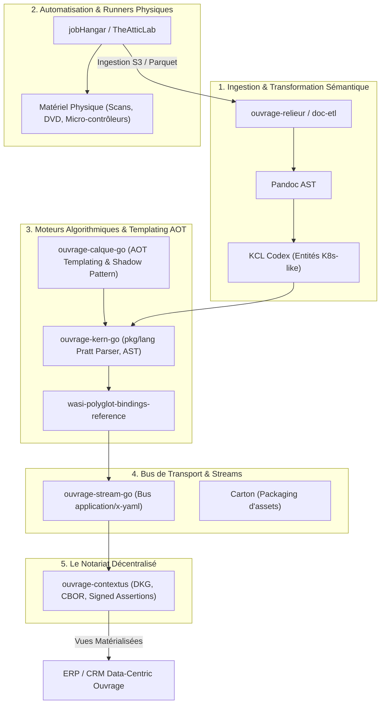

# Architecture Global & Vision d'Ouvrage Systems

## 1. La Grande Convergence

L'ensemble des projets de la guilde Ouvrage Systems ne constitue pas une suite d'outils isolés, mais un **écosystème d'ingénierie déterministe** convergeant vers trois piliers fondamentaux :

1. **`Contextus` (Le Web de la Preuve & L'Économie de la Vérité)** : Le standard de notariat décentralisé (CBOR / DID / KCL / ZKP) permettant d'échanger et de monétiser de la donnée certifiée à la source.
2. **L'ERP / CRM Data-Centric (Le Compilateur d'Entreprise)** : Un système de pilotage basé sur la matérialisation d'événements scellés (`PublishedDocument`), où l'entreprise est régie par la rigueur d'un compilateur.
3. **Le Serious Game `AML Connect`** : Le bac à sable réel permettant d'éprouver ces technologies sur 20 ans de dette technique industrielle.

---

## 2. Cartographie & Rôle de Chaque Brique Ouvrage

---

## 3. Détail des Rôles par Composant

* **`ouvrage-relieur` / `doc-etl`** :
  * *Rôle* : Aspiration des documents non structurés (PDF, HTML, PyMuPDF, Pandoc AST) $\rightarrow$ Translation vers le **KCL Codex** (déclaratif typé type Kubernetes-like).
* **`jobHangar` / `TheAtticLab`** :
  * *Rôle* : L'orchestrateur de tâches distribuées sans codebase lourde (runners légers). Il pilote le matériel physique (caméscopes, lecteurs Mini-DVD Handycam, numérisation autonome de cassettes/photos) pour ingérer les flux médias physiques vers du stockage S3/MinIO avec extraction sémantique autonome.
* **`ouvrage-calque-go` (`ocalque`)** :
  * *Rôle* : Le moteur de templates AOT sous *Shadow Pattern*. Masquer les règles de mutation dans les commentaires natifs du code C/Go pour préserver l'exécution en dev tout en compilant les transformations pour la prod.
* **`ouvrage-kern-go` (`okern`) + `wasi-polyglot`** :
  * *Rôle* : Le cœur d'AST et de grammaires formelles en pur Go sans dépendance, exporté en composant **WASI Preview 2** pour être exécuté en Python, TypeScript ou WASM browser.
* **`ouvrage-contextus`** :
  * *Rôle* : Le réseau de notariat et d'échange d'assertions signées. Il transforme les objets du KCL Codex et d'Ostream en assertions immuables monétisables.
