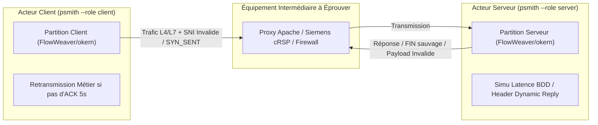

# Meeting & Architecture Note : ProtocolSmith (psmith)

## Métadonnées
* **Projet** : ProtocolSmith (`psmith`)
* **Auteur** : Guillaume Pineda (`@gpineda-dev`)
* **Statut** : 🔬 Expérimental (Prototypage & Outillage SRE)
* **Objet** : Forge d'ingénierie réseau et simulateur de trafic d'infrastructures réelles (L4/L7 & Chaos Déterministe).

---

## 1. Vision & Positionnement

`ProtocolSmith` est la boîte à outils d'un artisan pour forger des **protocoles réseau sur-mesure et à états (Stateful Network Protocols)** afin d'éprouver la résilience des équipements d'intermédiation (Proxies, Load Balancers, Firewalls, DMZ industrielles Siemens/cRSP).

Au lieu d'utiliser trois outils séparés pour le test de charge L7 (k6/JMeter), la forge de paquets L4 (Scapy), et le Chaos Engineering (Chaos Mesh), `ProtocolSmith` unifie ces capacités sous un langage déclaratif unique : **MSP (Manageable Scenario Protocol)**.

---

## 2. Architecture & Composants Clés

1. **Exécuteur Binaire Statique (`psmith`)** :
   * Un binaire Go unique, sans dépendances, capable de jouer les rôles d'acteur Client ou Serveur (`--role client|server`).
2. **Spécification déclarative MSP (`.yml`)** :
   * Description de la chorégraphie réseau pour l'ensemble des acteurs.
3. **Piles d'instructions atomiques (`Instructions`)** :
   * Actions bas-niveau L4 (`network.send`, `network.recv`), temporisations déterministes (`core.delay`), et protocoles applicatifs L7 (`http.request`, `grpc.call`).
4. **Flows & Workflows** :
   * Sequences réutilisables d'instructions pour simuler des scénarios d'utilisateurs et de pannes réelles.

---

## 3. Évolution 2026 & Cas d'Usage Avancés (La "Pièce de Théâtre" Réseau)

Alors qu'en 2023 le projet envisageait des bibliothèques externes (`looplab/fsm`), **la vision 2026 repose à 100% sur les moteurs de maison zéro-dépendance d'Ouvrage Systems** (`ouvrage-kern-go` / `okern` pour les FSMs et le parsing d'AST).

### 3.1 La Métaphore de la "Pièce de Théâtre" Réseau
`ProtocolSmith` et `FlowWeaver` ne sont pas un énième outil de stress-test HTTP synthétique (comme k6 ou Gatling). Ils orchestrent une **pièce de théâtre d'acteurs distribués** autour d'un équipement intermédiaire (un Reverse-Proxy Apache, un pare-feu industriel Siemens cRSP, un Load-Balancer) :

* **Le Serveur Joue sa Partition** : Il écoute, lit les en-têtes HTTP, simule un délai de traitement BDD de $X$ secondes, réinjecte les paramètres `GET` du client dans sa réponse.
* **Le Client Joue sa Partition** : Il envoie sa requête, gère ses *retransmissions métier* si aucun ACK applicatif n'est reçu sous 5s, et forge un nouveau payload à la volée.

### 3.3 Le Potentiel Ultime : Serveurs/Clients "Turing-Complets" en FSM & Registre Partagé

Le potentiel de cette architecture va bien au-delà d'un simple générateur de trafic :

1. **Recoder un Serveur ou Client complet en FSM Déclarative** :
   Puisque les instructions, boucles `foreach`, branchements et actions sont décrits en YAML/DSL puis compilés en FSM déterministe par `okern`, il devient théoriquement possible de **recoder un serveur applicatif complet (ou un client complexe) sous forme d'automate d'états**.
2. **Le Registre de Mémoire Partagé (Shared State Register)** :
   Chaque micro-acteur (listener, connexion socket) joue sa partition FSM, mais peut lire et écrire dans un **registre de mémoire centralisé**. 
   * *Exemple* : Simuler un `PHP_SESSION_ID` ou un token OAuth2 partagé entre $N$ acteurs virtuels concurrents, où un acteur authentifie la session et les $N-1$ autres réutilisent le token dans leur propre partition !
3. **Distribution WASI / Zero-Dependency** :
   Ces acteurs FSM compilés en binaire WASM (`okern`) peuvent tourner par milliers avec une empreinte mémoire dérisoire (quelques Mo de RAM par million de connexions).

