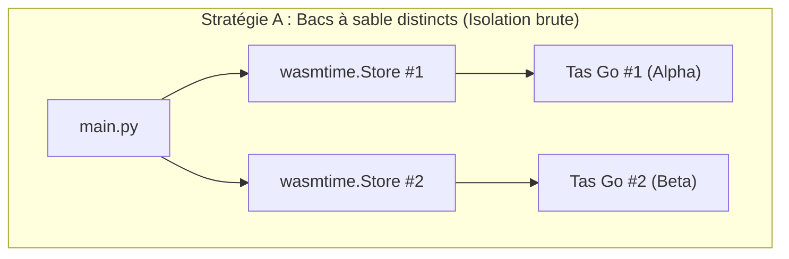
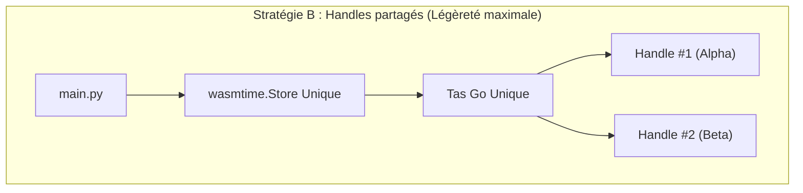

## 1. La philosophie d'Ouvrage-Kern

Quand j'ai conçu la bibliothèque **`ouvrage-kern-go`** (`okern`), l'objectif était clair : rassembler mes algorithmes fondamentaux (théorie des langages, parseurs de Pratt, structures de données arborescentes et mathématiques appliquées) dans une brique unique et réutilisable.

Pour préserver la clarté et la modularité de ce dépôt, j'ai posé quatre règles d'ingénierie simples (consignées dans mon ADR-000) :
1. **Séparation stricte des responsabilités** : Isolation physique des packages pour interdire tout import circulaire.
2. **Abstractions génériques** : Exploiter les types génériques de Go (mon package `/cs/ds/tree` sait visualiser aussi bien un AST qu'un arbre de répertoires).
3. **Cœur zéro-dépendance** : Le moteur n'embarque aucune dépendance externe. Les CLI d'exécution (`cmd/oklang`) sont isolés en périphérie.
4. **Conformité continue** : Des tests unitaires inspectent le graphe d'import à chaque build pour bloquer toute dérive.

---

## 2. Le dilemme : Réécrire en Python ou compiler en WASI ?

Si j'utilise Go pour l'essentiel de ma plomberie système, certaines briques annexes d'Ouvrage (outillage d'ingestion, scripts d'analyse, extensions IDE) nécessitent de tourner en **Python** ou en **TypeScript/Node.js**.

Face à ça, je n'avais que trois options :
* **Option A (Réécriture manuelle)** : Réécrire mes parseurs de Pratt et mes structures d'AST à la main en Python et JS. Cependant, maintenir la même logique complexe dans plusieurs langages introduit un risque inévitable de divergence sémantique et de duplication.
* **Option A' (Génération de code via CLI)** : Intégrer un sous-ordre de compilation dans le CLI d'Ouvrage (`oklang codegen -g grammaire.yml --target py`) pour émettre un `parser.py` zéro-abstraction sur-mesure pour une grammaire donnée. C'est une piste élégante pour le futur d'oklang, mais qui n'était pas la priorité immédiate du cœur `okern`.
* **Option B (WASI V2 - R&D retenue)** : Compiler directement le moteur Go en composant WebAssembly déterministe et générer des wrappers natifs typés via le Component Model.

J'ai choisi de pousser l'**Option B** pour valider la distribution polyglotte. Le week-end dernier, j'ai ouvert un laboratoire dédié : [**`labs-wasi-polyglot-bindings-reference`**](https://ouvrage-systems.github.io/labs-wasi-polyglot-bindings-reference/) pour faire mes premières armes sur la transition WASM 0.1 $\rightarrow$ WASI Preview 1 $\rightarrow$ WASI Preview 2 (Component Model).

Plutôt que de s'abriter derrière les scripts automatiques `make build-v2` du repo, cet article propose un exercice pratique et pas-à-pas : **ajouter une nouvelle fonctionnalité (lister les clés) dans la base Go et dérouler manuellement la chaîne de compilation et d'inspection WASI.**

---

## 3. Pourquoi le composant WASI Preview 2 (Component Model) ?

Plutôt que d'utiliser l'ancien standard WASM 0.1 (restreint au navigateur et manipulant des mémoires plates non structurées), j'utilise le standard **WASI Preview 2 (WASI 0.2)** et son *Component Model*.

L'avantage ? On définit une interface stricte via un fichier **WIT** (*WebAssembly Interface Type*), et le binaire Wasm expose proprement des objets avec constructeurs et méthodes dans une mémoire linéaire isolée.

---

## 4. Étude de cas pas-à-pas : Ajouter `ListKeys` et disséquer le composant

Pour cet exercice, nous partons de la structure Go `pkg/store/store.go` représentant notre `KVStore` en mémoire. Nous allons lui ajouter la méthode `ListKeys() []string` et mettre à jour la chaîne complète sans utiliser de magie automatisée.

### 4.1 L'interface WIT (Le contrat binaire)
Avant même de compiler, nous définissons le contrat de composant dans notre fichier `store.wit` :

```wit
package ouvrage:lab-wasi-demo;

interface store {
    resource kv-store {
        constructor();
        set: func(key: string, value: string);
        get: func(key: string) -> option<string>;
        delete: func(key: string) -> bool;
        list-keys: func() -> list<string>;
    }
}

world store-service {
    export store;
}
```

### 4.2 Le modèle de mémoire : Handles et Tas linéaire
Comment l'hôte Python peut-il manipuler un objet Go sans risque de corruption ?

1. **L'isolation de la mémoire tas** : La mémoire linéaire WASM de l'instance Go est totalement étanche par rapport au processus Python hôte.
2. **Le mécanisme de Handle** : Le constructeur Go `[constructor]kv-store` alloue la structure en mémoire WASM et retourne un simple identifiant numérique (`handle`).
3. **Le passage de contexte** : Chaque appel de méthode ultérieur (`set`, `get`, `delete`) transmet ce `handle` au moteur WASM pour cibler l'instance en mémoire.

```text
[ Python Hôte ] ──( Appelle set(handle=1, "key", "val") )──► [ Sandbox WASM / Go Heap ]
                                                               └── Pointeur #1 (KVStore)
```

### 4.3 Désosser le composant (`wasm-tools`)
Grâce à l'outillage `wasm-tools`, on peut directement inspecter et désosser l'interface binaire du composant `.wasm` compilé par `tinygo` :

```bash
# Inspection de l'interface du composant compilé
wasm-tools component wit build/store.wasm
```

---

## 5. Exécution autonome : Deux stratégies d'isolation mémoire

En WASI Preview 2, le développeur a le choix entre deux stratégies d'isolation mémoire selon les contraintes de sécurité et de consommation de son système :


### Stratégie A : Multi-Stores (Étanchéité matérielle absolue)



Chaque instance Go vit dans son propre `wasmtime.Store()`. Si l'instance Alpha subit une corruption de tas ou une défaillance mémoire, l'instance Beta est physiquement protégée et continue de tourner.
```python
# Instanciation de deux sandboxes séparées
store_alpha = wasmtime.Store(engine)
instance_alpha = linker.instantiate(store_alpha, component)

store_beta = wasmtime.Store(engine)
instance_beta = linker.instantiate(store_beta, component)
```

### Stratégie B : Single-Store & Handles (Haute densité & zéro-overhead)



Un seul `wasmtime.Store()` est alloué en mémoire (Singleton). Le constructeur Go est appelé plusieurs fois et retourne des identifiants entiers opaques (`handles`). C'est la stratégie idéale pour gérer des milliers d'objets métiers légers dans le même processus sans surcoût de runtime :
```python
# Une seule sandbox mémoire partagée
store = wasmtime.Store(engine)
instance = linker.instantiate(store, component)

# Allocation de deux KVStores distincts par leurs Handles
handle_alpha = ctor_func(store) # Handle 1
handle_beta = ctor_func(store)  # Handle 2

set_func(store, handle_alpha, "env", "production")
set_func(store, handle_beta, "env", "staging")
```

---

## 6. Observabilité & Waterfall Tracing (Traces JSON & Streamlit)

Pour mesurer avec précision l'instanciation des composant et le cycle de vie des *handles* en mémoire, nous pouvons instrumentaliser l'exécution pour générer un fichier de trace au format **Chrome Tracing / Perfetto** (`trace.json`).

### 6.1 Le dumper de traces Chrome Tracing (`tracer.py`)
```python
# TODO @gpineda: Remplir le squelette du WasiTracer avec format Perfetto / Chrome Tracing
class WasiTracer:
    def __init__(self, output_file="trace.json"):
        self.events = []
        self.output_file = output_file
        
    def log_event(self, name: str, cat: str, ph: str, ts_ns: int, args: dict = None):
        pass

    def save(self):
        pass
```

### 6.2 Visualisation Waterfall (Dashboard Streamlit)
```python
# TODO @gpineda: Remplir le script Streamlit app.py pour le rendu du graphe Waterfall (Plotly/Altair)
import streamlit as st
import json

st.title("🔬 WASI Execution Trace & Waterfall Viewer")
# Insérer la logique de rendu Waterfall à partir de trace.json
```

---

## 7. Enseignements & Bilan

Cette approche par composant WASI Preview 2 me permet de valider trois principes clés :
1. **Zéro duplication** : Le code Go reste l'unique source de vérité algorithmique.
2. **Type-Safety & Isolation** : Le code Python interagit avec une API typée par WIT sans risque de corrompre la mémoire du système hôte.
3. **Consommation minimale** : Le composant compilé pèse quelques mégaoctets et démarre en quelques microsecondes.

Le laboratoire [**`labs-wasi-polyglot-bindings-reference`**](https://ouvrage-systems.github.io/labs-wasi-polyglot-bindings-reference/) me sert de socle de référence pour distribuer mes briques Go à travers tous mes autres outils.

---

> 🛠️ *Cet article a été co-conçu avec Gemini (Antigravity) selon notre [Workflow de Rédaction Augmentée](/fr/posts/2026-08-04-augmented-pair-authoring-workflow) (voir aussi notre [Manifeste de l'Exosquelette](/fr/posts/2026-08-04-exoskeleton-manifesto)).*


