## 1. Du Sonar Omnidirectionnel au Métier des Systèmes

Dans notre manifeste ([*Du Tableau Blanc aux Principes Premiers*](/fr/posts/2026-09-19-ai-exoskelton-for-builders-not-oracle/)), nous évoquions le **sonar omnidirectionnel de l'ingénieur augmenté** (§4) : cette capacité à plonger sans friction dans 50 ans d'histoire des systèmes d'exploitation pour en extraire les invariants théoriques et les réinjecter dans nos architectures modernes.

Dans notre industrie, les briques d'infrastructure sur lesquelles reposent nos systèmes ne sont pas nécessairement les plus parfaites sur le plan académique. Elles sont le fruit d'un **darwinisme technique féroce où le pragmatisme du « Pire est Mieux » (*Worse is Better*) l'a emporté** :

* Là où des projets de recherche audacieux comme **Plan 9 (Bell Labs)** cherchaient l'élégance absolue en transformant les sockets réseau en pseudo-systèmes de fichiers manipulables directement en shell (`/net/tcp/clone`),
* Là où **Barrelfish (ETH Zurich / Microsoft Research)** repensait le système d'exploitation autour du passage de messages asynchrones entre cœurs plutôt que par de la mémoire partagée verrouillée,
* **Unix s'est imposé** grâce à une primitive rustique, universelle et immédiatement disponible : **le descripteur de fichier et le flux d'octets anonyme**.

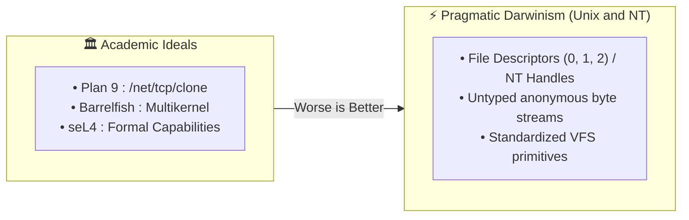

Pris dans le tourbillon des livraisons quotidiennes, l'industrie a fini par oublier pourquoi ces briques fonctionnaient ainsi. Nous avons empilé des frameworks obèses, des conteneurs imbriqués, des sidecars de 500 Mo et des agents tiers pour accomplir des tâches que les primitives de base du noyau permettent déjà d'exécuter à coût zéro.

Pour ce premier volet technique, commençons par la plus élémentaire (et pourtant la plus sous-estimée) d'entre elles : **`stdout` (le Descripteur de Fichier 1)**.

Ce que nous réduisons souvent à un simple déversoir de texte pour `printf()` (qui n'est au fond qu'un raccourci de la libc pour `fprintf(stdout, ...)` ou `dprintf(1, ...)`) n'a jamais été un canal passif. Sous le regard d'un traceur système comme `strace`, qu'il s'agisse d'une socket réseau TCP, d'un pipe anonyme ou d'un fichier sur disque, toutes les abstractions de nos langages de haut niveau s'effondrent sur les mêmes primitives fondamentales : **`write(2)`** et **`read(2)`**.

Ce flux n'est pas du simple texte : c'est un **bus de communication universel, réactif et multiplexé**, prêt à devenir une véritable membrane de sécurité et d'interposition.

---

## 2. La Table de Descripteurs et l'Invariance Système (Linux & Windows)

Pour comprendre la puissance de ce qui traverse nos terminaux, il faut redescendre sous la surface du noyau.

### 2.1 Anatomie d'un File Descriptor sous Linux
Un descripteur de fichier (*file descriptor*) n'est pas une abstraction nébuleuse : **c'est un simple index entier dans la table allouée par processus** (`task_struct->files->fdt->fd[fd_num]`), pointant vers une structure physique du noyau (`struct file`) dotée de sa table de pointeurs de fonctions d'I/O (`f_op`).

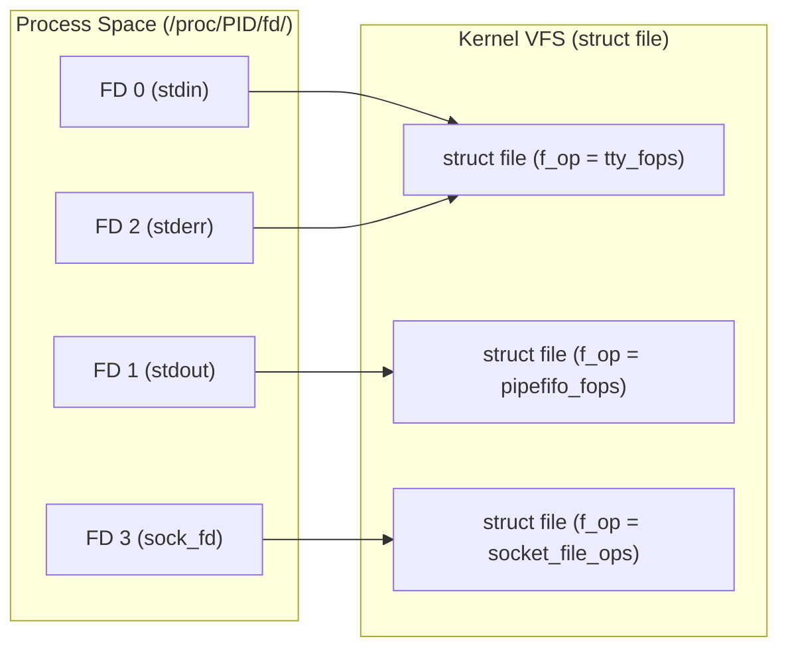

On peut inspecter cette réalité physique à tout instant dans le pseudo-système de fichiers `/proc` :
```bash
$ ls -l /proc/$$/fd
lrwx------ 1 gpineda gpineda 64 0 -> /dev/pts/2           # stdin (TTY interactif)
lrwx------ 1 gpineda gpineda 64 1 -> /dev/pts/2           # stdout (TTY interactif)
lrwx------ 1 gpineda gpineda 64 2 -> /dev/pts/2           # stderr (TTY interactif)
l-wx------ 1 gpineda gpineda 64 3 -> pipe:[4189210]       # un pipe anonyme (IPC)
lrwx------ 1 gpineda gpineda 64 4 -> socket:[892138]      # une socket TCP active
```

Pour le sous-système VFS (Virtual File System) de Linux, **lire sur un pipe `stdin`, écrire sur `stdout`, transférer des données sur un socket TCP ou écrire dans un fichier local repose sur exactement les mêmes appels système POSIX** :

$$\text{read}(fd, buf, size) \quad / \quad \text{write}(fd, buf, size) \quad / \quad \text{poll}(fds, ...)$$

Lorsqu'un processus enfant écrit sur son descripteur `1`, il n'a aucune conscience de la destination finale de ses octets : un écran cathodique en 1978, un fichier de log local, un pipe de compression `zstd`, ou un socket réseau vers un navigateur web à l'autre bout de la planète via un simple `dup2(sock_fd, 1)`.

### 2.2 Le Parallèle Windows NT : `HANDLE` et *Named Pipes*
Cette mécanique n'est pas un privilège réservé à Linux. Le noyau Windows NT repose sur une abstraction rigoureusement équivalente, articulée autour de la **table de `HANDLE`** logée dans le bloc exécutif `EPROCESS` :

* **Les Handles Standards :** Là où POSIX fige les entiers `0, 1, 2`, Win32 fournit les pseudo-constantes `STD_INPUT_HANDLE`, `STD_OUTPUT_HANDLE` et `STD_ERROR_HANDLE`, interrogées via `GetStdHandle()` et réassignables atomiquement via `SetStdHandle()`.
* **La Puissance des Named Pipes (`\\.\pipe\...`) :** Windows a poussé l'unification des flux très loin à travers son pilote de système de fichiers dédié **NPFS (*Named Pipe File System*)**. Les Named Pipes Windows offrent non seulement du streaming d'octets anonyme, mais également un mode **messages atomiques** et une intégration native avec les ports de complétion asynchrones (**IOCP / `OVERLAPPED` I/O**).
* **Le socle de l'IPC Windows :** De l'authentification locale LSASS aux services RPC et aux communications de conteneurs sous WSL2 / Hyper-V, le Named Pipe sous Windows joue exactement le même rôle de colonne vertébrale réactive que le descripteur de socket/pipe sous Unix.

### 2.3 Les Trois Super-Pouvoirs Physiques des Flux
Que l'on soit sous Linux ou Windows, ce modèle d'I/O confère trois super-pouvoirs fondamentaux à tout superviseur :

1. **L'Héritage Transparent :** Lors d'un `fork()` (POSIX) ou d'un `CreateProcess()` avec `bInheritHandles = TRUE` (Win32), l'enfant hérite des descripteurs/handles ouverts par le parent. Le parent peut configurer et sceller les entrées/sorties avant même l'exécution de la première instruction de l'enfant.
2. **Le Reroutage Atomique :** Remplacer instantanément la sortie standard par un pipe anonyme ou une socket en un seul appel système (`dup2(2)` sous Linux, `SetStdHandle()` sous Windows).
3. **Le Transfert Inter-Processus :** Transférer un descripteur ouvert d'un processus A vers un processus B totalement indépendant, sans lien de parenté (`sendmsg(2)` avec `SCM_RIGHTS` sur socket Unix, ou `DuplicateHandle()` sous Windows).

Mais avant de téléporter des descripteurs, commençons par exploiter ce que nous pouvons faire de plus direct : **intercepter et piloter en temps réel le flux qui traverse `stdout`**.

---

## 3. La Grande Fresque : Cinquante Ans de Détournements de `stdout`

Historiquement, les plus grands sauts d'architecture logicielle ont consisté à détourner ce simple flux de sortie pour y glisser des protocoles applicatifs, des moteurs de rendu ou des signaux d'infrastructure.

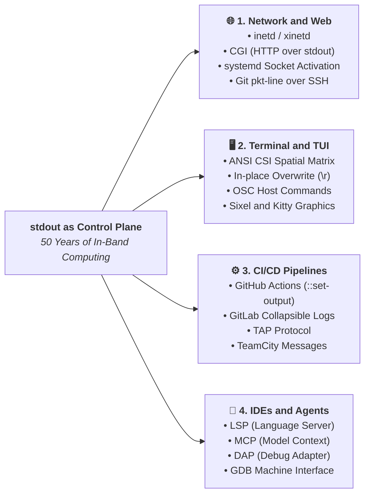

### 3.1 Les Super-Serveurs Réseau et le Web des Origines (1980 - 1993)

#### A. `inetd` / `xinetd` (1982) : Le Super-Serveur Unix originel

L'ancêtre direct de l'orchestration réseau et du serverless moderne. Un unique démon `inetd` écoutait en tâche de fond sur l'ensemble des ports TCP configurés de la machine (FTP sur le 21, Telnet sur le 23, Finger sur le 79). 

Dès qu'un client initiait un handshake TCP :
1. `inetd` acceptait la connexion via `accept(2)`.
2. Il créait un processus enfant via `fork(2)`.
3. Il réassignait la socket acceptée sur les descripteurs standards de l'enfant : `dup2(client_sock, 0)` et `dup2(client_sock, 1)`.
4. Il exécutait le binaire cible (`telnetd`, `ftpd`) via `execve(2)`.

**Le serveur applicatif ne contenait pas une seule ligne de code réseau** : il lisait la requête sur `stdin` et répondait sur `stdout`.

#### B. CGI (Common Gateway Interface - 1993) : La naissance du Web dynamique sur `stdout`

Le Web dynamique tout entier (bien avant les serveurs d'applications lourds, les conteneurs et les runtimes asynchrones) s'est bâti sur une spécification de quelques pages conçue en 1993 par Rob McCool au NCSA.

Son coup de génie ? Ne concevoir **aucun nouveau protocole réseau**, mais mapper l'intégralité du protocole HTTP sur les mécanismes natifs d'un processus POSIX :

| Composant HTTP | Vecteur Système POSIX | Mécanisme Noyau & Rôle |
| :--- | :--- | :--- |
| **En-têtes de Requête** | **`char **envp`** (Variables d'environnement) | Le serveur Web (NCSA HTTPd, Apache) parse la requête entrante et injecte les métadonnées dans le processus cible (`REQUEST_METHOD=POST`, `QUERY_STRING=id=42`, `CONTENT_LENGTH=128`, `HTTP_COOKIE=...`). |
| **Corps de Requête (`POST`/`PUT`)** | **`stdin` (FD 0)** | Apache ouvre un `pipe(2)` anonyme et y pousse le flux d'octets brut envoyé par le navigateur (payload JSON, formulaire encodé, upload de fichier). |
| **En-têtes & Corps de Réponse** | **`stdout` (FD 1)** | Le script applicatif écrit ses en-têtes HTTP de réponse, émet la séquence de démarcation *in-band* `\r\n\r\n`, puis écrit le corps HTML ou JSON. Apache intercepte le flux et le transmet au socket client. |
| **Logs d'Erreurs & Debug** | **`stderr` (FD 2)** | Tout appel à `warn()`, `die` ou `fprintf(stderr, ...)` est intercepté par le serveur Web et redirigé vers son `error.log` sans jamais corrompre la réponse HTTP envoyée à l'internaute. |

Un script de traitement de formulaire en C pur tenait ainsi en une dizaine de lignes, sans la moindre dépendance externe ni bibliothèque HTTP :

```c
#include <stdio.h>
#include <stdlib.h>
#include <unistd.h>

int main(void) {
    char *method = getenv("REQUEST_METHOD");
    int len = atoi(getenv("CONTENT_LENGTH") ? getenv("CONTENT_LENGTH") : "0");
    char body[1024] = {0};

    // Read POST payload directly from stdin (FD 0)
    if (len > 0 && len < sizeof(body)) {
        read(STDIN_FILENO, body, len);
    }

    // Emit headers, the in-band boundary "\r\n\r\n", and payload to stdout (FD 1)
    printf("Content-Type: text/plain\r\n\r\n");
    printf("Received via pure CGI (Method: %s, Payload: %s)\n", method, body);
    return 0;
}
```

##### La facture physique : Du `fork`/`exec` au C10k et à FastCGI

Ce modèle d'une simplicité absolue avait cependant un coût matériel direct : **1 requête HTTP = 1 `fork(2)` + 1 `execve(2)`**.  
Pour chaque visiteur, le serveur devait créer un nouvel espace d'adressage virtuel, charger le binaire de l'interpréteur (`perl`, `php` ou `python`) depuis le disque dur, parser le script et détruire le processus à la fin de la page.

Dès que le Web a dépassé quelques dizaines de requêtes par seconde à la fin des années 90, cette saturation des tables de processus du noyau a engendré le problème du *C10k*. La réponse de l'industrie ? **FastCGI (1996)**, puis des gestionnaires comme **`php-fpm`** : conserver exactement le même contrat de flux (`stdin`/`stdout`/`stderr`), mais sur des sockets Unix persistants avec des pools de workers pré-instanciés (*pre-fork*).

#### C. `systemd` Socket Activation (2010+) : Le paradigme moderne poussé dans ses retranchements

`systemd` a modernisé et poussé ce principe à l'échelle du système d'exploitation moderne. Dans son mode `Accept=yes` (héritier direct d'`inetd`), `systemd` maintient la socket d'écoute ouverte en permanence dans le noyau. Lorsqu'un paquet SYN arrive, il accepte la connexion et lance une instance de service dédiée en lui injectant directement la socket connectée sur `stdin` (FD 0) et `stdout` (FD 1).

Résultat ? Un simple script bash devient un serveur HTTP concurrent sans la moindre dépendance externe :

```ini
# ~/.config/systemd/user/bash-http.socket
[Socket]
ListenStream=127.0.0.1:8080
Accept=yes
```

```bash
#!/usr/bin/env bash
# bash-http-worker.sh
read -r request_line
echo -e "HTTP/1.1 200 OK\r\nContent-Type: text/plain\r\nConnection: close\r\n"
echo "Hello from pure Bash via systemd.socket! Request: ${request_line}"
```

**L'agnosticisme total : tester le serveur sans réseau ni systemd :**  
Puisque le script ne fait que lire sur `FD 0` et écrire sur `FD 1`, nous pouvons le tester immédiatement en local avec un simple tube Unix (`|`) :

```bash
$ echo "GET /index.html HTTP/1.1" | ./bash-http-worker.sh
HTTP/1.1 200 OK
Content-Type: text/plain
Connection: close

Hello from pure Bash via systemd.socket! Request: GET /index.html HTTP/1.1
```

Dans votre console, `stdin` est alimenté par le pipe de `echo` et `stdout` s'affiche sur votre écran. Sous `systemd`, `stdin` et `stdout` sont branchés sur un socket TCP client. **Pour le code métier, c'est strictement identique : un descripteur est un descripteur.**

##### i. L'Autopsie Noyau en Direct (`ss` & `/proc/<pid>/fd`)

```bash
$ curl -i http://127.0.0.1:8080/stream
HTTP/1.1 200 OK
Content-Type: text/plain; charset=utf-8
Connection: close

==> [START] Stream initiated at : 2026-09-19T18:28:49Z (PID: 518305)
==> [END]   Stream completed at : 2026-09-19T18:30:09Z
```

Pendant qu'une requête HTTP lente (`/stream`) est en cours de traitement via `curl`, inspectons la table physique des descripteurs de fichiers dans la mémoire du noyau Linux :


```bash
gpineda@ouvrage-serv1-debian:~$ sudo ss -4tuapni | grep 8080
tcp   LISTEN    0      4096       127.0.0.1:8080       0.0.0.0:*     users:(("systemd",pid=918,fd=32))                                                                                                     
tcp   TIME-WAIT 0      0          127.0.0.1:55772    127.0.0.1:8080                                                                                                                                        
tcp   ESTAB     0      0          127.0.0.1:47960    127.0.0.1:8080  users:(("curl",pid=518304,fd=4))                                                                                                      
tcp   ESTAB     0      0          127.0.0.1:8080     127.0.0.1:47960 users:(("sleep",pid=518322,fd=1),("sleep",pid=518322,fd=0),("bash",pid=518305,fd=1),("bash",pid=518305,fd=0),("systemd",pid=918,fd=8))

gpineda@ouvrage-serv1-debian:~$ sudo ls -lash /proc/518305/fd
total 0
0 dr-x------ 2 gpineda gpineda  4 Sep 19 20:28 .
0 dr-xr-xr-x 9 gpineda gpineda  0 Sep 19 20:28 ..
0 lrwx------ 1 gpineda gpineda 64 Sep 19 20:28 0 -> 'socket:[6066678]'
0 lrwx------ 1 gpineda gpineda 64 Sep 19 20:28 1 -> 'socket:[6066678]'
0 lrwx------ 1 gpineda gpineda 64 Sep 19 20:28 2 -> 'socket:[6070210]'
0 lr-x------ 1 gpineda gpineda 64 Sep 19 20:28 255 -> /home/gpineda/gpineda-dev/labs/first-principles-samples/01-systemd-socket-bash-server/bash-http-worker.sh

gpineda@ouvrage-serv1-debian:~$ sudo ls -lash /proc/918/fd
total 0
...
0 lrwx------ 1 gpineda gpineda 64 Sep 19 18:27 32 -> 'socket:[6065515]'     # TCP listening socket (systemd.socket)
0 lrwx------ 1 gpineda gpineda 64 Sep 19 20:28 8 -> 'socket:[6066678]'      # Active connected socket (accepted and passed to worker)

gpineda@ouvrage-serv1-debian:~$ systemctl --user status bash-http.socket
● bash-http.socket - Minimal Bash HTTP Socket Activation Demo
     Loaded: loaded (/home/gpineda/.config/systemd/user/bash-http.socket; disabled; preset: enabled)
     Active: active (listening) since Sat 2026-09-19 20:28:11 CEST; 7s ago
     Listen: 127.0.0.1:8080 (Stream)
   Accepted: 26; Connected: 0;
```

**L'énigme de `ss` : Mais où est passé le Reverse-Proxy ?**  
Face à une architecture où un superviseur reçoit du trafic et déclenche des workers, le premier réflexe d'un ingénieur SRE est de chercher le proxy (modèle HAProxy, Nginx, ou le classique tandem d'entreprise **Apache `mod_jk` / `mod_proxy_ajp` vers un serveur Java Tomcat** sur le port 8009).  

Dans un modèle Reverse-Proxy classique, la commande `ss` afficherait obligatoirement **deux sessions distinctes** :
1. Une socket frontend *Ingress* (`Client :47960 <-> Proxy :8080`).
2. Une seconde socket backend *Egress* (`Proxy :55442 <-> Worker :8009/9000` ou un Unix Domain Socket).  
Le frontal intermédiaire doit allouer des tampons en mémoire utilisateur, sérialiser/désérialiser les paquets (comme le protocole binaire AJP pour Java), et consommer du CPU pour transférer les octets d'une socket à l'autre.

Regardez attentivement la ligne `ESTAB` de notre sortie `ss` ci-dessus :  
**Il n'existe qu'une seule et unique socket TCP dans tout le noyau Linux (`127.0.0.1:8080 <-> 127.0.0.1:47960`).**  
`systemd` ne fait aucun proxying. Il a accepté la connexion et a directement passé le descripteur physique à la table du worker `bash` (PID 518305). Lorsque le script fait `echo`, il écrit directement dans la file d'attente d'émission TCP (`sk_buff`) du noyau Linux. Zéro pile réseau intermédiaire, zéro protocole de pontage, zéro copie mémoire, zéro surcoût réseau.

##### ii. Cartographie Graphique des Flux et Descripteurs (VFS)

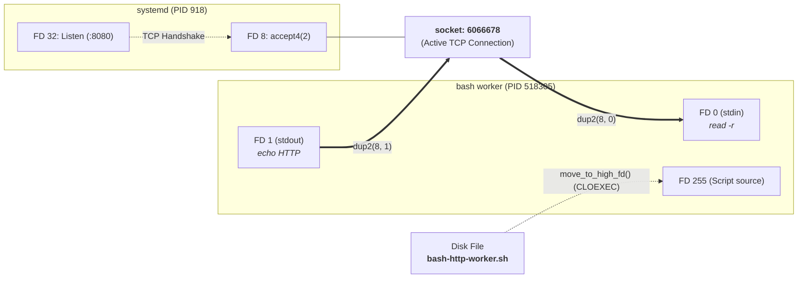

##### iii. `Accept=yes` vs `Accept=no` : Qui est le véritable propriétaire du descripteur ?

L'analyse de la cartographie révèle un détail architectural fondamental en ingénierie système : **la gestion de la propriété (*ownership*) du descripteur**.

* **Le piège de `Accept=yes` (Le worker "otage" du superviseur) :**  
  Dans le mode que nous venons de tester, `systemd` effectue lui-même l'appel système `accept4(2)` et conserve un descripteur ouvert (`FD 8`) sur la connexion TCP active tout en la dupliquant sur `FD 0` et `FD 1` du worker.  
  Dans le noyau Linux, les deux processus pointent vers la même structure `struct file` dont le compteur de références (`f_count`) vaut au moins 2.  
  **Conséquence :** même si notre script Bash termine son exécution, ferme ses descripteurs et quitte proprement (`exit 0`), le paquet réseau `FIN` de clôture TCP n'est émis et la socket n'est libérée de la RAM noyau que lorsque `systemd` ferme son propre `FD 8`. Si `systemd` subit un pic de charge, une contention CPU ou un délai dans sa boucle d'événements `sd-event`, notre connexion reste bloquée : l'application est littéralement "otage" de la disponibilité du PID 1.

* **La souveraineté de `Accept=no` (Gestion native du cycle & délégation `SCM_RIGHTS`) :**  
  À l'inverse, dans le mode `Accept=no` (utilisé par Nginx, PostgreSQL, ou l'architecture *daemonless* de Podman / `conmon`), `systemd` ne touche jamais aux connexions individuelles : il transmet uniquement la socket d'écoute passive sur le descripteur 3 (`LISTEN_FDS=1`, convention `SD_LISTEN_FDS_START`) puis s'efface totalement.  
  L'application (ou un démon superviseur ultra-léger type `acceptd`) prend alors le contrôle absolu du cycle de vie :
  1. Il appelle lui-même `accept4(2)` pour chaque client entrant.
  2. Il peut placer la socket acceptée dans sa propre boucle non-bloquante (`epoll`/`select`), ou la déléguer à un worker dédié en lui téléportant le descripteur via un Unix Domain Socket grâce au mécanisme **`SCM_RIGHTS`** (*ancillary data* du noyau).
  3. Dès que le descripteur est transmis au worker, le superviseur ferme immédiatement sa copie locale (`close(client_fd)`).  
  
  Le superviseur est alors **complètement retiré du chemin de données** : dès que le worker fait son `close()`, le compteur de référence noyau tombe instantanément à zéro, le `FIN` TCP part sur le câble, et aucune ressource ne reste captive.

> [!IMPORTANT] **Le Piège de Production : Contention `f_count` et Dépendance au PID 1**  
> Dans le mode `Accept=yes`, le descripteur reste ouvert simultanément dans `systemd` et dans le worker (`f_count >= 2`). Si votre worker termine son traitement et appelle `exit(0)`, la connexion TCP **ne se ferme pas physiquement sur le réseau** tant que la boucle d'événements de `systemd` n'a pas fermé sa propre copie de `FD 8`. En cas de pic de charge CPU sur le PID 1, vos clients HTTP restent bloqués en attente du paquet `FIN`. Pour la haute performance (Nginx, PostgreSQL), préférez toujours `Accept=no` avec délégation `SCM_RIGHTS`.

##### iv. Le Mystère du FD 255 : Le Mécanisme d'Auto-Défense de GNU Bash

Dans l'inspection de `/proc/518305/fd`, une ligne interpelle immédiatement :
`255 -> /home/.../bash-http-worker.sh`

D'où sort ce descripteur `255` alors que le script n'a jamais ouvert de tel fichier ?

Il s'agit d'une subtilité historique fascinante du code source de GNU Bash :
* **Le problème de la collision de flux :** Lorsqu'on exécute un script shell (`bash script.sh`), l'interpréteur ouvre le fichier `.sh` pour y lire les commandes au fur et à mesure de leur exécution. Si le script commence par manipuler ses propres descripteurs standards (par exemple un `exec 3<&-` pour fermer un flux ou une redirection `exec 0< fichier.txt`), il risquerait d'écraser ou de fermer le descripteur qui l'alimente lui-même en code !
* **La protection par `move_to_high_fd()` :** Pour immuniser son propre canal de lecture contre les bêtises du développeur ou les redirections utilisateur `0..9`, Bash déplace immédiatement le descripteur du fichier script vers le numéro le plus élevé possible réservé par le shell : **le FD 255** (défini par `DEFAULT_SAVED_LOC = 255` dans les sources de Bash).
* **Le flag `FD_CLOEXEC` :** Bash positionne également l'attribut `close-on-exec` sur ce FD 255. Ainsi, lorsqu'un sous-processus comme `sleep` est lancé via `fork`/`execve`, le FD 255 est automatiquement fermé et ne pollue pas la table des descripteurs de l'enfant (comme on le constate sur le PID 518322 qui ne conserve que `0` et `1`).

> [!TIP] **La Règle d'Or du Shell : Pourquoi ne jamais manipuler le FD 255**  
> Pour empêcher un script de couper la branche sur laquelle il est assis lors de redirections `exec 0< ...` ou `exec 3<&-`, GNU Bash déplace automatiquement son propre descripteur de lecture de code vers le plus haut entier possible : `DEFAULT_SAVED_LOC = 255`. Tenter d'allouer ou de fermer manuellement le FD 255 (`exec 255>&-`) interrompt immédiatement l'interpréteur au milieu de son exécution.

Le verdict est sans appel : pour le script `bash` et son sous-processus `sleep`, **`stdin` (FD 0) et `stdout` (FD 1) sont physiquement le descripteur de socket réseau `socket:[6066678]`** assigné par `systemd`. Le script écrit sur sa sortie standard, et les octets voyagent instantanément sur le réseau.

*(Retrouvez le code, les unités et l'automatisation Ansible complète dans le lab compagnon : [`01-systemd-socket-bash-server`](https://github.com/gpineda-dev/gpineda-dev.github.io/tree/main/labs/first-principles-samples/01-systemd-socket-bash-server)).*

### 3.2 Le Terminal comme Machine Graphique et Machine à États (1978+)

La plupart des développeurs perçoivent leur terminal comme un simple défilement vertical passif : une ligne est écrite, l'écran scrolle vers le bas, et le texte s'empile.

En réalité, un émulateur de terminal est une **matrice 2D de cellules en mémoire couplée à une machine à états**. Le flux `stdout` ne transporte pas seulement des caractères à afficher : **il transporte le jeu d'instructions qui pilote cette matrice**.

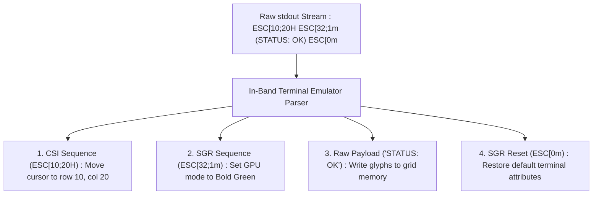

#### A. Séquences ANSI CSI : Le contrôle spatial du curseur et la matrice 2D

Comment des outils comme `htop`, `tmux`, `curses` ou `vim` créent-ils des fenêtres, des panneaux divisés et des interfaces riches sans ouvrir de serveur graphique (X11 ou Wayland) ? En utilisant les séquences **CSI (*Control Sequence Introducer*)** :
* **Le saut absolu de curseur :** `\033[<ligne>;<colonne>H` téléporte instantanément le curseur n'importe où sur l'écran pour réécrire une cellule précise.
* **L'écrasement sur place (`\r`) :** Le simple retour chariot sans saut de ligne permet aux barres de progression (`[=====>   ] 42%`) de se réécrire en boucle sur la même ligne physique sans polluer l'historique du terminal.
* **L'effacement sélectif :** `\033[2J` (effacement complet de la grille) et `\033[K` (effacement jusqu'à la fin de la ligne courante).

```bash
# Example of in-place animated rendering via \r and SGR codes
for i in {1..100}; do
    printf "\r\033[32m[PROGRESS]\033[0m %3d%% \033[34m[%-20s]\033[0m" "$i" "$(printf '#%.0s' $(seq 1 $((i/5))))"
    sleep 0.02
done
echo ""
```

**Autopsie de la trame d'octets injectée dans `stdout` :**

| Séquence d'octets | Type d'instruction | Rôle dans la machine à états du terminal |
| :--- | :--- | :--- |
| **`\r`** (`0x0D`) | Déplacement Curseur (*Carriage Return*) | Téléporte la tête d'écriture en colonne 0 sur la **même ligne physique** (sans `\n`), permettant d'écraser la frame précédente en mémoire. |
| **`\033[32m`** | Séquence CSI / SGR (*Select Graphic Rendition*) | `\033[` (`ESC [`) introduit le contrôle, `32m` active le premier plan en **vert**. |
| **`[PROGRESS]`** | Payload UTF-8 brut | Octets textuels écrits directement dans les cellules de la grille vidéo. |
| **`\033[0m`** | SGR Reset | Réinitialise les couleurs et attributs GPU aux paramètres par défaut. |
| **`%3d%%`** | Formatage numérique | Réserve 3 colonnes avec alignement à droite (`  5%` $\rightarrow$ `100%`) pour éviter tout saut ou décalage spatial de la barre. |
| **`\033[34m`** | Séquence SGR | Active la couleur **bleue** pour délimiter et remplir les blocs de progression. |
| **`[%-20s]`** | Formatage de chaîne | Réserve un gabarit fixe de 20 caractères aligné à gauche (`-`), et comble automatiquement le reste avec des espaces blancs. |

> [!WARNING] **La facture cachée du shell : Le piège du `fork` à chaque frame**  
> Si le protocole *in-band* lui-même (`\r` et séquences d'échappement) ne coûte strictement rien en I/O, observez le coût noyau d'une telle boucle en Bash :  
> Chaque sous-shell `$(seq ...)` et chaque binaire externe `sleep` déclenchent des appels système **`fork(2)` + `execve(2)`**.  
> Pour une simple barre de progression de 2 secondes, votre script force le noyau Linux à **créer et détruire plus de 300 processus éphémères**, saturant l'ordonnanceur et générant des micro-latences inutiles. En C, Rust ou Go, la même boucle n'émet que des `write(1, ...)` directs sans allouer le moindre processus.

#### B. Commandes OSC : Piloter le système d'exploitation hôte depuis `stdout`

Les séquences **OSC (*Operating System Commands*)** vont encore plus loin : elles permettent à un simple script bash d'envoyer des ordres directs au gestionnaire de fenêtres du système d'exploitation hôte !
* **Renommer l'onglet du terminal à chaud (OSC 0) :**
  ```bash
  echo -ne "\033]0;Cluster Prod EU-West [Master]\007"
  ```
  L'émulateur intercepte la séquence OSC 0, extrait le titre, met à jour la barre de titre de votre fenêtre de bureau, et ne consomme aucun caractère sur l'écran.
* **Les hyperliens cliquables natifs (OSC 8) :**
  Permet d'associer une URL masquée à un texte affiché dans la console, exactement comme une balise `<a href="...">` en HTML :
  ```bash
  echo -ne "\033]8;;https://gitlab.com/gpineda-dev-labs/fd-harness\033\\View project\033]8;;\033\\"
  ```
* **La téléportation du presse-papier sur SSH (OSC 52) :**
  Un script exécuté sur un serveur distant à l'autre bout du monde peut **remplir le presse-papier local de votre PC de bureau** en émettant une chaîne Base64 préfixée par `\033]52;c;...` dans son `stdout`.

#### C. Rendu Bitmap In-Band : De DEC Sixel aux protocoles Kitty & iTerm2

Le flux `stdout` ne s'arrête pas aux caractères vectoriels : il sait transporter de véritables images bitmap :
* **Le Protocole Sixel (DEC VT330 - Années 1980) :**
  L'ancêtre génial. L'image est découpée en bandes verticales de 6 pixels, chaque groupe de 6 bits étant mappé sur un caractère ASCII imprimable (`?` à `~`). Un script Python utilisant `matplotlib` ou `gnuplot` pouvait ainsi tracer des graphiques scientifiques directement dans le terminal.
* **Les Protocoles Modernes (Kitty & iTerm2 Inline Images) :**
  Aujourd'hui, comment un notebook ou un script Python affiche-t-il un tracé haute définition sans quitter le shell ?
  ```bash
  # Direct in-band Base64 PNG stream to stdout
  echo -ne "\033]1337;File=inline=1;width=600px:$(base64 -w0 plot.png)\007"
  ```
  L'émulateur intercepte la séquence, alloue une texture OpenGL/Metal à l'emplacement exact du curseur, et le texte normal continue de défiler en dessous.

*(Retrouvez le dashboard TUI interactif zéro-fork, les démos OSC et les benchmarks dans le lab compagnon : [`02-bash-ansi-csi`](https://github.com/gpineda-dev/gpineda-dev.github.io/tree/main/labs/first-principles-samples/02-bash-ansi-csi)).*

### 3.3 Les Moteurs de CI/CD et Pipelines de Build Modernes

Dans les pipelines d'intégration continue, `stdout` est le bus événementiel universel qui relie les exécutables de build au serveur d'orchestration.

#### A. GitHub Actions & GitLab CI : Le pilotage in-band des plateformes

Quand un job GitHub Actions doit replier un bloc de logs, lever une alerte ou exporter une variable d'environnement de build, il n'appelle aucune API REST distante. Il écrit simplement sur sa sortie standard :

```bash
echo "::group::Compiling Rust binaries"
echo "::set-output name=release_tag::v1.4.2"
echo "::error file=main.rs,line=42::Null pointer exception"
echo "::endgroup::"
```

Le runner intercepte la ligne, la masque de la console brute, et pilote l'interface web de GitHub en direct. GitLab CI utilise exactement la même convention avec les sections repliables `\e[0Ksection_start:...` écrites sur `stdout`.

#### B. Protocoles de Test Déterministes : TAP (*Test Anything Protocol*) & TeamCity

Bien avant le XML JUnit et les bases de données de métriques, Larry Wall a standardisé en 1987 le protocole **TAP (*Test Anything Protocol*)** :
```text
1..3
ok 1 - Parser TCP SYN handshake
not ok 2 - Tokenisation PCI-DSS # TODO: Support Amex
ok 3 - Rotation des File Descriptors
```
De même, JetBrains TeamCity parse en temps réel les messages de service émis sur `stdout` (`##teamcity[testStarted name='test1']`) pour mettre à jour ses tableaux de bord en streaming milliseconde sans le moindre agent lourd.

### 3.4 L'Ère des Agents IA et des IDEs Modernes (2016 - 2026)

Aujourd'hui, les architectures de développement les plus avancées du monde reposent sur ce même principe fondamental.

#### A. LSP (*Language Server Protocol*) & DAP (*Debug Adapter Protocol*)

Comment VSCode, Neovim ou Helix dialoguent-ils avec `rust-analyzer`, `gopls` ou `clangd` ?  
Ils n'injectent pas de plugins C++ dans le moteur de l'éditeur. L'éditeur lance le binaire du serveur de langage dans un sous-processus et communique via des trames **JSON-RPC sur `stdin` et `stdout`** :

```text
Content-Length: 118\r\n\r\n
{"jsonrpc":"2.0","method":"textDocument/completion","params":{"textDocument":{"uri":"file:///main.rs"},"position":{"line":42,"character":12}}}
```

#### B. MCP (*Model Context Protocol*) : Le standard universel des agents LLM

Lancé par Anthropic et adopté par l'écosystème IA (Claude, Antigravity, Cursor), le **Model Context Protocol (MCP)** standardise la façon dont un agent d'intelligence artificielle appelle des outils locaux (bases DuckDB, exécution bash, recherche de code).  
Le transport par défaut recommandé de MCP ? **Les flux standards `stdio` (`stdin`/`stdout`)**. Pas de serveur web à sécuriser, pas de ports TCP à ouvrir, juste un processus Unix spawné dont les flux sont captés par le runtime de l'agent.

### 3.5 La Synthèse du Bâtisseur : La Directive `# @harness`

C'est ici que s'ancre la genèse de **`fd-harness`**. 

Si 50 ans d'histoire démontrent que `stdout` est le moyen le plus frugal et universel de piloter un environnement sans SDK lourd : **pourquoi ne pas utiliser ce même canal *in-band* pour la sécurité, l'observabilité et la conformité des données ?**

Lorsqu'un script applicatif émet une directive de contrôle dans son flux :
```bash
echo "# @harness.filter:mask pattern='(?P<token>sec_[a-zA-Z0-9]{24})' target=token"
```

Le contrat d'I/O offre une **dégradation gracieuse (*graceful degradation*) parfaite** :
* **En exécution standard (sans `fd-harness`) :** La ligne transite sur `stdout` comme une simple ligne de commentaire conventionnelle (`# ...`), inoffensive pour la plupart des parseurs (YAML, INI, JSONL ou un simple `grep -v '^#'`).
* **Sous le superviseur `fd-harness run` :** La membrane d'I/O intercepte la directive *in-band*, reconfigure son moteur de tokenisation ou de masquage à la volée, et **l'avale immédiatement** (la retire du flux) pour qu'aucun consommateur en aval n'ait conscience de la commande de contrôle.

---

## 4. Le Cas d'Usage : Le Dilemme du Stagiaire et des Logs de Production

Posons maintenant le problème d'ingénierie réel qui va nous servir de fil conducteur.

### 4.1 Le Scénario Réel
Un vendredi à 17h, un incident critique frappe votre plateforme en production. Un comportement anormal et intermittent corrompt certaines transactions bancaires. Vous venez d'extraire un dump de logs de 2 Go (`production-incident.log.zst`).

Vous devez confier l'analyse de ce dump à un nouveau développeur, un stagiaire, un sous-traitant tiers, ou même le soumettre à un modèle de langage (LLM) pour corrélation d'erreurs.

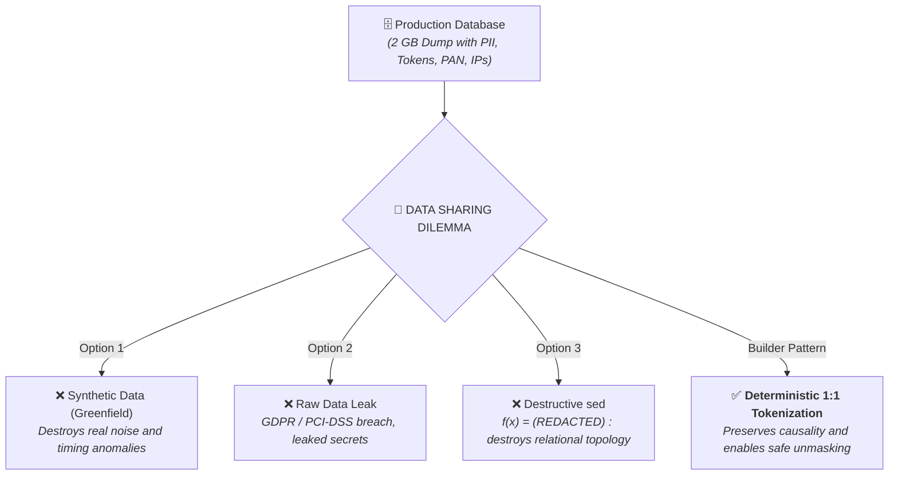

### 4.2 Les 3 Échecs Classiques :
1. **L'illusion des données synthétiques (Greenfield) :** Générer de faux logs propres en laboratoire ne sert à rien. Cela élimine le bruit réel, le désordre des horodatages, les micro-latences et les edge-cases tordus de la vraie production.
2. **Le risque juridique et sécuritaire :** Partager le log brut viole le RGPD, PCI-DSS et expose des tokens de session actifs (`Bearer sec_...`), des numéros de carte (PAN), des adresses IP d'infrastructure (`10.0.0.42`) et des identifiants clients (`CUST-1042`).
3. **Le piège du `sed` destructif :**
   Si vous appliquez un bête filtre destructif :
   $$f(x) = \text{"[REDACTED]"}$$
   **Vous détruisez toute la topologie relationnelle de l'incident.** Vous ne savez plus si le `[REDACTED]` qui a initié une requête à 14:02:10 est le même `[REDACTED]` qui a provoqué l'erreur de base de données à 14:02:15. Le log est anonymisé, mais il est devenu **inutilisable pour le débogage**.

### 4.3 Parenthèse Fondamentale : Pseudonymisation $\neq$ Anonymisation (L'État de l'Art)

Dans les cadres réglementaires stricts (**RGPD** en Europe et **PCI-DSS Exigence 3** dans l'industrie financière), une confusion massive persiste entre **Anonymisation** et **Pseudonymisation** :

* **L'Anonymisation (Destruction pure) :** Opération **irréversible** qui détruit tout lien entre la donnée et l'individu. Obligatoire pour les secrets absolus (cryptogrammes CVV, mots de passe, clés privées). Mais elle rend tout débogage relationnel impossible.
* **La Pseudonymisation (Tokenisation réversible 1:1) :** Remplace l'identifiant par un pseudonyme synthétique tout en conservant la clé de correspondance dans un coffre-fort séparé et restreint. **La relation $A \leftrightarrow B$ est préservée pour l'enquêteur**, mais la donnée réelle reste inaccessible.

> [!NOTE] **Frontière Réglementaire : RGPD (Art. 4 §5) vs PCI-DSS (Exigence 3)**  
> La destruction pure (**Anonymisation / `mask`**) est **légalement obligatoire** pour les données d'authentification sensibles (SAD : cryptogrammes CVV, codes PIN, mots de passe). En revanche, la tokenisation 1:1 réversible (**Pseudonymisation / `alias`**) est pleinement reconnue et encouragée pour les identifiants et numéros de cartes (PAN), à la condition expresse que le coffre de déchiffrement (`vault.jsonl`) soit stocké dans un périmètre cryptographique et physique strictement isolé.

Sur un flux de données, il n'existe que **3 opérations mathématiques possibles** :

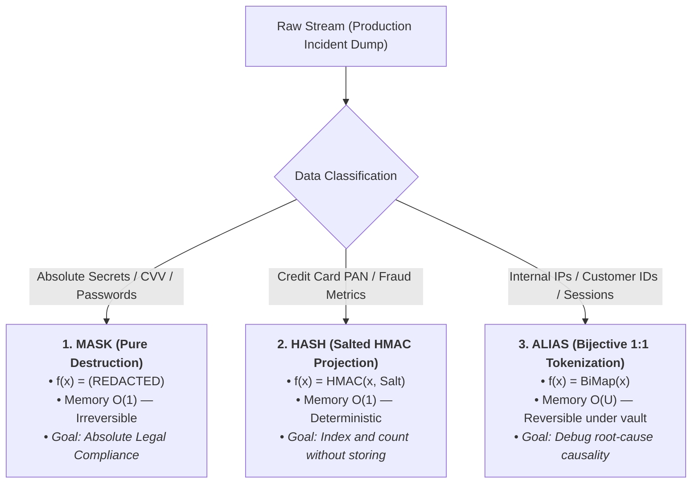

#### L'Autopsie d'une Ligne d'Incident Réelle

Pour comprendre la puissance du triptyque, observons la métamorphose physique d'un événement JSON extrait de notre dump de production :

**1. Avant le filtre DLP (Log brut de production - Fuite critique de conformité) :**
```json
{"time": "14:02:10", "ip": "10.0.0.42", "user": "CUST-1042", "token": "sec_8819ab21", "pan": "4532-0155-8891-1042", "cvv": "842"}
```

**2. Après passage dans la membrane DLP (Prêt pour le stagiaire / LLM / audit tiers) :**
```json
{"time": "14:02:10", "ip": "internal_ip_01", "user": "client_001", "token": "tok_01", "pan": "pan_3f8a1b2c", "cvv": "[REDACTED]"}
```

* **Le CVV `842`** est pulvérisé (`mask` destructif $O(1)$) : zéro trace résiduelle.
* **Le PAN** est projeté en empreinte HMAC `pan_3f8a1b2c` (`hash` $O(1)$) pour les métriques de fraude, ou masqué au format standard PCI-DSS `4532-****-****-1042` (`mask` First 4 / Last 4) pour l'affichage opérateur.
* **L'IP, le client et le token** sont devenus des alias bijectifs (`alias` $O(U)$) : l'enquêteur peut corréler les 10 000 requêtes de `client_001` vers `internal_ip_01` à travers tout le cluster, sans jamais avoir accès aux secrets sous-jacents.

---

## 5. Sous le Capot : L'Interposition Réactive avec `fd-harness`

C'est ici qu'intervient **`fd-harness`**, notre prototype de microkernel de descripteurs de fichiers écrit en Python pur (100% standard library, zéro dépendance externe).

### 5.1 L'Interposition In-Band Réactive (`fd-harness run`)
Comment un script applicatif ou un batch shell peut-il s'auto-protéger dynamiquement sans charger de SDK ni modifier ses dépendances ? En utilisant le principe des séquences de contrôle in-band sur `stdout` !

Soit le script bash suivant (`provision-worker.sh`, issu de nos samples de laboratoire) :

```bash
#!/usr/bin/env bash
echo "==> [INIT] Starting cluster provisioning..."

# 1. In-band directive emitted to stdout for 1:1 secret pseudonymization
echo '# @harness.filter:mask pattern="sec_[a-z0-9]{8}" action="alias" template="tok_{seq:02d}"'

# 2. In-band directive to hash static production API keys
echo '# @harness.filter:mask pattern="sk_live_[a-z0-9]{16}" action="hash" template="sk_{hash:8}"'

echo "==> [AUTH] Connecting to primary cluster with secret : sec_8819ab21"
echo "==> [API]  Verifying license with API key : sk_live_9948ab12cf345678"
echo "==> [AUTH] Refreshing session for backup key : sec_4410cd99"
echo "==> [AUTH] Reusing first session secret : sec_8819ab21"
echo "==> [DONE] Provisioning completed."
```

#### A. Exécution Directe (Sans superviseur)
Les secrets fuitent en clair sur la console et dans les logs de CI/CD :
```text
==> [INIT] Starting cluster provisioning...
# @harness.filter:mask pattern="sec_[a-z0-9]{8}" action="alias" template="tok_{seq:02d}"
# @harness.filter:mask pattern="sk_live_[a-z0-9]{16}" action="hash" template="sk_{hash:8}"
==> [AUTH] Connecting to primary cluster with secret : sec_8819ab21
==> [API]  Verifying license with API key : sk_live_9948ab12cf345678
==> [AUTH] Refreshing session for backup key : sec_4410cd99
==> [AUTH] Reusing first session secret : sec_8819ab21
==> [DONE] Provisioning completed.
```

#### B. Exécution Supervisée (`fd-harness run`)
```bash
$ fd-harness run ./provision-worker.sh
==> [INIT] Starting cluster provisioning...
==> [AUTH] Connecting to primary cluster with secret : tok_01
==> [API]  Verifying license with API key : sk_4a9b2c1d
==> [AUTH] Refreshing session for backup key : tok_02
==> [AUTH] Reusing first session secret : tok_01
==> [DONE] Provisioning completed.
```

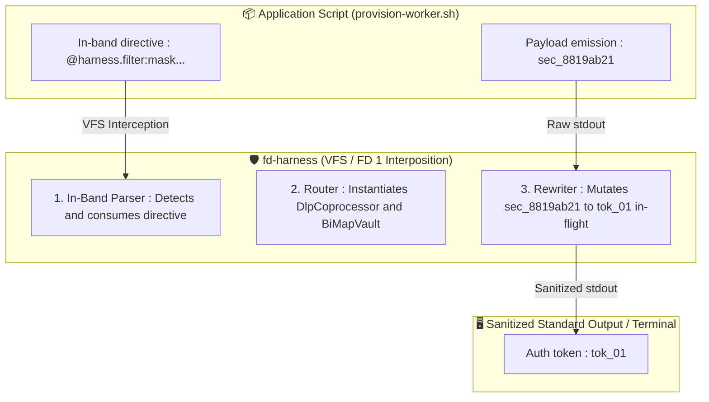

**Ce qui s'est produit :**
1. Les lignes `# @harness.filter:mask ...` ont été **interceptées et consommées du flux par le superviseur**. Elles n'apparaissent nulle part dans les logs finaux.
2. Le `CoprocessorRouter` interne a instancié la règle de pseudonymisation et la règle de hachage à chaud.
3. Les lignes suivantes ont été réécrites à la volée avec respect strict de la bijection (`sec_8819ab21` réutilisé redonne fidèlement `tok_01`).

---

### 5.2 L'Interposition Déclarative sur `systemd.socket` (La Membrane Réseau)

Dans le mode *in-band* (§5.1), le script émettait lui-même ses directives. Mais dans la réalité d'une infrastructure d'entreprise, **l'équipe sécurité ou SRE ne peut (et ne doit) pas modifier le code des applications legacy**.

Comment sécuriser à 100% le serveur HTTP en pur Bash déployé au §3.1 sans modifier **une seule ligne** du script `bash-http-worker.sh` ? 

En plaçant la membrane `fd-harness` directement en interception entre le descripteur de socket `systemd` et le worker applicatif :

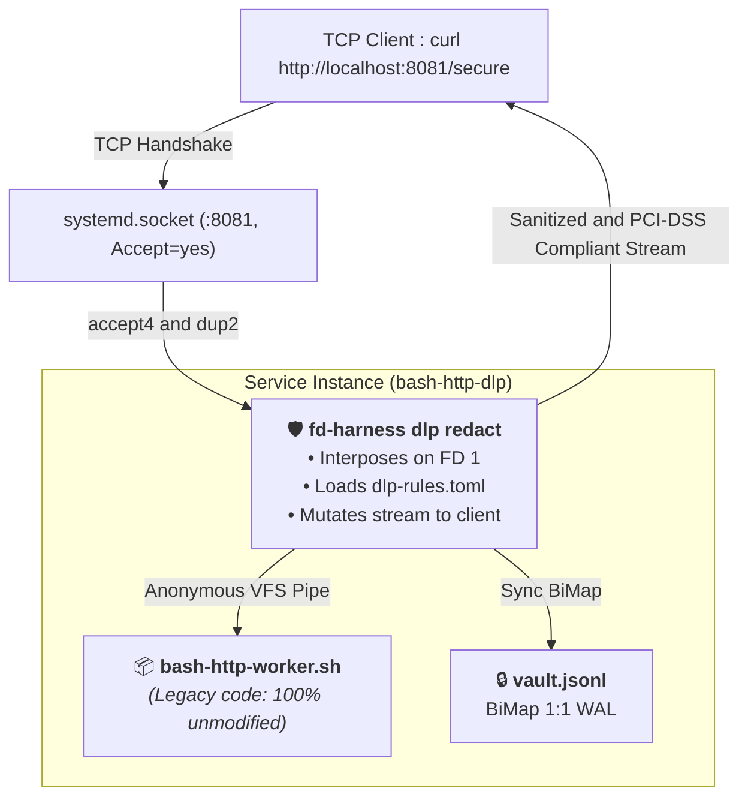

#### A. La Déclaration des Politiques de Sécurité (`dlp-rules.toml`)
Nous formalisons nos politiques de conformité bancaire et RGPD dans un fichier de configuration déclaratif :

```toml
[dlp]
fail_on_leak = false
summary = false
vault_file = "vault.jsonl"
salt = "first-principles-secret-salt-2026"

# 1. 1:1 Bijective Pseudonymization of Customer IDs (GDPR)
[[rules]]
name = "customer-id"
pattern = 'CUST-\d{4}'
action = "alias"
template = "client_{seq.cust:03d}"

# 2. Pseudonymization of Internal Infrastructure IP Addresses
[[rules]]
name = "internal-ip"
pattern = '10\.\d{1,3}\.\d{1,3}\.\d{1,3}'
action = "alias"
template = "internal_ip_{seq.ip:02d}"

# 3. Destructive Masking of Session Bearer Tokens
[[rules]]
name = "bearer-auth"
pattern = 'Bearer\s+sec_[A-Za-z0-9_]+'
action = "mask"
replacement = "Bearer [REDACTED_AUTH_TOKEN]"

# 4. Canonical PCI-DSS Masking (First 4 + Last 4) via Named Groups
[[rules]]
name = "card-pan"
pattern = '(?P<bin>\d{4})-\d{4}-\d{4}-(?P<last4>\d{4})'
action = "mask"
template = "{bin}-****-****-{last4}"

# 5. Pure Destruction of CVV Codes (SAD - Sensitive Auth Data)
[[rules]]
name = "card-cvv"
pattern = '(?<=Card CVV\s{5}:\s)\d{3}'
action = "mask"
replacement = "[REDACTED_CVV]"
```

#### B. L'Unité de Service `systemd` Supervisée
Dans l'unité `~/.config/systemd/user/bash-http-dlp@.service`, nous encapsulons l'exécution du worker :

```ini
[Unit]
Description=DLP-Supervised Bash HTTP Worker
After=network.target

[Service]
ExecStart=/usr/local/bin/fd-harness dlp redact \
  --rules %h/.config/harness/dlp-rules.toml \
  --vault %h/.local/share/fd-harness/vault-http.jsonl \
  --no-summary \
  -- %h/scripts/bash-http-worker.sh
StandardInput=socket
StandardOutput=socket
StandardError=journal
```

#### C. L'Épreuve du Réseau : Comparaison en Direct

Interrogeons la route sensible `/secure` sur le port brut (:8080) puis sur le port supervisé par `fd-harness` (:8081) :

```bash
# 1. Raw endpoint (Port 8080 - Compliance Leak)
$ curl -s http://127.0.0.1:8080/secure
Transaction Details:
Customer ID  : CUST-1042
Internal IP  : 10.0.0.42
Auth Token   : Bearer sec_9948ab12cf345678
Card PAN     : 4532-0155-8891-1042
Card CVV     : 842
Status       : APPROVED

# 2. Supervised endpoint via fd-harness (Port 8081 - Zero Leaks, 100% Compliant)
$ curl -s http://127.0.0.1:8081/secure
Transaction Details:
Customer ID  : client_001
Internal IP  : internal_ip_01
Auth Token   : Bearer [REDACTED_AUTH_TOKEN]
Card PAN     : 4532-****-****-1042
Card CVV     : [REDACTED_CVV]
Status       : APPROVED
```

*(Ou en test direct via un simple tube Unix : `curl -s http://127.0.0.1:8080/secure | fd-harness dlp redact -r dlp-rules.toml`)*.

**Le constat est immédiat :** Le script `bash-http-worker.sh` n'a pas été modifié d'un seul octet. La membrane d'I/O s'est interposée entre le descripteur réseau et le processus, appliquant le standard PCI-DSS, la pseudonymisation bijective et le masquage de tokens de façon transparente pour le client comme pour le serveur.

> [!TIP] **Zero-SDK & Zero-Patch : Le Pattern Membrane Réseau**  
> En encapsulant le worker au niveau de `systemd.socket` plutôt qu'au niveau applicatif, l'application legacy continue d'écrire en clair sur son `stdout` sans avoir conscience du chiffrement. Cela permet aux équipes Sécurité & Plateforme de durcir ou mettre à jour les règles DLP (`dlp-rules.toml`) à chaud sans redéployer, recompiler, ni interrompre le service métier.

*(Retrouvez le déploiement complet, les unités socket et les tests automatisés dans le lab compagnon : [`03-systemd-socket-dlp-harness`](https://github.com/gpineda-dev/gpineda-dev.github.io/tree/main/labs/first-principles-samples/03-systemd-socket-dlp-harness)).*

---

### 5.3 Le Pattern SRE & Bastion : Délégation Sécurisée via `/etc/sudoers`

Voici un cas d'usage d'architecture de sécurité particulièrement redoutable : **comment autoriser un opérateur de support N1/N2 ou un sous-traitant à auditer des fichiers de logs ultra-sensibles sans jamais lui donner accès aux secrets en clair ?**

Imaginons un fichier de transactions financières stocké dans un répertoire sécurisé `secured/transactions.log` protégé en `chmod 0600 root:root` (contenant des numéros de carte bancaire PAN et des tokens d'authentification).

Si vous donnez un droit sudo direct sur `cat` ou `tail`, l'opérateur voit les secrets en clair.
Mais en encapsulant la commande sous `fd-harness` dans `/etc/sudoers.d/99-support-dlp` en tirant parti du glob matching `sudo` :

```sudoers
# The operator can run tail with ANY option (-*), STRICTLY on this specific file
%support ALL=(root) NOPASSWD: /usr/local/bin/fd-harness dlp redact \
  -r /opt/first-principles/dlp-pci.toml \
  -V /opt/first-principles/secured/vault-payments.jsonl \
  --no-summary \
  -- /usr/bin/tail -* /opt/first-principles/secured/transactions.log
```

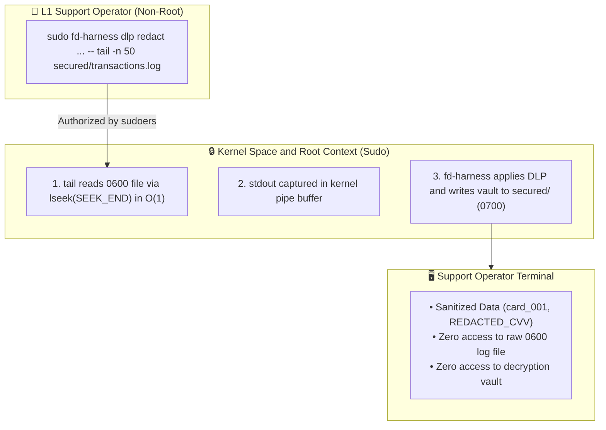

**Pourquoi ce pattern est une forteresse d'ingénierie :**
1. **Performance I/O en $O(1)$ :** En déléguant `tail` plutôt qu'un `cat` séquentiel, le processus fait un `lseek(SEEK_END)` pour ne lire que les dernières lignes voulues au lieu de scanner 50 Go de disque.
2. **Flexibilité des options via `-*` :** Le joker `-*` dans `sudoers` permet à l'opérateur de passer n'importe quel drapeau (`tail -n 20`, `tail -F`, `tail -n 100 -f`), tout en **verrouillant strictement le chemin du fichier** (toute tentative d'ouvrir `/etc/shadow` est rejetée par `sudo`).
3. **Interception avant sortie :** `fd-harness` intercepte la sortie de `tail` directement dans l'espace noyau/root avant de l'émettre.
4. **Isolation du coffre :** Le fichier de correspondance `vault-payments.jsonl` est stocké dans le répertoire `secured/` en `0700`. L'opérateur voit un stream parfaitement pseudonymisé pour diagnostiquer le problème, mais **ne possède pas les droits pour exécuter `dlp unmask`**. Seul un administrateur habilité pourra démasquer le compte incriminé en cas de litige.

> [!CAUTION] **Sécurité Sudoers : Pourquoi le joker `-*` doit impérativement verrouiller le chemin absolu**  
> Autoriser `tail *` dans `sudoers` est une vulnérabilité critique : un utilisateur malveillant pourrait passer `/etc/shadow` en paramètre. En écrivant `/usr/bin/tail -* /chemin/fixe/fichier.log`, `sudo` autorise n'importe quel drapeau d'options (`-n 50`, `-F`, `-q`), mais **refuse strictement tout autre chemin de fichier**.

*(Retrouvez la configuration sudoers complète, les scripts d'audit et de démasquage dans le lab compagnon : [`04-sudoers-dlp-bastion`](https://github.com/gpineda-dev/gpineda-dev.github.io/tree/main/labs/first-principles-samples/04-sudoers-dlp-bastion)).*

---

### 5.4 L'Ingénierie du "BiMap Vault" : Le Write-Ahead Log Frugal
Comment garantir un démasquage réversible sans maintenir une base de données lourde ni dupliquer inutilement la mémoire ?

Le coffre de correspondance (`BiMapVault`) repose sur deux principes fondamentaux :
1. **En Mémoire vive (RAM) :** Une structure bijective double ($A \to B$ et $B \to A$) pour une résolution en $O(1)$ temps constant.
2. **Sur Disque :** Un Write-Ahead Log (WAL) au format **JSONL événementiel non-redondant**. On ne persiste que les événements d'association canoniques :

```jsonl
{"type": "vault_settings", "properties": {"version": 1, "salt": "cluster-secret-salt-2026", "counters": {"cust": 2, "ip": 1}}}
{"type": "mapping_item", "properties": {"raw": "CUST-1042", "alias": "client_001", "rule_id": "customer-id", "created": 1789604316.348}}
{"type": "mapping_item", "properties": {"raw": "10.0.0.42", "alias": "internal_ip_01", "rule_id": "internal-ip", "created": 1789604316.350}}
```

Au rechargement ou pour le démasquage, la table inverse $B \to A$ est reconstruite au vol en mémoire. Zéro duplication de données, zéro format opaque.

---

### 5.5 La Boucle Bouclée : Le Démasquage Déterministe (`dlp unmask`)
Le stagiaire ou l'analyste a terminé son travail sur `sanitized-incident.log`.
Son verdict : *« L'incident est provoqué par le compte `client_001` qui envoie des requêtes malformées vers l'adresse `internal_ip_01` ! »*

En zone de production sécurisée, l'administrateur réinjecte le vault pour lever les pseudonymes et agir :

```bash
$ fd-harness dlp unmask -V vault.jsonl sanitized-incident.log > incident-resolved.log
```

Le moteur de démasquage compile l'ensemble des alias inverses en les triant par **longueur décroissante** (pour interdire toute collision de sous-chaînes, par exemple remplacer `client_1` à l'intérieur de `client_10`) et restaure fidèlement les valeurs originales : `CUST-1042` et `10.0.0.42`.

> [!NOTE] **Prévention des Collisions de Sous-Chaînes : Le Tri par Longueur Décroissante**  
> Lors du démasquage inverse (`dlp unmask`), si un alias court comme `client_1` est remplacé avant un alias plus long comme `client_10`, la chaîne `client_10` serait corrompue en `CUST-420`. Pour garantir une bijection mathématique parfaite, le moteur de démasquage compile toujours les motifs en les triant par **longueur décroissante** : $len(alias_i) \ge len(alias_{i+1})$.

---


```bash
$ bash test-system-sudo.sh 
========================================================================
    LAB 04: REAL SYSTEM SECURITY PROOF (USER: lab-support)
========================================================================

--- 1. Security Check: Direct Read of 0600 Log by lab-support ---
✅ SUCCESS: Direct access blocked (Permission denied, as expected).

--- 2. Security Check: Unauthorized Sudo Command by lab-support ---
✅ SUCCESS: Unauthorized command blocked by sudoers.

--- 3. Authorized Delegated Audit by lab-support (DLP Interposed) ---
2026-09-19T20:10:01Z [AUTH] ip=internal_ip_01 user=client_001 auth="Bearer [REDACTED_AUTH_TOKEN]" action=login status=SUCCESS
2026-09-19T20:10:05Z [PAYMENT] ip=internal_ip_01 user=client_001 pan=4532-****-****-1042 cvv=[REDACTED_CVV] amount=129.99 currency=EUR status=APPROVED txn_id=txn_881920
2026-09-19T20:11:15Z [AUTH] ip=internal_ip_02 user=client_002 auth="Bearer [REDACTED_AUTH_TOKEN]" action=login status=SUCCESS
2026-09-19T20:11:20Z [PAYMENT] ip=internal_ip_02 user=client_002 pan=4532-****-****-9988 cvv=[REDACTED_CVV] amount=45.50 currency=EUR status=APPROVED txn_id=txn_881921
2026-09-19T20:12:00Z [PAYMENT] ip=internal_ip_01 user=client_001 pan=4532-****-****-1042 cvv=[REDACTED_CVV] amount=890.00 currency=EUR status=DECLINED reason="INSUFFICIENT_FUNDS" txn_id=txn_881922
2026-09-19T20:12:30Z [INCIDENT] ip=internal_ip_01 user=client_001 retry_count=3 auth="Bearer [REDACTED_AUTH_TOKEN]" error="GATEWAY_TIMEOUT"

✅ SUCCESS: Delegated audit emitted sanitized stream without leaking plaintext secrets.

--- 4. Security Check: Vault Isolation from lab-support ---
✅ SUCCESS: Vault access blocked from support operator (0700 root:root).

--- 5. Compliance Admin Unmasking (Privileged Context) ---
Input  : Security alert on customer client_001 at internal_ip_01
Output : Security alert on customer CUST-1042 at 10.0.0.42
✅ SUCCESS: Privileged admin successfully resolved original identities.

========================================================================
    ALL SYSTEM SECURITY PROOFS PASSED (100% COMPLIANT BASTION)
========================================================================
```

Jetons un oeil au vault de correspondance généré par le superviseur `fd-harness` :
```bash
$ sudo cat secured/vault-payments.jsonl
{"type": "vault_settings", "properties": {"version": 1, "salt": "first-principles-bastion-salt-2026", "counters": {"cust": 2, "ip": 2}}}
{"type": "mapping_item", "properties": {"raw": "CUST-1042", "alias": "client_001", "rule_id": "customer-id", "created": 1789853878.215}}
{"type": "mapping_item", "properties": {"raw": "10.0.0.42", "alias": "internal_ip_01", "rule_id": "internal-ip", "created": 1789853878.215}}
{"type": "mapping_item", "properties": {"raw": "CUST-2099", "alias": "client_002", "rule_id": "customer-id", "created": 1789853878.215}}
{"type": "mapping_item", "properties": {"raw": "10.0.0.88", "alias": "internal_ip_02", "rule_id": "internal-ip", "created": 1789853878.215}}
```

## 6. Épilogue & Teaser : Vers le Microkernel de Flux (Acte II)

Ce que nous venons d'explorer à travers le prisme du DLP ne représente que la partie émergée de l'iceberg.

`dlp redact` n'est qu'un **coprocesseur** spécialisé greffé sur une membrane d'interposition de descripteurs de fichiers :

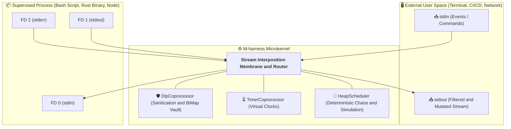

Si nous sommes capables d'intercepter `stdout` pour décoder des intentions à la volée et réécrire des flux en temps réel avec zéro dépendance... **que se passe-t-il lorsque le superviseur commence à manipuler l'entrée standard `stdin` et à déformer le temps perçu par l'application ?**

Dans le prochain article (**Acte II : Le Temps Virtuel & Le Chaos Déterministe**), nous verrons comment ce même microkernel permet d'accélérer le temps d'un script de test de 10 heures en 2 secondes, d'injecter des pannes I/O et de coordonner des topologies multi-processus complexes sans jamais toucher au code source.

---

### Références & Dépôts
* Code source du projet : [`gpineda-dev/fd-harness`](https://github.com/gpineda-dev/lab-fd-harness)
* Lab 01 (Socket Activation brute) : [`01-systemd-socket-bash-server`](https://github.com/gpineda-dev/lab-first-principles-samples/tree/main/01-systemd-socket-bash-server)
* Lab 02 (Machine à états ANSI CSI zéro-fork) : [`02-bash-ansi-csi`](https://github.com/gpineda-dev/lab-first-principles-samples/tree/main/02-bash-ansi-csi)
* Lab 03 (DLP in-band transparent sur systemd.socket) : [`03-systemd-socket-dlp-harness`](https://github.com/gpineda-dev/lab-first-principles-samples/tree/main/03-systemd-socket-dlp-harness)
* Lab 04 (Pattern Bastion SRE & délégation sudoers) : [`04-sudoers-dlp-bastion`](https://github.com/gpineda-dev/lab-first-principles-samples/tree/main/04-sudoers-dlp-bastion)
* [RFC 3875](https://datatracker.ietf.org/doc/html/rfc3875) : *The Common Gateway Interface (CGI) Version 1.1*
* Linux Kernel VFS & Pipes : `man 7 pipe`, `man 2 dup2`, `man 7 unix`