## 1. From the Omnidirectional Sonar to Systems Craft

In our manifesto ([*From the Whiteboard to First Principles*](/posts/2026-09-19-ai-exoskelton-for-builders-not-oracle/)), we introduced the **augmented engineer's omnidirectional sonar** (§4): the ability to dive frictionlessly across fifty years of operating systems history, extract deep theoretical invariants, and reinject them directly into modern architectures.

In our industry, the foundational primitives upon which our entire software stack rests are not necessarily the most academically immaculate. They are the battle-hardened survivors of a **ferocious technical Darwinism where the pragmatism of *Worse is Better* prevailed**:

* Where audacious research operating systems like **Plan 9 (Bell Labs)** sought absolute conceptual purity by turning network sockets into virtual filesystems manipulable straight from the shell (`/net/tcp/clone`),
* Where **Barrelfish (ETH Zurich / Microsoft Research)** reimagined the OS around asynchronous message-passing across heterogeneous cores rather than shared locked memory,
* **Unix dominated the world** thanks to a rustic, universal, and instantly available primitive: **the file descriptor and the anonymous byte stream**.

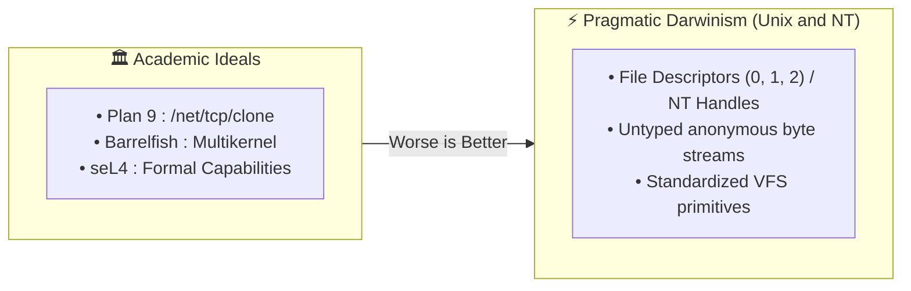

Swept up in relentless delivery cycles, the industry gradually forgot why these primitives were designed this way. We stacked bloated frameworks, nested containers, 500 MB sidecars, and third-party agents to achieve tasks that standard kernel primitives can execute with zero overhead.

For this first technical installment, let us begin with the most elementary (and yet most underestimated) primitive of all: **`stdout` (File Descriptor 1)**.

What is too often dismissed as a mere passive text dump for `printf()` (which under the hood is nothing more than a libc wrapper around `fprintf(stdout, ...)` or `dprintf(1, ...)`) has never been a passive conduit. Under the lens of a system tracer like `strace`, whether targeting a live TCP socket, an anonymous pipe, or a disk file, every high-level language abstraction collapses into the exact same foundational primitives: **`write(2)`** and **`read(2)`**.

This stream is far more than raw text: it is a **universal, reactive, and multiplexed communication bus**, ready to serve as an in-band security membrane and interposition plane.

---

## 2. The Descriptor Table and System Invariance (Linux & Windows)

To grasp the power of what traverses our terminals, we must venture beneath the surface of the kernel.

### 2.1 Anatomy of a Linux File Descriptor
A file descriptor is not a nebulous abstraction: **it is a simple integer index within a per-process kernel table** (`task_struct->files->fdt->fd[fd_num]`), pointing to a concrete kernel structure (`struct file`) equipped with its own table of I/O function pointers (`f_op`).

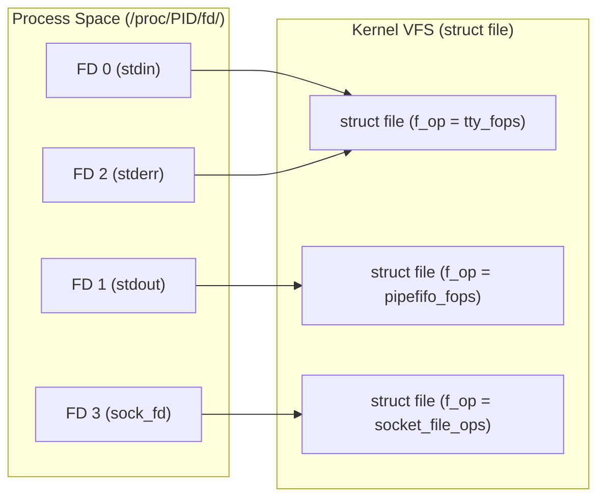

We can inspect this physical reality at any moment inside the `/proc` virtual filesystem:
```bash
$ ls -l /proc/$$/fd
lrwx------ 1 gpineda gpineda 64 0 -> /dev/pts/2           # stdin (interactive TTY)
lrwx------ 1 gpineda gpineda 64 1 -> /dev/pts/2           # stdout (interactive TTY)
lrwx------ 1 gpineda gpineda 64 2 -> /dev/pts/2           # stderr (interactive TTY)
l-wx------ 1 gpineda gpineda 64 3 -> pipe:[4189210]       # an anonymous pipe (IPC)
lrwx------ 1 gpineda gpineda 64 4 -> socket:[892138]      # an active TCP socket
```

For the Linux VFS (Virtual File System) layer, **reading from a `stdin` pipe, writing to `stdout`, streaming bytes across a TCP socket, or writing to a local file rely on the exact same POSIX system calls**:

$$\text{read}(fd, buf, size) \quad / \quad \text{write}(fd, buf, size) \quad / \quad \text{poll}(fds, ...)$$

When a child process writes to its descriptor `1`, it is completely oblivious to the ultimate destination of its bytes: a cathode-ray terminal in 1978, a local log file, a `zstd` compression pipe, or a remote browser on the other side of the planet via a single `dup2(sock_fd, 1)`.

### 2.2 The Windows NT Parallel: `HANDLE` and Named Pipes
This architecture is not unique to Linux. The Windows NT kernel relies on a strictly equivalent abstraction centered around the **`HANDLE` table** inside the executive `EPROCESS` block:

* **Standard Handles:** Where POSIX fixes integer constants `0, 1, 2`, Win32 provides the pseudo-constants `STD_INPUT_HANDLE`, `STD_OUTPUT_HANDLE`, and `STD_ERROR_HANDLE`, queried via `GetStdHandle()` and atomically reassignable via `SetStdHandle()`.
* **The Power of Named Pipes (`\\.\pipe\...`):** Windows took stream unification remarkably far through its dedicated **NPFS (*Named Pipe File System*)** driver. Windows Named Pipes offer not only anonymous byte streaming, but also **atomic message framing** and first-class integration with asynchronous I/O completion ports (**IOCP / `OVERLAPPED` I/O**).
* **The Backbone of Windows IPC:** From local LSASS authentication to RPC system services and container communication under WSL2 / Hyper-V, Named Pipes on Windows serve the exact same reactive architectural role as Unix domain sockets and pipes.

### 2.3 The Three Physical Superpowers of Streams
Whether running on Linux or Windows, this I/O model grants three fundamental superpowers to any supervisor process:

1. **Transparent Inheritance:** During `fork()` (POSIX) or `CreateProcess()` with `bInheritHandles = TRUE` (Win32), the child inherits open descriptors/handles from the parent. The parent can wire and seal all I/O streams before the child executes its very first machine instruction.
2. **Atomic Redirection:** Instantly swapping standard output for an anonymous pipe or socket in a single syscall (`dup2(2)` on Linux, `SetStdHandle()` on Windows).
3. **Inter-Process Transfer:** Teleporting an open descriptor from process A to a completely unrelated process B with no parent-child relationship (`sendmsg(2)` with `SCM_RIGHTS` over a Unix domain socket, or `DuplicateHandle()` on Windows).

Before teleporting descriptors, however, let us explore what we can accomplish with the most immediate capability: **intercepting and controlling the data stream flowing through `stdout` in real time**.

---

## 3. The Grand Panorama: Fifty Years of `stdout` Exploits

Historically, the most significant architectural leaps in software engineering have involved repurposing this humble output stream to carry application protocols, rendering engines, or infrastructure signals.

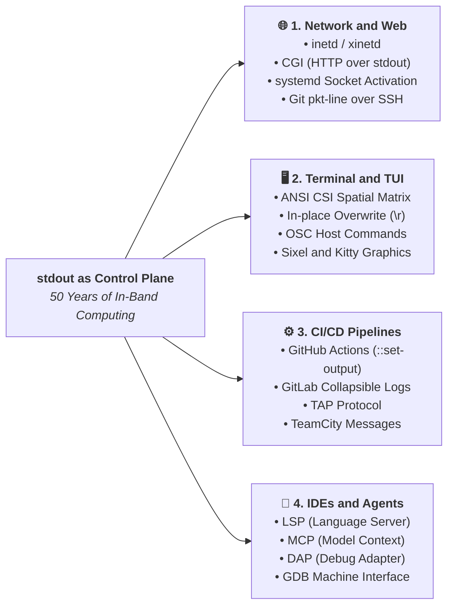

### 3.1 Network Super-Servers and the Early Web (1980 - 1993)

#### A. `inetd` / `xinetd` (1982): The Original Unix Super-Server

The direct ancestor of modern network orchestration and serverless computing. A single `inetd` daemon listened in the background across all configured TCP ports on the machine (FTP on port 21, Telnet on 23, Finger on 79).

As soon as a client initiated a TCP handshake:
1. `inetd` accepted the connection via `accept(2)`.
2. It spawned a child process via `fork(2)`.
3. It reassigned the accepted socket to the child's standard descriptors: `dup2(client_sock, 0)` and `dup2(client_sock, 1)`.
4. It executed the target service binary (`telnetd`, `ftpd`) via `execve(2)`.

**The application server contained zero lines of networking code**: it read incoming requests on `stdin` and wrote responses to `stdout`.

#### B. CGI (Common Gateway Interface - 1993): The Birth of the Dynamic Web on `stdout`

The entire dynamic Web (long before heavyweight application servers, containers, and asynchronous runtimes) was built on a specification spanning just a few pages, authored in 1993 by Rob McCool at the NCSA.

Its stroke of genius? **No new network protocol was created.** Instead, the HTTP protocol was mapped directly onto standard POSIX process mechanics:

| HTTP Component | POSIX System Vector | Kernel Mechanism & Role |
| :--- | :--- | :--- |
| **Request Headers** | **`char **envp`** (Environment Variables) | The Web server (NCSA HTTPd, Apache) parses the incoming request and injects metadata into the target process (`REQUEST_METHOD=POST`, `QUERY_STRING=id=42`, `CONTENT_LENGTH=128`, `HTTP_COOKIE=...`). |
| **Request Body (`POST`/`PUT`)** | **`stdin` (FD 0)** | Apache opens an anonymous `pipe(2)` and pushes the raw byte stream sent by the browser (JSON payload, URL-encoded form, file upload). |
| **Response Headers & Body** | **`stdout` (FD 1)** | The application script writes its response HTTP headers, emits the *in-band* demarcation boundary `\r\n\r\n`, and writes the HTML or JSON body. Apache intercepts the stream and forwards it to the client socket. |
| **Error & Debug Logs** | **`stderr` (FD 2)** | Any call to `warn()`, `die`, or `fprintf(stderr, ...)` is intercepted by the Web server and forwarded to `error.log` without corrupting the HTTP response sent to the user. |

A form-processing script in pure C took less than twenty lines, with zero external dependencies or HTTP libraries:

```c
#include <stdio.h>
#include <stdlib.h>
#include <unistd.h>

int main(void) {
    char *method = getenv("REQUEST_METHOD");
    int len = atoi(getenv("CONTENT_LENGTH") ? getenv("CONTENT_LENGTH") : "0");
    char body[1024] = {0};

    // Read POST payload directly from stdin (FD 0)
    if (len > 0 && len < sizeof(body)) {
        read(STDIN_FILENO, body, len);
    }

    // Emit headers, the in-band boundary "\r\n\r\n", and payload to stdout (FD 1)
    printf("Content-Type: text/plain\r\n\r\n");
    printf("Received via pure CGI (Method: %s, Payload: %s)\n", method, body);
    return 0;
}
```

##### The Physical Toll: From `fork`/`exec` to C10k and FastCGI

This model of pristine simplicity came with a direct hardware cost: **1 HTTP request = 1 `fork(2)` + 1 `execve(2)`**.  
For every incoming visitor, the server had to allocate a new virtual address space, load the interpreter binary (`perl`, `php`, or `python`) from physical disk, parse the script, and destroy the process upon page delivery.

When Web traffic surged beyond a few dozen requests per second in the late 1990s, this kernel process table saturation gave rise to the *C10k problem*. The industry's answer? **FastCGI (1996)**, followed by process managers like **`php-fpm`**: preserving the exact same stream contract (`stdin`/`stdout`/`stderr`), but over persistent Unix domain sockets with pre-forked worker pools.

#### C. `systemd` Socket Activation (2010+): The Modern Paradigm Pushed to Its Limits

`systemd` modernized and elevated this principle to the scale of the operating system. In its `Accept=yes` mode (the direct descendant of `inetd`), `systemd` holds the listening socket permanently open in the kernel. When an incoming SYN packet arrives, it accepts the connection and spawns a dedicated service instance, passing the connected socket directly on `stdin` (FD 0) and `stdout` (FD 1).

The result? A minimal Bash script becomes a concurrent HTTP server with zero external dependencies:

```ini
# ~/.config/systemd/user/bash-http.socket
[Socket]
ListenStream=127.0.0.1:8080
Accept=yes
```

```bash
#!/usr/bin/env bash
# bash-http-worker.sh
read -r request_line
echo -e "HTTP/1.1 200 OK\r\nContent-Type: text/plain\r\nConnection: close\r\n"
echo "Hello from pure Bash via systemd.socket! Request: ${request_line}"
```

**Total Agnosticism: Testing the Server Without Network or systemd:**  
Because the script simply reads from `FD 0` and writes to `FD 1`, we can test it locally with a standard Unix pipe (`|`):

```bash
$ echo "GET /index.html HTTP/1.1" | ./bash-http-worker.sh
HTTP/1.1 200 OK
Content-Type: text/plain
Connection: close

Hello from pure Bash via systemd.socket! Request: GET /index.html HTTP/1.1
```

In your terminal, `stdin` is fed by the `echo` pipe and `stdout` prints directly to your screen. Under `systemd`, `stdin` and `stdout` are wired to a client TCP socket. **For the application logic, it is strictly identical: a descriptor is a descriptor.**

##### i. Live Kernel Autopsy (`ss` & `/proc/<pid>/fd`)

```bash
$ curl -i http://127.0.0.1:8080/stream
HTTP/1.1 200 OK
Content-Type: text/plain; charset=utf-8
Connection: close

==> [START] Stream initiated at : 2026-09-19T18:28:49Z (PID: 518305)
==> [END]   Stream completed at : 2026-09-19T18:30:09Z
```

While a long-running HTTP request (`/stream`) is being served via `curl`, let us inspect the physical file descriptor table directly inside Linux kernel memory:

```bash
gpineda@ouvrage-serv1-debian:~$ sudo ss -4tuapni | grep 8080
tcp   LISTEN    0      4096       127.0.0.1:8080       0.0.0.0:*     users:(("systemd",pid=918,fd=32))                                                                                                     
tcp   TIME-WAIT 0      0          127.0.0.1:55772    127.0.0.1:8080                                                                                                                                        
tcp   ESTAB     0      0          127.0.0.1:47960    127.0.0.1:8080  users:(("curl",pid=518304,fd=4))                                                                                                      
tcp   ESTAB     0      0          127.0.0.1:8080     127.0.0.1:47960 users:(("sleep",pid=518322,fd=1),("sleep",pid=518322,fd=0),("bash",pid=518305,fd=1),("bash",pid=518305,fd=0),("systemd",pid=918,fd=8))

gpineda@ouvrage-serv1-debian:~$ sudo ls -lash /proc/518305/fd
total 0
0 dr-x------ 2 gpineda gpineda  4 Sep 19 20:28 .
0 dr-xr-xr-x 9 gpineda gpineda  0 Sep 19 20:28 ..
0 lrwx------ 1 gpineda gpineda 64 Sep 19 20:28 0 -> 'socket:[6066678]'
0 lrwx------ 1 gpineda gpineda 64 Sep 19 20:28 1 -> 'socket:[6066678]'
0 lrwx------ 1 gpineda gpineda 64 Sep 19 20:28 2 -> 'socket:[6070210]'
0 lr-x------ 1 gpineda gpineda 64 Sep 19 20:28 255 -> /home/gpineda/gpineda-dev/labs/first-principles-samples/01-systemd-socket-bash-server/bash-http-worker.sh

gpineda@ouvrage-serv1-debian:~$ sudo ls -lash /proc/918/fd
total 0
...
0 lrwx------ 1 gpineda gpineda 64 Sep 19 18:27 32 -> 'socket:[6065515]'     # TCP listening socket (systemd.socket)
0 lrwx------ 1 gpineda gpineda 64 Sep 19 20:28 8 -> 'socket:[6066678]'      # Active connected socket (accepted & passed to worker)

gpineda@ouvrage-serv1-debian:~$ systemctl --user status bash-http.socket
● bash-http.socket - Minimal Bash HTTP Socket Activation Demo
     Loaded: loaded (/home/gpineda/.config/systemd/user/bash-http.socket; disabled; preset: enabled)
     Active: active (listening) since Sat 2026-09-19 20:28:11 CEST; 7s ago
     Listen: 127.0.0.1:8080 (Stream)
   Accepted: 26; Connected: 0;
```

**The `ss` Conundrum: Where Did the Reverse-Proxy Go?**  
When encountering an architecture where a supervisor receives network traffic and spawns workers, an SRE's initial reflex is to look for the proxy (HAProxy, Nginx, or the classic enterprise **Apache `mod_jk` / `mod_proxy_ajp` bridge to a Java Tomcat** server on port 8009).

In a traditional reverse-proxy model, `ss` would show **two distinct TCP sessions**:
1. An *Ingress* frontend socket (`Client :47960 <-> Proxy :8080`).
2. An *Egress* backend socket (`Proxy :55442 <-> Worker :8009/9000` or a Unix Domain Socket).  
The intermediate proxy must allocate user-space memory buffers, serialize/deserialize packets (such as the binary AJP protocol for Java), and burn CPU cycles copying bytes between sockets.

Look closely at the `ESTAB` line from our `ss` output above:  
**There is only one single TCP socket in the entire Linux kernel (`127.0.0.1:8080 <-> 127.0.0.1:47960`).**  
`systemd` does not perform any proxying whatsoever. It accepted the connection and handed the physical descriptor directly to the `bash` worker's file table (PID 518305). When the script runs `echo`, it writes straight into the Linux kernel's TCP transmit queue (`sk_buff`). Zero intermediate network stack, zero bridging protocol, zero memory copying, zero networking overhead.

##### ii. Graphical Map of Flows and Descriptors (VFS)

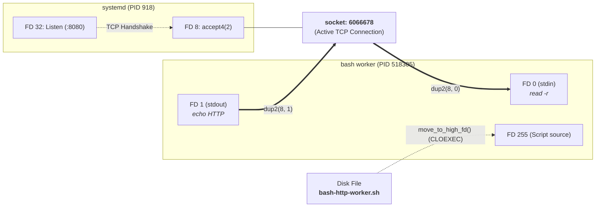

##### iii. `Accept=yes` vs `Accept=no`: Who Truly Owns the Descriptor?

Analyzing this topology highlights a fundamental architectural decision in systems engineering: **descriptor ownership management**.

* **The `Accept=yes` Trap (Worker Held Hostage by the Supervisor):**  
  In the mode we just inspected, `systemd` executes the `accept4(2)` syscall itself and retains an open descriptor (`FD 8`) on the active TCP connection while duplicating it to `FD 0` and `FD 1` of the worker.  
  Inside the Linux kernel, both processes point to the same `struct file`, whose reference counter (`f_count`) is at least 2.  
  **Consequence:** Even if our Bash script finishes, closes its descriptors, and exits cleanly (`exit 0`), the TCP `FIN` packet is not emitted and the socket is not freed from kernel RAM until `systemd` closes its own `FD 8`. If `systemd` encounters high load, CPU contention, or a delay in its `sd-event` loop, the connection remains stalled: the application is literally held hostage by the availability of PID 1.

* **The Sovereignty of `Accept=no` (Native Lifecycle & `SCM_RIGHTS` Delegation):**  
  Conversely, in `Accept=no` mode (used by Nginx, PostgreSQL, or Podman's daemonless `conmon` architecture), `systemd` never touches individual connections: it passes only the listening socket on descriptor 3 (`LISTEN_FDS=1`, following the `SD_LISTEN_FDS_START` convention) and gets out of the way entirely.  
  The application (or a lightweight supervisor daemon like `acceptd`) takes complete control of the lifecycle:
  1. It calls `accept4(2)` itself for each incoming client.
  2. It can manage the accepted socket in its own non-blocking event loop (`epoll`/`select`), or delegate it to a dedicated worker by teleporting the descriptor over a Unix Domain Socket using the kernel's **`SCM_RIGHTS`** ancillary data mechanism.
  3. Once the descriptor is passed to the worker, the supervisor immediately closes its local copy (`close(client_fd)`).  
  
  The supervisor is now **completely removed from the data path**: the moment the worker issues `close()`, the kernel reference counter drops instantly to zero, the TCP `FIN` is transmitted on the wire, and no resources remain captive.

> [!IMPORTANT] **The Production Trap: `f_count` Contention and Dependency on PID 1**  
> In `Accept=yes` mode, the descriptor remains open concurrently in both `systemd` and the worker process (`f_count >= 2`). If your worker terminates its work and calls `exit(0)`, the TCP connection **does not physically close on the wire** until `systemd`'s event loop closes its own copy of `FD 8`. Under CPU starvation or spike on PID 1, client HTTP connections remain stalled waiting for the `FIN` packet. For high-throughput services (Nginx, PostgreSQL), always favor `Accept=no` with `SCM_RIGHTS` delegation.

##### iv. The Mystery of FD 255: GNU Bash Self-Defense Mechanism

In our inspection of `/proc/518305/fd`, one line stands out:
`255 -> /home/.../bash-http-worker.sh`

Where did this file descriptor `255` come from, when the script never opened any such file?

This is a fascinating historical nuance in the GNU Bash source code:
* **The Stream Collision Problem:** When executing a shell script (`bash script.sh`), the interpreter opens the `.sh` file to read commands as execution progresses. If the script manipulates its own standard descriptors (for example `exec 3<&-` to close a stream or `exec 0< file.txt` to redirect input), it could inadvertently overwrite or close the descriptor feeding it its own source code!
* **Protection via `move_to_high_fd()`:** To protect its own input channel from developer mistakes or user redirections `0..9`, Bash immediately moves the script's file descriptor to the highest integer reserved by the shell: **FD 255** (defined as `DEFAULT_SAVED_LOC = 255` in Bash sources).
* **The `FD_CLOEXEC` Flag:** Bash also sets the `close-on-exec` flag on FD 255. When a subprocess like `sleep` is executed via `fork`/`execve`, FD 255 is automatically closed and does not leak into the child's descriptor table (as seen on PID 518322, which only retains `0` and `1`).

> [!TIP] **The Shell Golden Rule: Why You Must Never Touch FD 255**  
> To prevent a shell script from cutting the branch it is sitting on during `exec 0< ...` or `exec 3<&-` redirections, GNU Bash automatically shifts its internal code-reading descriptor to the highest available integer: `DEFAULT_SAVED_LOC = 255`. Attempting to manually close or hijack FD 255 (`exec 255>&-`) terminates the interpreter mid-execution.

The kernel's verdict is unambiguous: for the `bash` script and its `sleep` child process, **`stdin` (FD 0) and `stdout` (FD 1) are physically the network socket descriptor `socket:[6066678]`** assigned by `systemd`. The script writes to standard output, and the bytes travel instantly across the network.

*(Explore the code, systemd units, and automated Ansible deployment in companion lab: [`01-systemd-socket-bash-server`](https://github.com/gpineda-dev/gpineda-dev.github.io/tree/main/labs/first-principles-samples/01-systemd-socket-bash-server)).*

---

### 3.2 The Terminal as a Graphical and State Machine (1978+)

Most developers view their terminal as a simple, passive vertical scroll: a line is printed, the screen shifts down, and text stacks up.

In reality, a terminal emulator is a **2D in-memory matrix of character cells paired with a state machine**. The `stdout` stream does not merely transport text glyphs: **it carries the instruction set that drives this matrix**.

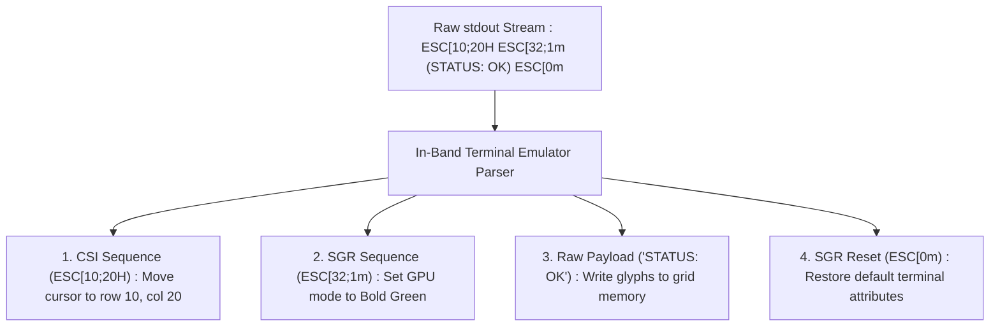

#### A. ANSI CSI Sequences: Spatial Cursor Control and the 2D Matrix

How do tools like `htop`, `tmux`, `curses`, or `vim` render windows, split panes, and rich user interfaces without opening a graphical window server (X11 or Wayland)? By leveraging **CSI (*Control Sequence Introducer*)** escape codes:
* **Absolute Cursor Jumps:** `\033[<row>;<col>H` instantly teleports the cursor anywhere on screen to rewrite a specific cell.
* **In-Place Overwrites (`\r`):** A simple carriage return without a line feed allows progress bars (`[=====>   ] 42%`) to continuously overwrite the same physical line without polluting terminal scrollback.
* **Selective Screen Clearing:** `\033[2J` (clears the entire screen matrix) and `\033[K` (erases from the cursor to the end of the current line).

```bash
# Example of in-place animated rendering via \r and SGR codes
for i in {1..100}; do
    printf "\r\033[32m[PROGRESS]\033[0m %3d%% \033[34m[%-20s]\033[0m" "$i" "$(printf '#%.0s' $(seq 1 $((i/5))))"
    sleep 0.02
done
echo ""
```

**Autopsy of the Byte Frame Injected into `stdout`:**

| Byte Sequence | Instruction Type | Role in Terminal State Machine |
| :--- | :--- | :--- |
| **`\r`** (`0x0D`) | Cursor Motion (*Carriage Return*) | Teleports write head to column 0 on the **same physical line** (without `\n`), overwriting the previous frame in memory. |
| **`\033[32m`** | CSI / SGR (*Select Graphic Rendition*) | `\033[` (`ESC [`) initiates control sequence; `32m` switches foreground color to **green**. |
| **`[PROGRESS]`** | Raw UTF-8 Payload | Textual glyphs written directly into the video matrix cells. |
| **`\033[0m`** | SGR Reset | Resets all color and styling attributes to terminal defaults. |
| **`%3d%%`** | Numeric Formatting | Allocates 3 right-aligned columns (`  5%` $\rightarrow$ `100%`) preventing horizontal jitter of the bar. |
| **`\033[34m`** | SGR Sequence | Activates **blue** foreground to frame and render progress blocks. |
| **`[%-20s]`** | String Formatting | Allocates a fixed 20-character left-aligned (`-`) container, automatically padded with trailing spaces. |

> [!WARNING] **The Hidden Cost of Shell: The `fork` per Frame Trap**  
> While the *in-band* protocol itself (`\r` and escape sequences) has zero I/O overhead, observe the kernel cost of such a loop in Bash:  
> Every subshell `$(seq ...)` and external `sleep` invocation triggers **`fork(2)` + `execve(2)`** syscalls.  
> For a 2-second progress bar, this script forces the Linux kernel to **spawn and destroy over 300 ephemeral processes**, burdening the CPU scheduler and adding micro-latencies. In C, Rust, or Go, the exact same loop issues direct `write(1, ...)` syscalls without creating a single process.

#### B. OSC Commands: Controlling the Host Operating System from `stdout`

**OSC (*Operating System Commands*)** sequences go even further: they allow a shell script to send direct commands to the host operating system's window manager!
* **Dynamic Terminal Tab Renaming (OSC 0):**
  ```bash
  echo -ne "\033]0;Cluster Prod EU-West [Master]\007"
  ```
  The emulator intercepts OSC 0, extracts the title, updates your desktop window title bar, and consumes zero character space on screen.
* **Native Clickable Hyperlinks (OSC 8):**
  Embeds a clickable URL behind displayed terminal text, exactly like an HTML `<a href="...">` anchor:
  ```bash
  echo -ne "\033]8;;https://gitlab.com/gpineda-dev-labs/fd-harness\033\\View Project\033]8;;\033\\"
  ```
* **Clipboard Teleportation over SSH (OSC 52):**
  A script running on a remote server halfway around the world can **populate your local workstation's clipboard** by writing a Base64 payload prefixed with `\033]52;c;...` to its `stdout`.

#### C. In-Band Bitmap Rendering: From DEC Sixel to Kitty & iTerm2 Protocols

The `stdout` stream is not restricted to vector characters: it can transport full bitmap graphics:
* **The Sixel Protocol (DEC VT330 - 1980s):**
  The original raster protocol. Images are sliced into 6-pixel vertical strips, with each 6-bit column mapped onto a printable ASCII character (`?` to `~`). Python scripts using `matplotlib` or `gnuplot` could render scientific plots directly in the terminal.
* **Modern Protocols (Kitty & iTerm2 Inline Images):**
  How do modern notebooks and CLI tools display high-definition charts without leaving the shell?
  ```bash
  # Direct emission of Base64 PNG in-band into stdout stream
  echo -ne "\033]1337;File=inline=1;width=600px:$(base64 -w0 plot.png)\007"
  ```
  The emulator intercepts the sequence, allocates an OpenGL/Metal texture at the cursor's exact coordinates, and normal text continues scrolling beneath it.

*(Explore the zero-fork interactive TUI dashboard, OSC demos, and performance benchmarks in companion lab: [`02-bash-ansi-csi`](https://github.com/gpineda-dev/gpineda-dev.github.io/tree/main/labs/first-principles-samples/02-bash-ansi-csi)).*

---

### 3.3 Modern CI/CD Engines and Build Pipelines

In continuous integration and deployment pipelines, `stdout` serves as the universal event bus linking build runners to the central orchestration platform.

#### A. GitHub Actions & GitLab CI: In-Band Platform Control

When a GitHub Actions runner needs to collapse a log group, emit a warning annotation, or export a build output variable, it makes no REST API calls. It simply writes formatted lines to standard output:

```bash
echo "::group::Compiling Rust binaries"
echo "::set-output name=release_tag::v1.4.2"
echo "::error file=main.rs,line=42::Null pointer exception"
echo "::endgroup::"
```

The runner agent intercepts these lines, strips them from the raw console output, and dynamically updates the GitHub UI in real time. GitLab CI uses the exact same approach with collapsible `\e[0Ksection_start:...` markers written to `stdout`.

#### B. Deterministic Test Protocols: TAP (*Test Anything Protocol*) & TeamCity

Long before JUnit XML and specialized metric databases, Larry Wall standardized the **TAP (*Test Anything Protocol*)** in 1987:
```text
1..3
ok 1 - Parse TCP SYN handshake
not ok 2 - PCI-DSS tokenization # TODO: Support Amex
ok 3 - File descriptor rotation
```
Similarly, JetBrains TeamCity parses live service messages from `stdout` (`##teamcity[testStarted name='test1']`) to update build dashboards with millisecond streaming precision and zero heavy agents.

---

### 3.4 The Era of AI Agents and Modern IDEs (2016 - 2026)

Today, the most advanced software engineering tools in the world rely on this very same primitive.

#### A. LSP (*Language Server Protocol*) & DAP (*Debug Adapter Protocol*)

How do editors like VSCode, Neovim, or Helix communicate with `rust-analyzer`, `gopls`, or `clangd`?  
They do not load C++ plugins into the editor process. The editor spawns the language server binary as a child process and communicates via **JSON-RPC frames over `stdin` and `stdout`**:

```text
Content-Length: 118\r\n\r\n
{"jsonrpc":"2.0","method":"textDocument/completion","params":{"textDocument":{"uri":"file:///main.rs"},"position":{"line":42,"character":12}}}
```

#### B. MCP (*Model Context Protocol*): The Universal Standard for LLM Agents

Introduced by Anthropic and adopted across the AI development ecosystem (Claude, Antigravity, Cursor), the **Model Context Protocol (MCP)** standardizes how AI agents invoke local tools (DuckDB databases, Bash execution, codebase search).  
The primary, recommended transport for MCP? **Standard `stdio` streams (`stdin`/`stdout`)**. No web server to configure, no network ports to expose, just a spawned Unix process whose standard streams are wired directly into the agent runtime.

---

### 3.5 The Builder's Synthesis: The `# @harness` Directive

This is where **`fd-harness`** was born.

If fifty years of operating systems history prove that `stdout` is the most frugal and universal medium for controlling environments without heavyweight SDKs: **why not use this exact same *in-band* channel for data security, observability, and compliance?**

When an application script emits an in-band control directive into its stream:
```bash
echo "# @harness.filter:mask pattern='(?P<token>sec_[a-zA-Z0-9]{24})' target=token"
```

The I/O contract achieves **flawless graceful degradation**:
* **In Standard Execution (Without `fd-harness`):** The line travels through `stdout` as a standard shell comment (`# ...`), completely harmless to downstream parsers (YAML, INI, JSONL, or a basic `grep -v '^#'`).
* **Under the `fd-harness run` Supervisor:** The I/O membrane intercepts the in-band directive, reconfigures its tokenization or masking engine on the fly, and **swallows the line** (stripping it from the stream) so that downstream consumers never see the control message.

---

## 4. The Use Case: The Intern's Dilemma and Production Logs

Let us formulate the concrete engineering challenge that will serve as our running thread.

### 4.1 The Real-World Scenario
It is Friday at 5:00 PM. A critical production incident strikes your banking platform. Intermittent anomalies are corrupting a fraction of financial transactions. You have just extracted a 2 GB log dump (`production-incident.log.zst`).

You must hand this log dump over to a junior developer, an intern, an external contractor, or feed it to a Large Language Model (LLM) for automated root-cause analysis.

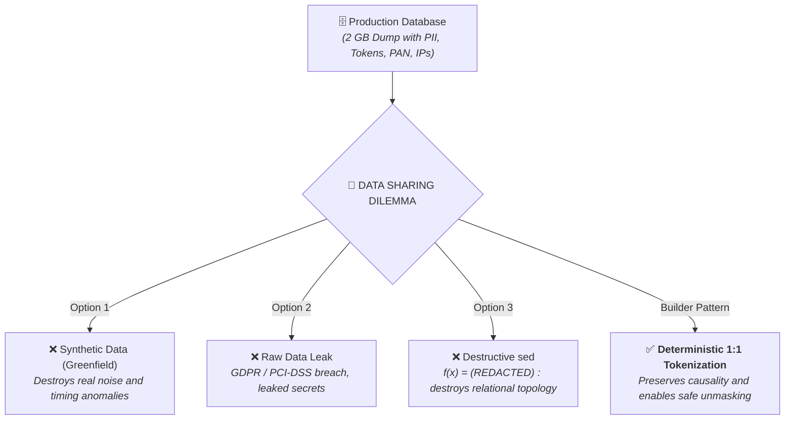

### 4.2 The 3 Classic Failures:
1. **The Synthetic Data Illusion (Greenfield):** Generating clean, artificial logs in a test sandbox is useless for debugging. It strips away real-world noise, timestamp jitter, network micro-latencies, and complex production edge cases.
2. **The Legal and Security Catastrophe:** Sharing raw logs violates GDPR, PCI-DSS, and leaks active session tokens (`Bearer sec_...`), credit card PANs, internal network topologies (`10.0.0.42`), and customer identifiers (`CUST-1042`).
3. **The Destructive `sed` Trap:**
   Applying a naive destructive filter:
   $$f(x) = \text{"[REDACTED]"}$$
   **destroys the relational topology of the incident.** You can no longer tell whether the `[REDACTED]` that initiated a request at 14:02:10 is the same `[REDACTED]` that triggered the database deadlock at 14:02:15. The log is anonymized, but it is now **useless for troubleshooting**.

---

### 4.3 Fundamental Aside: Pseudonymization $\neq$ Anonymization (The State of the Art)

In strict regulatory environments (**GDPR** in Europe and **PCI-DSS Requirement 3** in the financial industry), widespread confusion persists between **Anonymization** and **Pseudonymization**:

* **Anonymization (Irreversible Destruction):** A one-way operation that permanently eliminates any link between the data and the individual. Mandatory for absolute secrets (CVV security codes, passwords, private keys). However, it breaks all relational debugging capability.
* **Pseudonymization (Reversible 1:1 Tokenization):** Replaces sensitive identifiers with synthetic aliases while securing the translation keys in a restricted vault. **The relational link $A \leftrightarrow B$ remains intact for the investigator**, but the underlying sensitive data is shielded.

> [!NOTE] **Regulatory Boundary: GDPR (Art. 4 §5) vs PCI-DSS (Requirement 3)**  
> Irreversible destruction (**Anonymization / `mask`**) is **legally mandatory** for sensitive authentication data (SAD: CVV card codes, PIN blocks, passwords). In contrast, reversible 1:1 tokenization (**Pseudonymization / `alias`**) is fully recognized and recommended for account identifiers and card PANs, provided the decryption vault (`vault.jsonl`) is isolated in a physically and cryptographically restricted security zone.

Across any streaming data pipeline, there exist only **three fundamental mathematical operations**:

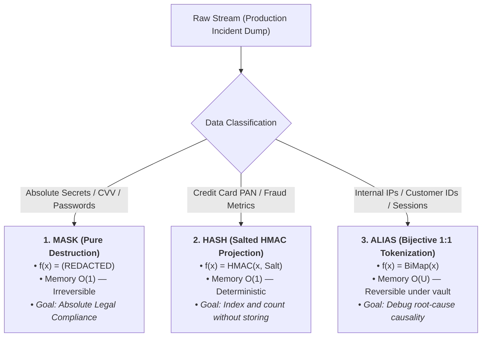

#### Autopsy of a Real Incident Log Line

To illustrate the practical power of this triptyque, observe the physical transformation of a JSON event extracted from our production dump:

**1. Before the DLP Filter (Raw production log - Critical compliance leak):**
```json
{"time": "14:02:10", "ip": "10.0.0.42", "user": "CUST-1042", "token": "sec_8819ab21", "pan": "4532-0155-8891-1042", "cvv": "842"}
```

**2. After Passing Through the DLP Membrane (Safe for intern / LLM / external audit):**
```json
{"time": "14:02:10", "ip": "internal_ip_01", "user": "client_001", "token": "tok_01", "pan": "pan_3f8a1b2c", "cvv": "[REDACTED]"}
```

* **The CVV code `842`** is permanently purged (`mask` destructive $O(1)$): zero residual trace.
* **The Credit Card PAN** is projected into an HMAC digest `pan_3f8a1b2c` (`hash` $O(1)$) for fraud metrics, or formatted according to PCI-DSS standard `4532-****-****-1042` (`mask` First 4 / Last 4) for operational display.
* **The IP address, customer ID, and token** become bijective aliases (`alias` $O(U)$): the investigator can correlate 10,000 requests from `client_001` to `internal_ip_01` across the cluster without ever accessing the underlying secrets.

---

## 5. Under the Hood: Reactive Interposition with `fd-harness`

This is where **`fd-harness`** comes in: our lightweight file descriptor microkernel prototype written in pure Python (100% standard library, zero external dependencies).

### 5.1 Reactive In-Band Interposition (`fd-harness run`)
How can an application script or batch job self-protect dynamically without loading proprietary SDKs or modifying build dependencies? By leveraging in-band control sequences on `stdout`!

Consider the following Bash script (`provision-worker.sh`, taken directly from our lab samples):

```bash
#!/usr/bin/env bash
echo "==> [INIT] Starting cluster provisioning..."

# 1. In-band directive emitted to stdout for 1:1 secret pseudonymization
echo '# @harness.filter:mask pattern="sec_[a-z0-9]{8}" action="alias" template="tok_{seq:02d}"'

# 2. In-band directive to hash static production API keys
echo '# @harness.filter:mask pattern="sk_live_[a-z0-9]{16}" action="hash" template="sk_{hash:8}"'

echo "==> [AUTH] Connecting to primary cluster with secret : sec_8819ab21"
echo "==> [API]  Verifying license with API key : sk_live_9948ab12cf345678"
echo "==> [AUTH] Refreshing session for backup key : sec_4410cd99"
echo "==> [AUTH] Reusing first session secret : sec_8819ab21"
echo "==> [DONE] Provisioning completed."
```

#### A. Direct Execution (Unsupervised)
Secrets leak in plain text to the console and CI/CD logs:
```text
==> [INIT] Starting cluster provisioning...
# @harness.filter:mask pattern="sec_[a-z0-9]{8}" action="alias" template="tok_{seq:02d}"
# @harness.filter:mask pattern="sk_live_[a-z0-9]{16}" action="hash" template="sk_{hash:8}"
==> [AUTH] Connecting to primary cluster with secret : sec_8819ab21
==> [API]  Verifying license with API key : sk_live_9948ab12cf345678
==> [AUTH] Refreshing session for backup key : sec_4410cd99
==> [AUTH] Reusing first session secret : sec_8819ab21
==> [DONE] Provisioning completed.
```

#### B. Supervised Execution (`fd-harness run`)
```bash
$ fd-harness run ./provision-worker.sh
==> [INIT] Starting cluster provisioning...
==> [AUTH] Connecting to primary cluster with secret : tok_01
==> [API]  Verifying license with API key : sk_4a9b2c1d
==> [AUTH] Refreshing session for backup key : tok_02
==> [AUTH] Reusing first session secret : tok_01
==> [DONE] Provisioning completed.
```

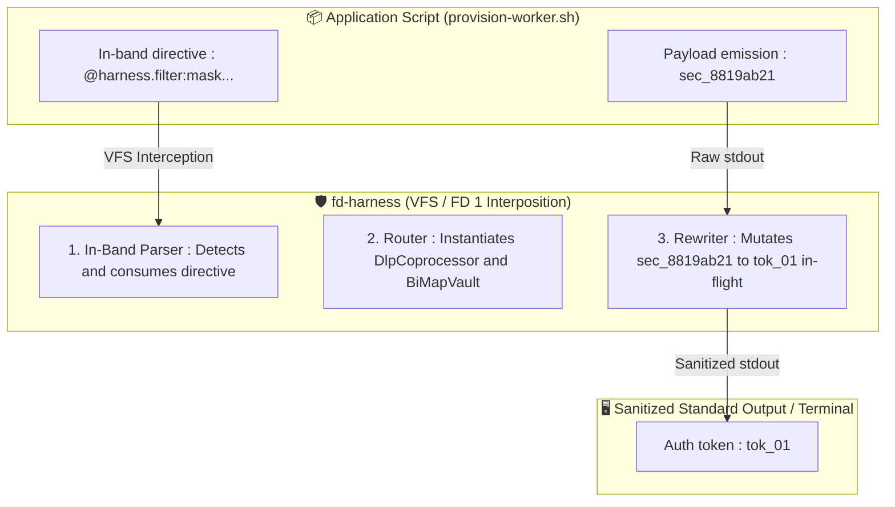

**What Actually Occurred:**
1. The `# @harness.filter:mask ...` lines were **intercepted and stripped from the stream by the supervisor**. They never appear in the final output.
2. The internal `CoprocessorRouter` dynamically instantiated the pseudonymization and hashing rules on the fly.
3. Subsequent lines were rewritten in-flight while preserving strict bijective mapping (`sec_8819ab21` reliably resolved back to `tok_01` on repeat occurrences).

---

### 5.2 Declarative Interposition on `systemd.socket` (The Network Membrane)

In the *in-band* mode (§5.1), the script explicitly emitted its own directives. In production enterprise environments, however, **security and SRE teams cannot (and should not) modify legacy application code**.

How can we fully secure the pure Bash HTTP server deployed in §3.1 without altering a **single line** of `bash-http-worker.sh`?

By placing the `fd-harness` membrane directly in-flight between the `systemd` socket descriptor and the application worker:

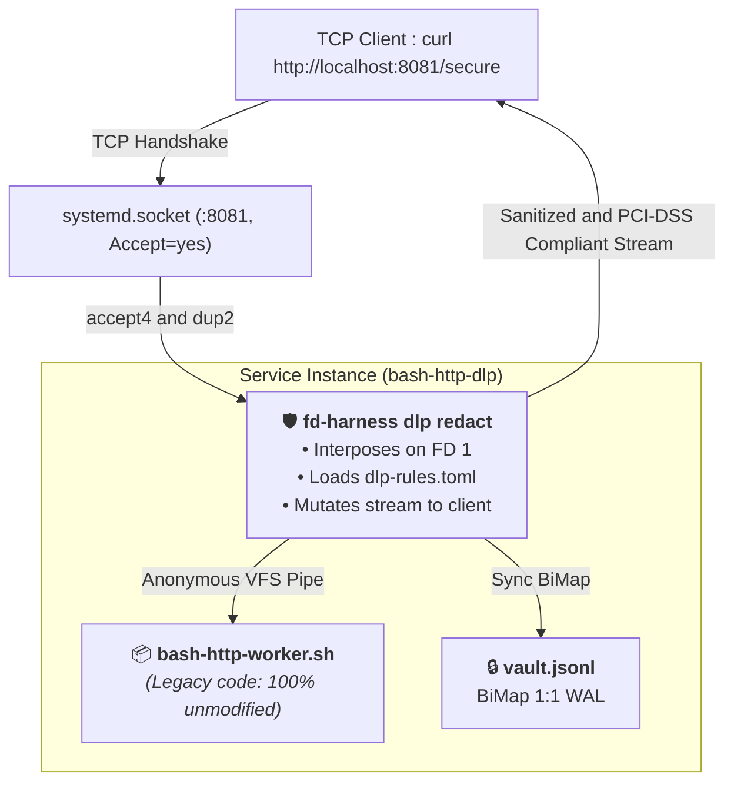

#### A. Security Policy Declaration (`dlp-rules.toml`)
We formalize banking compliance and GDPR rules in a declarative TOML configuration:

```toml
[dlp]
fail_on_leak = false
summary = false
vault_file = "vault.jsonl"
salt = "first-principles-secret-salt-2026"

# 1. 1:1 Bijective Pseudonymization of Customer IDs (GDPR)
[[rules]]
name = "customer-id"
pattern = 'CUST-\d{4}'
action = "alias"
template = "client_{seq.cust:03d}"

# 2. Pseudonymization of Internal Infrastructure IP Addresses
[[rules]]
name = "internal-ip"
pattern = '10\.\d{1,3}\.\d{1,3}\.\d{1,3}'
action = "alias"
template = "internal_ip_{seq.ip:02d}"

# 3. Destructive Masking of Session Bearer Tokens
[[rules]]
name = "bearer-auth"
pattern = 'Bearer\s+sec_[A-Za-z0-9_]+'
action = "mask"
replacement = "Bearer [REDACTED_AUTH_TOKEN]"

# 4. Canonical PCI-DSS Masking (First 4 + Last 4) via Named Groups
[[rules]]
name = "card-pan"
pattern = '(?P<bin>\d{4})-\d{4}-\d{4}-(?P<last4>\d{4})'
action = "mask"
template = "{bin}-****-****-{last4}"

# 5. Pure Destruction of CVV Codes (SAD - Sensitive Authentication Data)
[[rules]]
name = "card-cvv"
pattern = '(?<=Card CVV\s{5}:\s)\d{3}'
action = "mask"
replacement = "[REDACTED_CVV]"
```

#### B. The Supervised `systemd` Service Unit
In `~/.config/systemd/user/bash-http-dlp@.service`, we wrap the worker execution:

```ini
[Unit]
Description=DLP-Supervised Bash HTTP Worker
After=network.target

[Service]
ExecStart=/usr/local/bin/fd-harness dlp redact \
  --rules %h/.config/harness/dlp-rules.toml \
  --vault %h/.local/share/fd-harness/vault-http.jsonl \
  --no-summary \
  -- %h/scripts/bash-http-worker.sh
StandardInput=socket
StandardOutput=socket
StandardError=journal
```

#### C. The Network Test: Live Comparison

Querying the sensitive `/secure` endpoint on the raw port (:8080) versus the `fd-harness` supervised port (:8081):

```bash
# 1. Raw endpoint (Port 8080 - Compliance Leak)
$ curl -s http://127.0.0.1:8080/secure
Transaction Details:
Customer ID  : CUST-1042
Internal IP  : 10.0.0.42
Auth Token   : Bearer sec_9948ab12cf345678
Card PAN     : 4532-0155-8891-1042
Card CVV     : 842
Status       : APPROVED

# 2. Supervised endpoint via fd-harness (Port 8081 - Zero Leaks, 100% Compliant)
$ curl -s http://127.0.0.1:8081/secure
Transaction Details:
Customer ID  : client_001
Internal IP  : internal_ip_01
Auth Token   : Bearer [REDACTED_AUTH_TOKEN]
Card PAN     : 4532-****-****-1042
Card CVV     : [REDACTED_CVV]
Status       : APPROVED
```

*(Or via a direct Unix pipe: `curl -s http://127.0.0.1:8080/secure | fd-harness dlp redact -r dlp-rules.toml`)*.

**The result is instantaneous:** The `bash-http-worker.sh` script remained completely unmodified. The I/O membrane interposed itself between the socket descriptor and the process, applying PCI-DSS formatting, bijective pseudonymization, and token destruction transparently to both client and server.

> [!TIP] **Zero-SDK & Zero-Patch: The Network Membrane Pattern**  
> Wrapping the worker at the `systemd.socket` level rather than inside application code allows legacy services to emit plaintext logs to `stdout` oblivious to encryption. Security and Platform teams can dynamically update or harden DLP policies (`dlp-rules.toml`) in-flight without rebuilding, patching, or restarting business services.

*(Explore the complete deployment, socket units, and automated tests in companion lab: [`03-systemd-socket-dlp-harness`](https://github.com/gpineda-dev/gpineda-dev.github.io/tree/main/labs/first-principles-samples/03-systemd-socket-dlp-harness)).*

---

### 5.3 The SRE Bastion Pattern: Secure Delegation via `/etc/sudoers`

Here is a particularly powerful security architecture pattern: **how can we permit Tier 1 / Tier 2 support engineers or contractors to audit highly sensitive log files without ever granting them access to plaintext secrets?**

Imagine a payment transaction log stored inside a protected directory `secured/transactions.log` set to `chmod 0600 root:root` (containing credit card PANs and auth tokens).

Granting sudo access to `cat` or `tail` exposes all secrets directly to the operator.
Instead, by wrapping the command under `fd-harness` inside `/etc/sudoers.d/99-support-dlp` using `sudo` glob matching:

```sudoers
# The operator can run tail with ANY option (-*), STRICTLY on this specific file
%support ALL=(root) NOPASSWD: /usr/local/bin/fd-harness dlp redact \
  -r /opt/first-principles/dlp-pci.toml \
  -V /opt/first-principles/secured/vault-payments.jsonl \
  --no-summary \
  -- /usr/bin/tail -* /opt/first-principles/secured/transactions.log
```

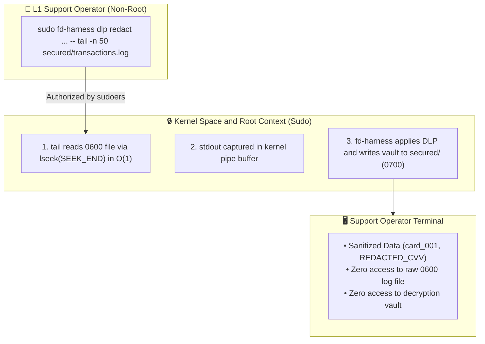

**Why This Pattern Is an Engineering Fortress:**
1. **$O(1)$ Seek Performance:** By delegating `tail` instead of sequential `cat`, the process issues `lseek(SEEK_END)` to read only the desired trailing lines rather than scanning a 50 GB file from disk.
2. **Flag Flexibility via `-*`:** The `-*` wildcard in `sudoers` allows the operator to pass any flags (`tail -n 20`, `tail -F`, `tail -n 100 -f`), while **strictly locking down the file path** (any attempt to open `/etc/shadow` is rejected by `sudo`).
3. **In-Flight Interposition:** `fd-harness` intercepts `tail` output directly in root kernel space before emitting bytes to user space.
4. **Vault Isolation:** The mapping database `vault-payments.jsonl` is written to `secured/` with `0700` permissions. The operator sees a sanitized stream to diagnose the issue, but **lacks the permissions to run `dlp unmask`**. Only an authorized administrator can unmask the customer records during formal dispute resolution.

> [!CAUTION] **Sudoers Security: Why the `-*` Wildcard MUST Strictly Lock the Absolute File Path**  
> Granting `tail *` in `sudoers` is a critical security vulnerability: a malicious operator could pass `/etc/shadow` as an argument. By configuring `/usr/bin/tail -* /fixed/path/to/file.log`, `sudo` permits any operational flag (`-n 50`, `-F`, `-q`), but **strictly rejects any unauthorized file path**.

*(Explore the complete sudoers configuration, audit, and unmasking scripts in companion lab: [`04-sudoers-dlp-bastion`](https://github.com/gpineda-dev/gpineda-dev.github.io/tree/main/labs/first-principles-samples/04-sudoers-dlp-bastion)).*

---

### 5.4 The Engineering of the "BiMap Vault": The Frugal Write-Ahead Log
How do we guarantee reversible unmasking without maintaining a heavyweight database or duplicating memory?

The mapping vault (`BiMapVault`) relies on two core design principles:
1. **In-Memory (RAM):** A dual-map bijective structure ($A \to B$ and $B \to A$) enabling constant-time $O(1)$ lookups.
2. **On Disk:** A Write-Ahead Log (WAL) structured as **non-redundant append-only JSONL events**. Only canonical creation events are persisted:

```jsonl
{"type": "vault_settings", "properties": {"version": 1, "salt": "cluster-secret-salt-2026", "counters": {"cust": 2, "ip": 1}}}
{"type": "mapping_item", "properties": {"raw": "CUST-1042", "alias": "client_001", "rule_id": "customer-id", "created": 1789604316.348}}
{"type": "mapping_item", "properties": {"raw": "10.0.0.42", "alias": "internal_ip_01", "rule_id": "internal-ip", "created": 1789604316.350}}
```

Upon reload or during unmasking, the reverse mapping table $B \to A$ is reconstructed on the fly in memory. Zero data duplication, zero opaque binary formats.

---

### 5.5 Closing the Loop: Deterministic Unmasking (`dlp unmask`)
The junior engineer or analyst completes their investigation on `sanitized-incident.log`.  
Their verdict: *“The outage is triggered by account `client_001` transmitting malformed payloads to address `internal_ip_01`!”*

Inside the secure production zone, the administrator uses the vault to reverse the aliases:

```bash
$ fd-harness dlp unmask -V vault.jsonl sanitized-incident.log > incident-resolved.log
```

The unmasking engine compiles all inverse aliases, sorts them by **descending string length** (to prevent substring collisions, such as replacing `client_1` inside `client_10`), and faithfully restores the original values: `CUST-1042` and `10.0.0.42`.

> [!NOTE] **Substring Collision Prevention: Sorting by Descending Length**  
> During reverse unmasking (`dlp unmask`), if a shorter alias like `client_1` were substituted prior to a longer alias like `client_10`, the string `client_10` would be mangled into `CUST-420`. To guarantee mathematical bijection, the unmasking engine always compiles and applies substitution patterns sorted by **descending length**: $len(alias_i) \ge len(alias_{i+1})$.

---

```bash
$ bash test-system-sudo.sh 
========================================================================
    LAB 04: REAL SYSTEM SECURITY PROOF (USER: lab-support)
========================================================================

--- 1. Security Check: Direct Read of 0600 Log by lab-support ---
✅ SUCCESS: Direct access blocked (Permission denied, as expected).

--- 2. Security Check: Unauthorized Sudo Command by lab-support ---
✅ SUCCESS: Unauthorized command blocked by sudoers.

--- 3. Authorized Delegated Audit by lab-support (DLP Interposed) ---
2026-09-19T20:10:01Z [AUTH] ip=internal_ip_01 user=client_001 auth="Bearer [REDACTED_AUTH_TOKEN]" action=login status=SUCCESS
2026-09-19T20:10:05Z [PAYMENT] ip=internal_ip_01 user=client_001 pan=4532-****-****-1042 cvv=[REDACTED_CVV] amount=129.99 currency=EUR status=APPROVED txn_id=txn_881920
2026-09-19T20:11:15Z [AUTH] ip=internal_ip_02 user=client_002 auth="Bearer [REDACTED_AUTH_TOKEN]" action=login status=SUCCESS
2026-09-19T20:11:20Z [PAYMENT] ip=internal_ip_02 user=client_002 pan=4532-****-****-9988 cvv=[REDACTED_CVV] amount=45.50 currency=EUR status=APPROVED txn_id=txn_881921
2026-09-19T20:12:00Z [PAYMENT] ip=internal_ip_01 user=client_001 pan=4532-****-****-1042 cvv=[REDACTED_CVV] amount=890.00 currency=EUR status=DECLINED reason="INSUFFICIENT_FUNDS" txn_id=txn_881922
2026-09-19T20:12:30Z [INCIDENT] ip=internal_ip_01 user=client_001 retry_count=3 auth="Bearer [REDACTED_AUTH_TOKEN]" error="GATEWAY_TIMEOUT"

✅ SUCCESS: Delegated audit emitted sanitized stream without leaking plaintext secrets.

--- 4. Security Check: Vault Isolation from lab-support ---
✅ SUCCESS: Vault access blocked from support operator (0700 root:root).

--- 5. Compliance Admin Unmasking (Privileged Context) ---
Input  : Security alert on customer client_001 at internal_ip_01
Output : Security alert on customer CUST-1042 at 10.0.0.42
✅ SUCCESS: Privileged admin successfully resolved original identities.

========================================================================
    ALL SYSTEM SECURITY PROOFS PASSED (100% COMPLIANT BASTION)
========================================================================
```

Let's inspect the correlation vault generated on the fly by the `fd-harness` supervisor:
```bash
$ sudo cat secured/vault-payments.jsonl
{"type": "vault_settings", "properties": {"version": 1, "salt": "first-principles-bastion-salt-2026", "counters": {"cust": 2, "ip": 2}}}
{"type": "mapping_item", "properties": {"raw": "CUST-1042", "alias": "client_001", "rule_id": "customer-id", "created": 1789853878.215}}
{"type": "mapping_item", "properties": {"raw": "10.0.0.42", "alias": "internal_ip_01", "rule_id": "internal-ip", "created": 1789853878.215}}
{"type": "mapping_item", "properties": {"raw": "CUST-2099", "alias": "client_002", "rule_id": "customer-id", "created": 1789853878.215}}
{"type": "mapping_item", "properties": {"raw": "10.0.0.88", "alias": "internal_ip_02", "rule_id": "internal-ip", "created": 1789853878.215}}
```

---

## 6. Epilogue & Teaser: Towards the Stream Microkernel (Act II)

What we have explored through DLP is merely the tip of the iceberg.

`dlp redact` is simply one specialized **coprocessor** attached to a file descriptor interposition membrane:

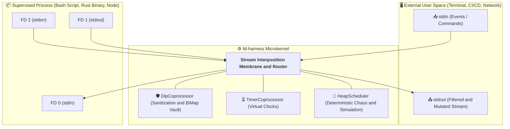

If we can intercept `stdout` to decode intentions on the fly and rewrite streams in real time with zero dependencies... **what happens when the supervisor begins manipulating standard input `stdin` and warping the time perceived by the application?**

In our next installment (**Act II: Virtual Time & Deterministic Chaos**), we will see how this same microkernel can compress a 10-hour test suite into 2 seconds of real time, inject deterministic I/O failures, and orchestrate complex multi-process topologies without touching a single line of source code.

---

### References & Repositories
* Project Source Code: [`gpineda-dev/fd-harness`](https://github.com/gpineda-dev/fd-harness)
* Lab 01 (Raw Socket Activation): [`01-systemd-socket-bash-server`](https://github.com/gpineda-dev/lab-first-principles-samples/tree/main/01-systemd-socket-bash-server)
* Lab 02 (Zero-Fork ANSI CSI State Machine): [`02-bash-ansi-csi`](https://github.com/gpineda-dev/lab-first-principles-samples/tree/main/02-bash-ansi-csi)
* Lab 03 (Transparent In-Band DLP on systemd.socket): [`03-systemd-socket-dlp-harness`](https://github.com/gpineda-dev/lab-first-principles-samples/tree/main/03-systemd-socket-dlp-harness)
* Lab 04 (SRE Bastion Pattern & sudoers Delegation): [`04-sudoers-dlp-bastion`](https://github.com/gpineda-dev/lab-first-principles-samples/tree/main/04-sudoers-dlp-bastion)
* [RFC 3875](https://datatracker.ietf.org/doc/html/rfc3875): *The Common Gateway Interface (CGI) Version 1.1*
* Linux Kernel VFS & Pipes: `man 7 pipe`, `man 2 dup2`, `man 7 unix`
