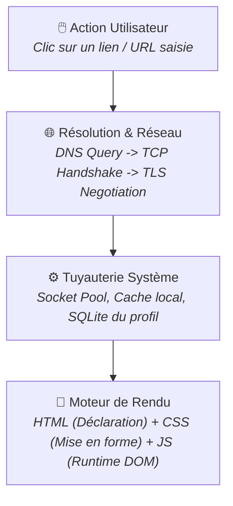
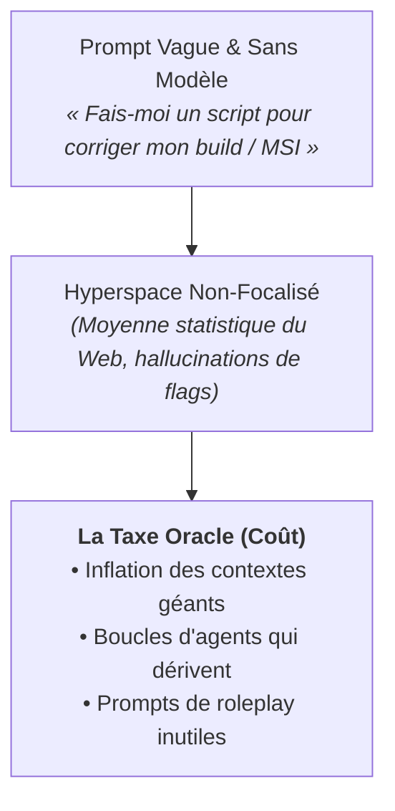
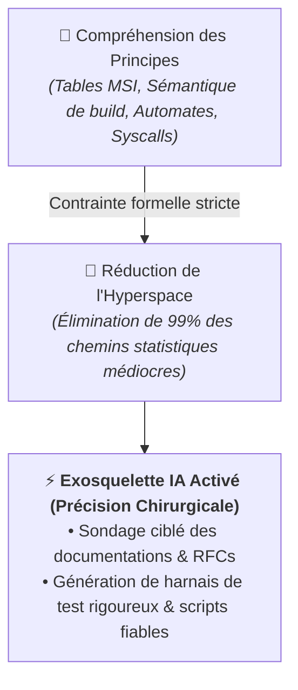
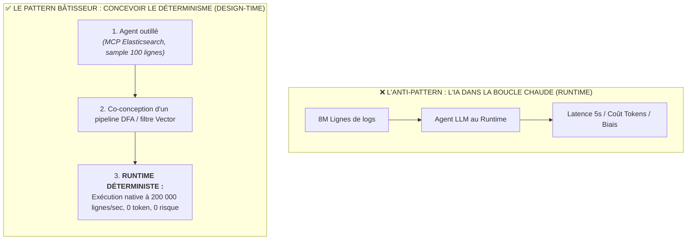
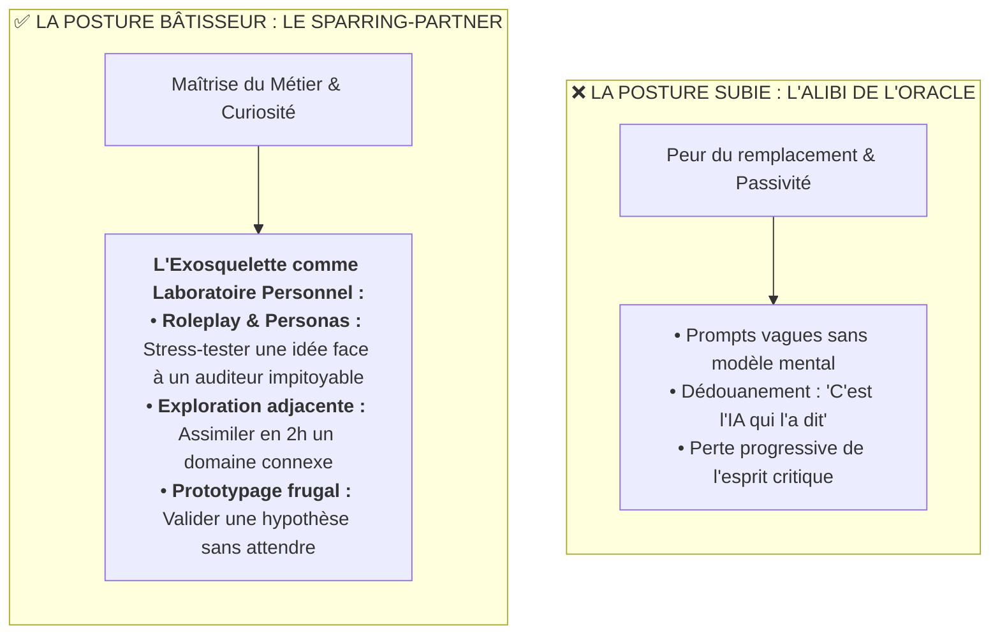
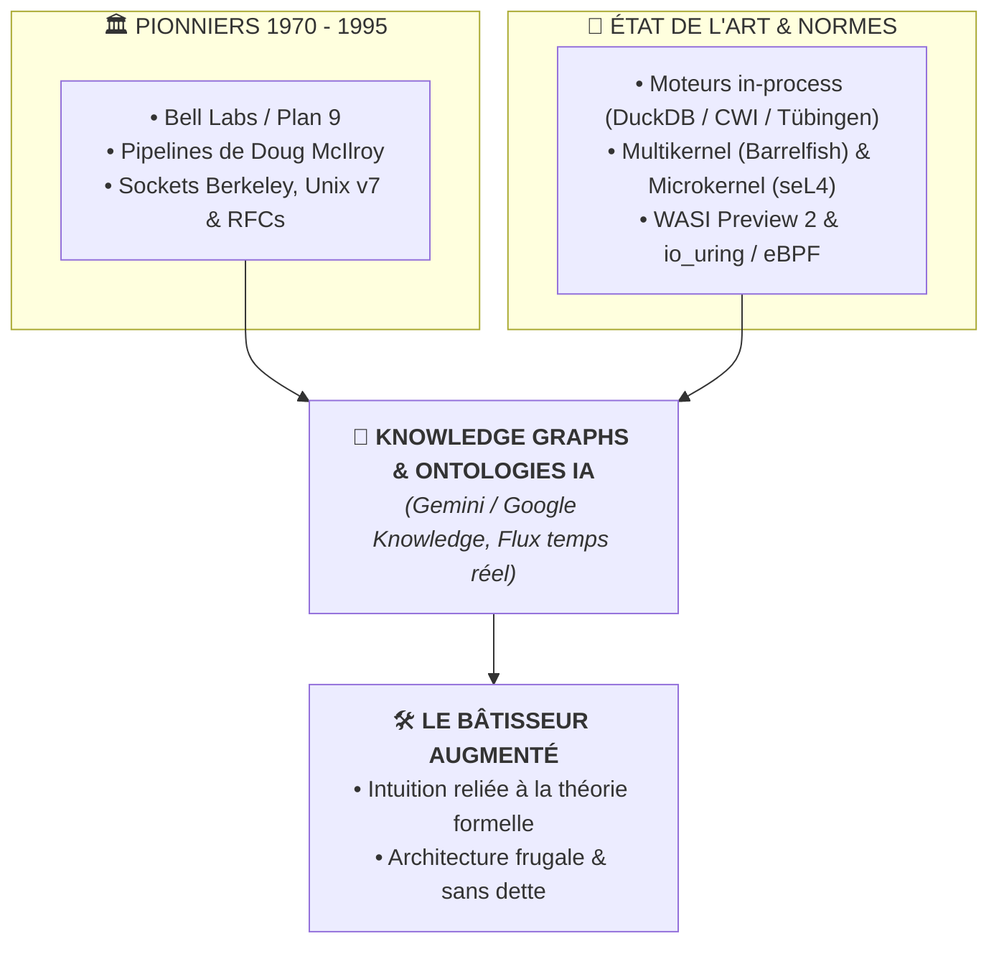
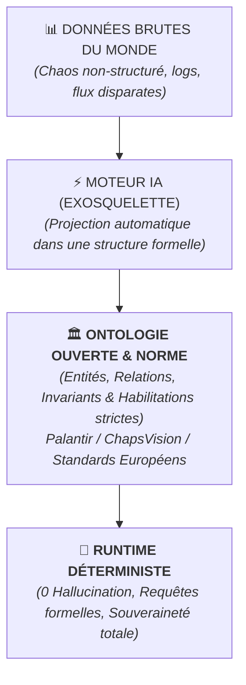
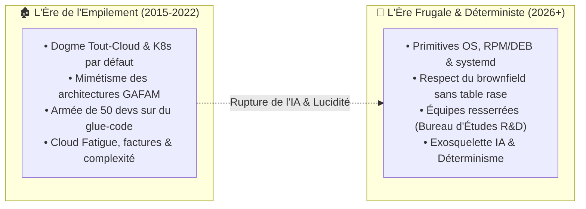
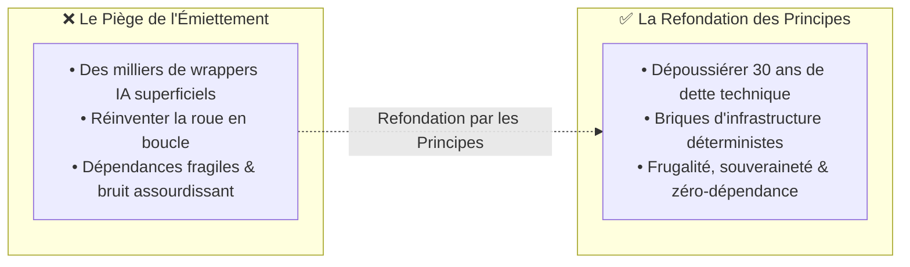
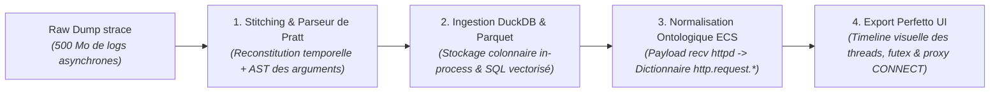

> *« L'IA est un exosquelette pour le bâtisseur, mais une menace pour celui qui y cherche un oracle. »*

---

## 1. Six Ans dans la Tranchée (2020 – 2026) : Le Code Comme Vecteur

Je n'ai pas de doctorat en machine learning. Je ne conçois pas de nouvelles architectures de transformers et je ne prétends pas faire de la recherche théorique en data science.

Mais je ne suis pas non plus un puriste retranché dans une tour d'ivoire. Les appels système POSIX et les descripteurs de fichiers ne représentent même pas 5 % de mon temps.

Mon quotidien depuis six ans, c'est celui d'un **ingénieur de terrain, ancré dans les systèmes et l'automatisation**. 

Dès l'obtention de mon diplôme en 2020, une obsession m'a servi de boussole : **automatiser systématiquement toute tâche chronophage ou répétitive**. Puis, au fil des années et des systèmes éprouvés en production, cette démarche s'est enrichie d'une règle d'or : **comprendre et respecter la mécanique du *brownfield* legacy sans jamais forcer une table rase dogmatique**.

Quand j'aborde une infrastructure ou que je rejoins une équipe, ma méthode ne dévie pas :
1. **M'approprier les flux existants** et cartographier la tuyauterie réelle de bout en bout.
2. **Identifier les frictions et les limites** là où les outils sont devenus des boîtes noires que plus personne n'ose toucher.
3. **Faire sauter les verrous par l'ingénierie directe** : concevoir un POC Python en 30 minutes pour valider une hypothèse et débloquer une impasse, écrire des scripts pour extraire la substantifique moelle d'anciens fichiers `.vcproj` de MSVC 2008 et régénérer automatiquement des cibles `CMakeLists.txt` modernes, dompter du scripting Batch avec `EnableDelayedExpansion` sur des méandres Windows où StackOverflow était un désert, ou structurer la gestion de dépendances C/C++ sous Conan.

Bien avant l'arrivée des LLMs, une conviction guidait déjà chaque ligne écrite : **le code n'est pas un monument qu'on polit pour la beauté du geste. Ce n'est pas du « code pour faire du code ». C'est un outil d'ingénierie au service de la résolution concrète de problèmes.**

### 1.1 L'École des Fondamentaux : Pourquoi le « Vanilla » Était une Bénédiction

Cette posture prend racine encore plus tôt, dans le creuset des classes préparatoires et des écoles d'ingénieurs publiques françaises. Cette culture scientifique généraliste forge un réflexe fondamental : **ne jamais accepter la boîte noire**.

#### A. Le Bain de Rigueur : La CPGE (Lycée Dessaignes, MPSI / MP 2015 – 2016)
Avant même de toucher à des architectures distribuées, le premier choc intellectuel s'est joué devant les tableaux noirs des khôlles de prépa à Blois. 

À l'époque, encadrés par des professeurs et colleurs à « double casquette » (mathématiciens et physiciens rompant le fer avec l'informatique fondamentale), la programmation n'était pas envisagée comme un simple outil de production : **c'était une science de la preuve au service de la modélisation du monde**. 
* On n'empilait pas des dépendances : on prouvait la terminaison d'un algorithme par des invariants de boucle stricts.
* On ne devinait pas une performance : on démontrait la complexité asymptotique $\mathcal{O}(n \log n)$ au feutre ou à la craie.
* L'informatique théorique (Python après 20 % du sujet à coucher / formaliser sur papier) servait à simuler des systèmes dynamiques en physique, à résoudre des équations différentielles ou à manipuler des structures de graphes pures.

Ce culte de la rigueur formelle et du « zéro approximation » a posé le socle : avant de faire tourner un code, il faut comprendre pourquoi et comment il fonctionne mathématiquement.

#### B. L'Épreuve du Terrain : L'INSA CVL et l'Apprentissage du "Vanilla"
À l'école d'ingénieurs (INSA Centre-Val de Loire), cette rigueur s'est incarnée dans la matière des systèmes sous l'exigence d'enseignants-chercheurs passionnés qui refusaient tout compromis de facilité :
* **Déconstruire le Web :** Quand M. Abdallah nous forçait à réécrire notre propre routeur HTTP en PHP ou en C *from scratch* plutôt que d'importer docilement Symfony ou CakePHP, beaucoup d'étudiants trouvaient cela « arriéré ».
* **L'Épreuve du Réseau & le Modèle OSI :** Six mois à peine après la sortie de prépa, se battre avec les primitives de sockets BSD en C dans les cours de Christian Toinard. À l'époque, sans recul opérationnel, manipuler des pointeurs, des structures `sockaddr_in` et tenter de matérialiser les couches abstraites du modèle OSI relevait d'un combat aride contre la syntaxe. On ne « voyait » pas encore les paquets circuler. Mais cinq ans plus tard, au cœur de l'infrastructure industrielle de **cRSP** (Worldline), disséquer des captures de trames `.pcap` et diagnostiquer des anomalies TCP/IP en production est devenu une seconde nature.
* **La Théorie des Langages :** S'arracher les cheveux sur les automates finis de parsing et la logique formelle dans les cours denses de Pascal Berthomé.
* **Le Noyau et la Machine :** Recoder un shell Unix complet en C (gestion des `fork`, `execve`, tables de descripteurs et capture de signaux `SIGINT` / `SIGCHLD`) et se forger le cuir sur des distributions comme Gentoo sous la houlette de Jérémy Briffaut.
* **L'Anatomie d'une Base de Données :** Implémenter un moteur SGBD relationnel en comprenant la réalité physique des $B$-Trees, les verrous transactionnels ACID et les contraintes formelles de $k$-anonymat avec Benjamin Nguyen.

Sur le moment, face aux sirènes de l'industrie qui réclamait des développeurs de frameworks prêts à l'emploi, ce choix pédagogique exigeant pouvait dérouter.

Avec le recul de 2026, **ce fut la plus grande bénédiction possible**.

Les frameworks meurent et se réinventent tous les quatre ans, entraînant avec eux des vagues d'obsolescence programmée. Mais la théorie des graphes, les automates déterministes, la mécanique d'ordonnancement d'un OS et la tuyauterie des descripteurs de fichiers ne bougent pas. Ce socle fondamental est le seul capital technique qui ne se déprécie jamais.

> [!TIP]
> **Un Conseil aux Juniors en Formation Académique**  
> Profitez de la chance unique d'être encadrés par des enseignants-chercheurs pour forger votre compréhension intime des principes premiers (systèmes, compilateurs, protocoles, complexité). Ne cédez pas à la tentation de survoler les bases avec des projets de groupe libres choisis par facilité pour simplement « assurer la moyenne du semestre » en empilant des bibliothèques à la mode. Les bibliothèques s'oublient, les fondamentaux restent votre armure à vie.

### 1.2 Le Test du Tableau Blanc : Comprendre Avant de Déléguer à l'IA

Voilà l'état d'esprit qui doit animer le bâtisseur : une curiosité viscérale, le goût de démonter les mécanismes et l'obsession de comprendre comment la machine s'anime réellement. C'est précisément ce terrain d'exploration que l'IA permet aujourd'hui de sonder à vitesse grand V.

Mais il y a un prérequis non négociable : **avant de déléguer des tâches ou de sous-traiter votre réflexion à un modèle de langage, apprenez d'abord à réaliser ce travail par vous-même.** 

Pour tirer son épingle du jeu à l'ère de l'IA, il est indispensable de plonger sous les couches d'abstractions. Et pour mesurer votre niveau de compréhension, commencez par un exercice d'une simplicité désarmante : **prenez un feutre et un tableau blanc (ou une feuille de papier). Seriez-vous capable de schématiser ce qui se passe réellement entre le moment où vous cliquez sur un lien dans votre navigateur et l'affichage du premier pixel à l'écran ?**

Avec qui la machine échange-t-elle ? Quelles couches s'activent ?

Pour explorer ce monde, nul besoin d'attendre qu'un modèle vous l'explique :
1. **Ouvrez l'inspecteur du navigateur (F12)** et observez l'onglet Réseau : découvrez la cascade de requêtes, les en-têtes HTTP et les temps de latence.
2. **Lancez Wireshark en injectant vos clés de session TLS** (`SSLKEYLOGFILE`) pour observer le trafic déchiffré en direct : vous découvrirez toute la bavarderie sous-jacente du réseau, le multiplexage HTTP/2 ou HTTP/3 et la négociation des chiffrements.
3. **Comprenez le moteur de rendu :** Réaliser que le **HTML** n'est qu'une déclaration de contenu (*le quoi*), le **CSS** la règle de mise en forme (*le comment*), et le **JavaScript** un moteur d'exécution local pour manipuler l'arbre DOM au runtime.

C'est en maîtrisant cette chaîne que l'on comprend pourquoi un site statique ultra-frugal propulsé par **Hugo** (du pur HTML/CSS pré-compilé en quelques millisecondes, sans base de données dynamique ni bundle JavaScript de 5 Mo) est infiniment plus rapide, écologique et résilient pour une immense majorité des besoins du Web.

Et c'est seulement une fois ce modèle mental gravé dans votre esprit que l'IA devient un allié redoutable : non pas pour vous cacher la réalité, mais pour vous aider à la manipuler à la vitesse de la pensée.

---

### 1.3 L'Héritage des Anciens : Apprendre à Voir la Machine et à Garder les Pieds sur Terre

Cette culture scientifique s'est ensuite confrontée au terrain grâce à mes premiers mentors et architectes à ma sortie d'école.

D'un côté, des ingénieurs chevronnés proches de la retraite (merci Edi, Rainer) qui ont eu l'infinie patience de me transmettre la matière brute et m'ont appris à **« voir » la machine** :
* **Visualiser la vie intime d'un processus** non pas à travers un dashboard pré-mâché, mais en lisant sa table de descripteurs de fichiers (`/proc/<pid>/fd`) et ses sockets sous `netstat` / `ss`.
* **Comprendre le réseau jusqu'au paquet :** Démystifier TCP, TLS et IPsec au niveau du flux binaire plutôt que de faire confiance aveuglément à une bibliothèque cliente.
* **L'élégance sobre d'un autre temps :** Découvrir le monde d'`xinetd` bien avant `systemd`, comprendre pourquoi une boucle événementielle basée sur `select(2)` battait souvent des architectures multithreadées lourdes, et observer des architectures multi-repositories à base d'includes relatifs qui semblaient rustiques mais tournaient sans faillir depuis plus de vingt ans.
* **Le savoir tribal non documenté :** Comprendre l'histoire et le compromis derrière d'anciennes bibliothèques internes en C/C++ gérant des ring buffers circulaires et des schedulers sur-mesure.

De l'autre, des confrontations salutaires avec notre architecte infrastructure (MZ) qui ramenait systématiquement les projets à **la réalité économique et opérationnelle du terrain** :
* *« Nous n'avons pas les moyens ni l'armée de SREs de chez Google. Notre rôle est d'être frugaux et réalistes. »*
* **Refuser le mimétisme des conférences CNCF :** Plutôt que de succomber à la tentation d'empiler une énième usine à gaz à la mode (déployer Mimir, Loki ou des clusters de monitoring dédiés lourds à maintenir), savoir faire preuve d'opportunisme d'ingénierie en se greffant intelligemment sur l'existant (eg. en exploitant la tuyauterie **ElastiFlow / Elasticsearch** déjà maintenue et fiabilisée par l'équipe réseau).
* Comprendre qu'une solution élégante n'est pas celle qui empile le plus de technologies modernes, mais celle qui résout le problème avec le coût opérationnel le plus faible pour l'équipe qui devra la maintenir pendant dix ans.

Cette double transmission (la rigueur bas niveau des anciens et le réalisme pragmatique de l'architecture) est irremplaçable. Un LLM a lu des millions de pages de documentation et de tutoriels génériques, mais il ne possède ni la mémoire orale de vingt ans de production industrielle, ni le sens du compromis budgétaire.

C'est précisément parce qu'ils m'ont appris à regarder *derrière* la boîte noire tout en gardant les pieds sur terre que je peux aujourd'hui utiliser l'IA comme un levier d'accélération chirurgical, plutôt que d'en être le spectateur crédule.

---

### 1.4 L'Onde de Choc (2020 – 2026)

Depuis 2020, j'ai vécu de l'intérieur toute l'onde de choc :
* Les premiers émerveillements sur GPT-3 en 2022,
* L'arrivée de GitHub Copilot dans nos IDEs,
* Les assistants intégrés en 2024/2025,
* Et aujourd'hui des environnements d'agents comme Antigravity en 2026.

Après six ans à confronter ces outils à la réalité brute de la production, un constat viscéral s'impose : **l'intelligence artificielle ne crée pas d'ingénieurs. Elle agit comme un miroir grossissant de la posture de celui qui s'en sert.**

---

## 2. La « Taxe Oracle » et le Piège de la Moyenne Statistique

Quand on utilise l'IA comme un **Oracle** (ie. quand on lui délègue la compréhension d'un problème qu'on ne maîtrise pas), on se heurte immédiatement à une réalité mathématique impitoyable : **l'hyperspace non-focalisé**.

### 2.1 La Moyenne du Web est Médiocre
Un LLM est un modèle probabiliste entraîné sur l'ensemble du corpus public mondial. Si vous lui soumettez un log d'erreur WiX MSI ou une erreur de linkage obscure sans cadrer précisément les mécanismes sous-jacents, il va vous répondre avec la **moyenne statistique de ce corpus**. 

Et la moyenne d'Internet, sur des sujets pointus ou du legacy, ce sont des snippets StackOverflow obsolètes de 2009, des abstractions molles, des hacks de contournement qui masquent le problème de fond, ou des hallucinations pures de paramètres CLI inexistants.

### 2.2 La Fuite en Avant de la « Taxe Oracle »
Pour tenter de masquer ce manque de compréhension sans faire l'effort d'analyser la mécanique réelle, l'utilisateur d'un oracle paie une taxe exponentielle :
1. **L'inflation des tokens et des contextes géants :** On balance des dumps de logs de 50 000 lignes dans l'espoir que le modèle « trouve la magie » par lui-même.
2. **L'illusion des « Prompts Magiques » :** Écrire en préambule *« Tu es un Staff Infrastructure Engineer avec 30 ans d'expérience »*. C'est du pur mode *roleplay* : le modèle adopte un ton plus péremptoire et convaincant, mais son raisonnement n'a pas gagné un seul gramme de rigueur formelle.
3. **Le mirage des « Agents d'agents » :** Empiler trois couches d'agents automatiques qui se corrigent mutuellement pour compenser des hallucinations qui dérivent au fil des itérations.
4. **La fausse promesse des « compresseurs de contexte » :** On voit fleurir des dépôts GitHub cumulant des milliers d'étoiles qui promettent de « compresser vos prompts et vos contextes de 80 % » à coups de filtres heuristiques ou de résumés récursifs. C'est une illusion d'optique. En compressant mécaniquement des blocs de texte sans discernement d'ingénierie, ces outils éliminent précisément les contraintes physiques aux limites (les codes d'erreur d'un installeur, l'ordre des passes d'un build, les subtilités d'un syscall). C'est une compression avec perte (*lossy*) qui détruit le signal vital.

> [!WARNING]
> **L'Illusion des « Compresseurs de Contexte »**  
> Tronquer mécaniquement des blocs de texte par des filtres heuristiques ou des résumés récursifs élimine précisément les contraintes physiques aux limites (les codes d'erreur d'un installeur, l'ordre des passes d'un build, les subtilités d'un syscall). C'est une compression avec perte (*lossy*) qui détruit le signal vital. La seule vraie compression est sémantique : celle de l'ingénieur qui pose les invariants théoriques.

---

## 3. Le Bâtisseur et la Matière : Réduire l'Espace d'États

À l'opposé de l'Oracle, il y a la posture du **Bâtisseur**.

Le bâtisseur sait manipuler la matière. Il comprend les rouages intimes de ses outils. Il n'attend pas que l'IA résolve le problème à sa place ; il utilise l'IA comme un **exosquelette mécanique** pour aller dix fois plus vite dans l'exploration, le prototypage et l'exécution.

### 3.1 Comment le Bâtisseur s'affranchit de la Taxe Oracle
Il s'en affranchit en **reliant systématiquement son problème pratique à la théorie et aux invariants techniques** :
* **Sur du build / packaging :** Il ne demande pas *« Pourquoi mon MSI échoue ? »*. Il analyse la table `InstallExecuteSequence`, identifie que la Custom Action s'exécute en contexte différé (*deferred*) sans élévation, et demande à l'IA de générer le snippet WiX avec les attributs `Execute="deferred"` et `Impersonate="no"` adéquats.
* **Sur de la haute disponibilité / performance serveur :** Face à un serveur Apache `httpd` qui s'effondre, l'utilisateur d'un oracle demande d'augmenter la RAM ou de redémarrer le pod. Le bâtisseur, lui, convoque **la Loi de Little ($L = \lambda W$)**[^little] et la théorie des files d'attente : il comprend qu'une augmentation de la latence de traitement fait exploser le nombre de requêtes concurrentes, déclenchant une tempête de contention de locks et d'appels système `futex(2)`. Il demande à l'IA d'auditer la configuration MPM (`ThreadsPerChild`, `MaxRequestWorkers`) et les métriques de context switching.
* **Sur de l'intégrité de flux & réseau :** Plutôt que d'empiler des protocoles verbeux pour sécuriser un transport, il s'appuie sur les **codes correcteurs d'erreurs (Hamming, Reed-Solomon)**[^shannon] et la théorie de l'information de Shannon pour cadrer le bon format de trame binaire.
* **Sur du réseau / automatisation :** Il ne demande pas *« Écris-moi un bot de test »*. Il spécifie l'automate d'états finis exact, les transitions de statut SSH via Paramiko et les assertions de DOM Playwright avec timeouts stricts.
* **Sur du streaming de données :** Il ne demande pas *« Masque-moi des strings »*. Il pose la contrainte : *« Je veux un automate DFA qui garantit une bijection 1:1 sans collision de préfixes, avec un tri d'alias par longueur décroissante et une complexité mémoire en $O(U)$. »*

En énonçant la contrainte technique et formelle exacte, **le bâtisseur réduit l'hyperspace de 10 milliards de possibilités médiocres aux 2 ou 3 solutions d'ingénierie pures**. Le modèle n'a plus à deviner : il est canalisé vers le sommet de son corpus.

### 3.2 La Seule Vraie Compression : Le Laser des Principes Premiers

La véritable « compression de contexte » ne vient pas d'un outil tiers qui tronque des tokens au hasard. Elle vient de **la clarté de conceptualisation du bâtisseur**.

Plutôt que d'enchaîner des bibliothèques à la mode pour compresser un prompt boursouflé, l'ingénieur décompose son problème en briques élémentaires et utilise les **mots-clés pivots de la théorie** (`DFA`, `SCM_RIGHTS`, `InstallExecuteSequence`, `zstd frame`, `SEEK_END`). Ces concepts agissent comme des coordonnées GPS ultra-précises dans l'espace latent du LLM. 

Une phrase de 30 mots articulée autour des bons principes premiers apporte infiniment plus de signal et de précision d'exécution qu'un pavé de 5 000 tokens passé dans un compresseur heuristique.

---

### 3.3 L'IA à la Conception, le Déterminisme au Runtime

Cette démarche aboutit à une règle d'or architecturale : **maximiser l'IA en phase de design et d'analyse pour produire des solutions 100 % déterministes au runtime.**

Vouloir placer un modèle de langage dans la boucle chaude d'un système de production (pour parser des logs à la volée ou prendre des décisions critiques en continu) est une aberration opérationnelle : latence imprévisible, non-déterminisme et explosion des coûts.

L'ingénieur de terrain procède à l'inverse :
* Il ne donne pas **8 millions de lignes d'`access.log` Apache** à un agent dans un contexte géant.
* Il dote l'agent d'un **serveur MCP branché sur l'API Elasticsearch** ou lui soumet un **échantillon représentatif de 100 lignes** pour analyser la structure de la donnée.
* L'IA sert à modéliser, prototyper et éprouver la solution : générer la requête d'agrégation DSL exacte, concevoir un filtre Vector/Logstash robuste ou écrire un coprocesseur de streaming $O(1)$.
* **Au runtime**, l'IA disparaît complètement de l'équation. C'est le moteur déterministe qui traite les 8 millions de lignes à la vitesse du silicium, pour un coût nul et une fiabilité mathématique.

> [!IMPORTANT]
> **La Règle d'Or du Bâtisseur : IA au Design-time, Déterminisme au Runtime**  
> Maximisez l'utilisation des modèles d'IA en amont pour la modélisation mathématique, l'exploration d'architecture et la génération de harnais de tests rigoureux. Mais en production, dans la boucle chaude : **zéro token, zéro latence d'inférence et zéro risque probabiliste**. Le runtime doit être 100 % déterministe et s'exécuter à la vitesse du silicium.

### 3.4 L'Émancipation du Métier : Sparring-Partner, Personas et Exploration

Cette posture ne s'arrête pas aux frontières de l'informatique. **Elle s'applique avec la même force à tout professionnel qui refuse la passivité dans son métier.**

Aujourd'hui, beaucoup abordent l'IA sous le prisme de la peur du remplacement ou s'en servent d'alibi pour masquer un travail approximatif. C'est l'éternel travers de l'Oracle : attendre que la machine dicte la réponse ou se plaindre de ses approximations.

Pour le praticien et le bâtisseur de métier (qu'il soit ingénieur, contrôleur de gestion, juriste, logisticien ou médecin), l'exosquelette de l'IA ouvre au contraire un **espace d'exploration et d'émancipation inédit** :

#### 1. Le Sparring-Partner et le Jeu de Rôles (*Personas*)
L'artisan de terrain ne demande pas à l'IA d'écrire son rapport à sa place. Il s'en sert comme d'un **miroir contradicteur** :
* *« Agis comme un auditeur réglementaire impitoyable et attaque chaque faille de mon plan de continuité d'activité. »*
* *« Prends le rôle d'un client sceptique face à cette proposition d'architecture et liste tes objections majeures. »*  
En quelques minutes, le bâtisseur confronte son intuition à une simulation rigoureuse de la réalité pour en éliminer les angles morts.

> [!WARNING]
> **Le Piège du Sophiste Probabiliste : L'Impératif du Grounding Ontologique**  
> Une simulation de jeu de rôles ou une exploration juridique/financière ne peut reposer sur un simple générateur stochastique de tokens en roue libre. Sans contraintes formelles, le modèle invente des précédents fictifs ou des règles fiscales imaginaires.  
> C'est ici que **l'ancrage (*grounding*) par les ontologies formelles et les graphes de connaissances** devient la clé de voûte absolue : contraindre l'IA dans une structure de faits vérifiables pour garantir une rigueur mathématique (nous y revenons en détail au [**§4.3 : La Force des Ontologies**](#43-la-force-des-ontologies--le-vrai-web-30-et-la-souverainet%C3%A9)).

#### 2. L'Exploration Décomplexée et l'Éveil Scientifique des Métiers
Combien d'idées audacieuses ont été abandonnées parce qu'elles exigeaient de maîtriser un domaine connexe (un calcul statistique poussé, une norme juridique obscure, un modèle de flux complexe) ?  
L'exosquelette de l'IA efface la friction de l'inconnu : il traduit les concepts complexes dans les termes du métier et suggère les ponts théoriques sous-jacents.

Mieux encore : **il révèle la structure scientifique et mathématique cachée derrière chaque pratique professionnelle.**  
À l'image des travaux pionniers du **projet Catala (Inria)**[^catala], qui a prouvé que des pans entiers du Code Général des Impôts et du calcul des allocations familiales pouvaient être traduits mot à mot en logique mathématique formelle et vérifiée sans ambiguïté, chaque métier repose sur des invariants profonds.  
En dialoguant avec son exosquelette, l'expert de terrain tisse des connexions insoupçonnées :
* Le logisticien découvre que son casse-tête d'affectation est un problème classique de flot maximal dans un graphe ou d'optimisation linéaire sous contraintes.
* Le juriste découvre que son corpus contractuel s'articule comme un automate d'états finis déterministe.
* Le contrôleur de gestion découvre la puissance des moteurs colonnaires vectorisés pour auditer des millions d'écritures en temps réel.

Ce qui était autrefois confiné aux tours d'ivoire de la recherche académique devient un instrument de modélisation quotidien à la disposition du praticien de terrain.

#### 3. Prototyper sans s'Éparpiller
Il ne s'agit pas de réinventer la roue par orgueil ou de reconstruire son propre ERP dans son coin : déléguer les briques génériques à des solutions logicielles et SaaS éprouvées reste une marque de bon sens.  
Mais pour le **dernier kilomètre**, le cas particulier ou le goulot d'étranglement qui paralyse une équipe : l'expert métier n'est plus impuissant. Il est capable de concevoir, tester et exécuter un prototype déterministe en quelques heures sur son poste de travail (par exemple un script DuckDB/Python qui croise 50 classeurs Excel récalcitrants en 1 seconde).

L'IA ne remplace pas l'exigence du métier : **elle donne à ceux qui le maîtrisent le temps, la lucidité et la liberté de l'exercer au plus haut niveau.**

---

## 4. Le Sonar Omnidirectionnel : De l'An 0 aux Frontières de la Recherche

Pour ma génération d'ingénieurs (diplômés aux alentours de 2017+), l'An 2000 ressemble inconsciemment à l'« An 0 » de l'informatique. C'est l'époque où le Web a explosé, où Linux s'est standardisé, et où la majorité des frameworks modernes sont nés.

Mais le sonar de l'ingénieur augmenté n'est pas seulement rétrospectif : il est **omnidirectionnel**. Il crée un pont instantané entre cinquante ans d'histoire des systèmes et l'état de l'art le plus pointu de la recherche contemporaine.

### 4.1 Dépoussiérer 50 Ans d'Invariants Oubliés
Les plus grands sauts conceptuels de notre discipline ont été pensés à une époque où faire tourner un OS exigeait de composer avec 64 Ko de mémoire :
* Les concepts de namespace universel et d'isolation de **Plan 9 (Bell Labs)**[^plan9],
* La pureté des flux de données et de la composition Unix de **Doug McIlroy**[^mcilroy],
* Les débats d'architecture fondateurs consignés dans les archives de mailing lists (comme celles d'Apache ou du kernel Linux).

Trop souvent, ces briques historiques ont été mal comprises, menant à des forks bancals ou à des bibliothèques de 500 Mo créées pour réinventer ce que l'OS offrait nativement. L'IA permet d'auditer ces décisions historiques en quelques secondes pour en réinjecter la sobriété dans nos designs actuels.

### 4.2 Se Brancher sur l'État de l'Art Académique et Industriel
À l'autre extrémité du spectre, une simple intuition jetée au modèle trouve immédiatement un point d'écho avec la recherche universitaire et les architectures de pointe :

* **DuckDB : De la théorie des bases de données aux logs de 70 Mo zstd en 5 secondes :**
  Quand on aborde un besoin analytique par le prisme classique des « besoins métier », la réponse par défaut de l'industrie consiste à déployer un monstre : cluster Elasticsearch à six nœuds, brokers Kafka et pipelines Logstash lourds.
  Le bâtisseur, lui, redescend aux principes fondamentaux du traitement de données : stockage colonnaire, vectorisation SIMD (abandon du modèle itératif tuple-par-tuple de Volcano au profit de vecteurs de données en cache L1/L2) et parallélisme multi-cœurs sans copie mémoire. 
  **DuckDB n'est pas de la magie :** c'est l'incarnation pure des travaux de recherche du **CWI d'Amsterdam et de l'Université de Tübingen**[^duckdb]. Résultat ? Une simple requête SQL in-process est capable de scanner, décompresser et agréger **70 Mo de logs Apache compressés en `.zst` en 5 secondes chrono** sur un simple laptop, sans aucun démon résident ni infrastructure payante.
* **Barrelfish et l'Architecture Multikernel (ETH Zurich / Microsoft Research)**[^barrelfish] :
  Au lieu de voir une machine moderne à 64 cœurs comme une mémoire partagée géante qui s'effondre sous la contention des verrous de cache, l'approche multikernel traite le matériel comme un système distribué de cœurs indépendants communiquant par passage de messages asynchrones. Ce qui exigeait des années de recherche fondamentale devient une grille de lecture limpide pour architecturer des superviseurs de processus modernes.
* **seL4 et la Vérification Formelle (UNSW / Data61)**[^sel4] :
  Le modèle de sécurité par capacités (*capability-based security*) et les preuves mathématiques formelles d'absence de bugs mémoire (longtemps cantonnés à l'aérospatial et au militaire) deviennent aujourd'hui des patrons de conception directement exploitables pour concevoir des micro-noyaux applicatifs fiables.
* **Exokernels & Isolation Modulaire (WASI Preview 2) :**
  De la philosophie des **Exokernels du MIT** (exposer directement les primitives matérielles sans imposer d'abstractions rigides) aux spécifications de composants logiciels de **WASI Preview 2** par la **Bytecode Alliance**[^wasi], l'IA permet de concevoir des bacs à sable étanches et ultra-légers sans la lourdeur d'une virtualisation complète.
* **Noyaux modernes et I/O zero-copy :** Exploiter à plein régime les files de soumission asynchrones d'`io_uring` ou les sondes `eBPF` pour observer et filtrer les flux sans context switches superflus.

Ces concepts académiques majeurs semblaient autrefois réservés à des laboratoires de recherche ou à des géants du cloud. Aujourd'hui, avec l'exosquelette de l'IA, **ils deviennent des outils de conception à portée de main** pour tout bâtisseur qui refuse la dette technique et choisit de viser l'excellence des principes premiers.

### 4.3 La Force des Ontologies : Le Vrai Web 3.0 et la Souveraineté

Ce bond qualitatif s'explique par la nature même des architectures IA modernes : elles ne font pas que réciter des probabilités de mots. Elles s'adossent à des **Knowledge Graphs** gigantesques et des ontologies structurées sur des décennies (comme l'écosystème Google / Gemini adossé au Google Knowledge Graph, ou des modèles branchés sur les flux temps réel).

Le bâtisseur formule une intuition brute ou un cas d'usage métier $\to$ le modèle traverse ces graphes de connaissances pour la relier aux taxonomies formelles, aux papiers IEEE/ACM et aux standards en cours d'élaboration.

Mais l'ontologie est bien plus qu'un outil de recherche : **c'est le cœur de la valeur des plateformes d'analyse de données de demain.**

* **Le secret des plateformes comme Palantir ou ChapsVision :**
  Ce qui fait la puissance de plateformes comme **Palantir Foundry / Gotham** ou **ChapsVision** dans la défense, la santé ou les infrastructures critiques, ce ne sont pas des chatbots magiques. **C'est leur ontologie.** C'est la capacité de contraindre des millions de données hétérogènes dans une grammaire formelle d'entités, de relations et d'événements. Une fois l'ontologie verrouillée, l'IA ne peut plus dériver : elle raisonne dans un graphe de contraintes mathématiques et sécuritaires strictes.
* **Le Vrai Web 3.0 : La Revanche du Web Sémantique :**
  Pendant des années, le terme « Web3 » a été confisqué par la spéculation crypto. Mais la vision originelle de **Tim Berners-Lee pour le Web 3.0 était le Web Sémantique**[^semanticweb] (ontologies RDF, OWL, triplets formels). Si cette vision a stagné pendant vingt ans, c'est parce que modéliser le monde à la main était une tâche humaine titanesque. L'IA change la donne : elle est enfin le traducteur universel capable de structurer le chaos en ontologies exploitables.
* **L'Opportunité Géopolitique Européenne :**
  L'Europe est souvent moquée pour sa manie de tout normaliser (RGPD, AI Act, CSRD, NIS2), vue par la Silicon Valley comme un frein à la vitesse. Mais cette tradition de codification est notre plus grande arme stratégique. Plutôt que de chercher à cloner un énième LLM américain à 10 milliards de dollars ou de s'enfermer dans les silos propriétaires de Palantir, l'Europe a le pouvoir de **définir et imposer des standards ontologiques ouverts de référence** (santé, énergie, supply chain, souveraineté industrielle). 
  En appliquant le principe de l'« Effet Bruxelles » à l'architecture des données, nous forçons les géants de la tech à s'aligner sur nos normes ouvertes et déterministes, plutôt que l'inverse.

> [!NOTE]
> **L'Effet Bruxelles appliqué aux Données**  
> La vraie valeur des plateformes d'analyse massives (Palantir, ChapsVision) ne réside pas dans des modèles magiques, mais dans **la rigueur formelle de leur ontologie**. En définissant et en imposant des standards ontologiques ouverts de référence dans les secteurs régulés (santé, énergie, supply chain), l'Europe transforme sa culture de la norme en avantage géopolitique souverain.

On ne réinvente plus la roue dans son coin. On construit sur les épaules des pionniers, on structure la donnée par les ontologies, et l'on pose des fondations souveraines pour les décennies à venir.

---

## 5. 2026 et l'Ère Frugale : Le Retour des Bureaux d'Études Augmentés

Entre 2015 et 2020, l'industrie a vécu sous un dogme quasi-religieux : le « tout-cloud », Kubernetes imposé pour le moindre micro-service naissant, et une standardisation massive sur Java ou des méga-frameworks motivée non pas par la pureté de la conception, mais par la taille du vivier de recrutement (*« il faut du Java/Spring parce que le pool de développeurs est plus large sur le marché »*).

### 5.1 Le Syndrome de la « Cloud Fatigue » et le Réalisme Brownfield

À force d'adopter aveuglément des architectures taillées pour les hyperscalers (la poignée d'entreprises mondiales gérant des millions de requêtes par seconde), l'industrie a imposé à la masse des projets d'entreprise des cathédrales de complexité accidentelle :
* Des pipelines CI/CD de 45 minutes pour construire des images Docker de plusieurs gigaoctets.
* Des clusters Kubernetes facturés des milliers d'euros par mois pour faire tourner trois services qui consomment 200 Mo de RAM.
* Une dépendance critique à des dizaines de services cloud propriétaires qui enferment les données et les budgets.

Pourtant, la réalité du terrain que vit la majorité des ingénieurs, c'est le **brownfield legacy** : des systèmes industriels éprouvés, des bases de code historiques qui font tourner des flux critiques, et des contraintes d'exploitation strictes.

Vouloir tout conteneuriser par réflexe de mode ou forcer une migration cloud en faisant table rase est souvent une erreur stratégique majeure. Pour 95 % des besoins réels, **un binaire compilé ou un packaging propre en `.rpm` / `.deb`, supervisé par un simple service `systemd` sur une machine bare-metal bien dimensionnée**, offre des performances dix fois supérieures, une latence divisée par cent, une résilience à toute épreuve et un coût d'exploitation dérisoire.

### 5.2 Oser la Frugalité et Repenser les Fondations

En 2026, l'exosquelette de l'IA fait voler les vieux compromis en éclats :
* **La fin du besoin d'armées de développeurs pour du *glue-code* :** Une équipe resserrée de bâtisseurs n'a plus besoin de 50 personnes pour écrire du code d'assemblage de frameworks verbeux. L'IA absorbe l'effort de frappe et permet de cibler des implémentations épurées au plus près des primitives de l'OS.
* **Le respect du brownfield sans subir sa dette :** L'IA permet d'auditer la tuyauterie existante, de déchiffrer les formats obscurs et de construire des ponts d'ingénierie robustes (génération de `CMakeLists.txt` depuis de vieux XMLs, outillage d'automatisation, parsing de protocoles) sans jamais imposer une réécriture hasardeuse.
* **La renaissance des Bureaux d'Études R&D :** Nous avons aujourd'hui l'opportunité historique de retrouver l'esprit des bureaux d'études d'ingénierie d'il y a 10 ou 20 ans. Des cellules agiles de stratèges, d'architectes et de bâtisseurs, dotées d'une capacité de R&D et d'exploration démultipliée par l'IA, où **seule l'imagination, la rigueur technique et le bon sens redeviennent les limites**.

---

## 6. Repenser l'Open Source : Bâtir des Briques Déterministes

Cette bascule vers la frugalité pose une question cruciale pour l'avenir de l'écosystème Open Source.

Avec la démocratisation des LLMs, nous assistons déjà à un premier risque : **l'émiettement stérile**. Des millions de micro-projets jetables et de wrappers superficiels générés en dix secondes réinventent la roue dans leur coin, ajoutant du bruit au bruit.

À l'inverse, l'exosquelette de l'IA offre une opportunité historique : **revisiter les briques fondamentales de l'infrastructure et du SRE.**

Beaucoup d'outils historiques du monde libre traînent vingt ou trente ans de dette technique, de forks successifs et de patchs empilés pour contourner des limites matérielles qui n'ont plus cours aujourd'hui. L'IA nous permet d'auditer ces architectures, d'en extraire la substantifique moelle et de réécrire des briques :
* **Modernes et déterministes**,
* **Frugales et sans dépendances superflues**,
* **Alignées sur les primitives réelles des systèmes actuels.**

Il ne s'agit pas de faire du « libre pour le libre » par dogme idéologique, ni de s'épuiser à concevoir avec cinq ans de retard des copies pâles de logiciels propriétaires ou de SaaS à la mode. Cette posture réactive est une impasse.

Le bâtisseur privilégie **la voie du pragmatisme forgée par Linus Torvalds** :
* Utiliser sans dogmatisme les outils et standards industriels qui fonctionnent lorsqu'ils font le travail,
* Mais dès qu'un angle mort technique bloque le terrain, **forger à partir des principes premiers la brique fondamentale qui manque au monde** (à l'image de Linus concevant l'architecture de `git` en quelques jours autour d'un graphe orienté acyclique d'objets immuables, plutôt que de cloner les gestionnaires de version centralisés de son temps).

Cette démarche pour le logiciel libre n'est ni militante ni suiveuse : elle est **lumineuse, féconde et profondément émancipatrice**.

### 6.1 Le Refus de la *Tabula Rasa* : Respecter, Critiquer, S'Approprier

À chaque saut technologique, l'industrie cède à une tentation nihiliste : celle de la **table rase** (*« Oubliez le bas niveau, oubliez les protocoles, les modèles d'IA vont tout régénérer à partir de rien »*).

C'est une illusion destructrice. L'ingénierie logicielle est un patrimoine vivant, une chaîne ininterrompue de transmission d'ingénieur à ingénieur. 

La posture du bâtisseur face à cet héritage est triple :
1. **Respecter ce qui a été transmis :** Reconnaître l'élégance et la robustesse des invariants posés par les pionniers et nos aînés.
2. **Critiquer avec lucidité :** Identifier la dette historique, les compromis devenus obsolètes et les inefficiences masquées par des années de surcouches.
3. **Faire sienne la transmission :** Utiliser l'exosquelette de l'IA non pas pour raser le passé, mais pour **restaurer, épurer et parfaire ces fondations** au niveau des exigences de souveraineté, de frugalité et de sécurité de notre siècle.

> [!IMPORTANT]
> **Le Triptyque de la Transmission**  
> 1. **Respecter** ce qui a été transmis : reconnaître l'élégance et la robustesse des invariants posés par les pionniers.  
> 2. **Critiquer** avec lucidité : identifier la dette historique, les compromis devenus obsolètes et la complexité accidentelle.  
> 3. **Faire sienne la transmission** : utiliser l'exosquelette de l'IA pour restaurer, épurer et parfaire ces fondations au niveau des exigences de 2026.

### 6.2 Du Cas d'Usage à l'Océan Bleu : L'Exemple d'un ETL `strace` en 48 Heures

Pour comprendre la puissance de frappe d'un bâtisseur équipé de cet exosquelette, prenons un problème d'ingénierie concret auquel tout ingénieur système est un jour confronté : **analyser en profondeur la dynamique interne d'un processus serveur en production à partir d'un dump `strace` de 500 Mo**.

Dans l'écosystème open source actuel, il n'existe aucune solution clé en main satisfaisante pour transformer ce flux textuel chaotique (lignes asynchrones `<unfinished ...>`, reprises `<... resumed>`, arguments imbriqués de `recvfrom` ou `ioctl`) en une structure analytique requêtable et visualisable. La réponse standard de l'industrie ? Des scripts `grep` / `awk` artisanaux ou l'abandon pur et simple face au volume.

En convoquant les principes premiers et l'exosquelette de l'IA, un pipeline ETL complet a été **modélisé, implémenté et validé en à peine deux jours** :

1. **La Théorie des Compilateurs au secours du Debugging (Parseur de Pratt)**[^pratt] : Plutôt que d'empiler des expressions régulières fragiles qui cassent sur le moindre argument de syscall, conception d'un tokenizer formel et d'un parseur de Pratt pour extraire la structure exacte de chaque appel système.
2. **Reconstitution d'États (*Stitching*) :** Réconciliation des fragments d'appels système concurrents (`unfinished` $\to$ `resumed`) pour reformer la séquence logique exacte de chaque thread (PID/TID).
3. **Moteur Analytique Frugal (DuckDB & Parquet) :** Conversion du flux structuré en fichiers **Parquet** et ingestion in-process via **DuckDB**, permettant de scanner et requêter des millions d'événements système en SQL vectorisé avec une latence quasi nulle sur un simple laptop.
4. **Projection Ontologique (Elastic Common Schema - ECS)**[^ecs] : Détection de signatures applicatives : identifier le payload binaire d'un syscall `recv` d'un worker Apache `httpd`, décoder la trame réseau sous-jacente et la projeter directement dans un dictionnaire structuré conforme au standard ECS (`http.request.method`, `http.request.bytes`, etc.).
5. **Visualisation Sans Réinventer la Roue (Perfetto UI)**[^perfetto] : Export direct des spans temporels au format trace pour les injecter dans **Perfetto UI** (`ui.perfetto.dev`). En quelques secondes, le comportement intime d'un serveur Apache `httpd` sous `mpm_worker` se révèle graphiquement : la danse des verrous `futex(2)`, la contention des threads sur `accept4(2)` / `epoll_wait(2)`, et la gestion fine des tunnels de proxying HTTP (`CONNECT` via `http_connect_proxy`).

#### L'Océan Bleu de l'Ingénierie vs L'Océan Rouge des Wrappers

C'est devant ce type de réalisation éclair que la divergence de trajectoire devient éclatante :

* **L'Océan Rouge (Saturé & Stérile) :** 95 % de l'écosystème s'agglutine pour lever des fonds sur des « wrappers SaaS » d'APIs de LLM ou pour réécrire aveuglément des outils existants en Rust par simple effet de mode (*« Rewrite it in Rust »* sans repenser l'architecture).
* **L'Océan Bleu (Vierge & Souverain) :** Les territoires inexplorés des systèmes, de l'observabilité bas-niveau, des ponts brownfield et de l'outillage SRE frugal. Des domaines où des verrous techniques historiques peuvent désormais être débloqués en 48 heures de co-conception rigoureuse.

> [!TIP]
> **L'Océan Bleu : Le Nouveau Compagnonnage Open Source**  
> C'est dans cet Océan Bleu que doivent se retrouver les **compagnonnages et collectifs d'ingénieurs passionnés**. Dans le cadre du logiciel libre, notre rôle n'est pas de gonfler la bulle des micro-outils jetables, mais de penser et forger les briques d'infrastructure de demain.  
> C'est aussi une **opportunité de transmission inestimable pour les jeunes ingénieurs** : au lieu d'être cantonnés à un rôle passif de pousseurs de prompts superficiels, ils peuvent s'asseoir aux côtés des aînés, s'imprégner de décennies de savoir-faire sur les systèmes profonds et utiliser l'exosquelette de l'IA pour absorber, modéliser et perpétuer cette mémoire technique.  
> Grâce au patron du *Strangler Fig*, nous n'avons plus besoin de condamner ou de jeter le *brownfield legacy* industriel délaissé : nous pouvons **l'accompagner, le sécuriser, l'instrumenter et le réinterroger sans rupture**, avec une élégance et une sobriété inégalées.

### 6.3 Le Laboratoire du Bâtisseur : Réinterroger la Tuyauterie

C'est exactement dans cette démarche que s'inscrivent mes travaux de recherche et d'exploration personnelle :
* **Repenser un moteur de templates** non pas comme un empilement de regex fragiles, mais sous l'angle pur de la **théorie des compilateurs** (arbres syntaxiques AST, bytecode et passes d'optimisation).
* **Réinterroger la manipulation des flux I/O** en traitant les sockets réseau, les processus et les pipes comme de simples descripteurs de fichiers réactifs unifiés (`pipe(7)`, `dup2(2)`, `SCM_RIGHTS`).
* **Concevoir un framework de DSE (Design Space Exploration) et des automates finis (FSM) compilés** pour cartographier et comparer systématiquement des solutions d'architecture selon leurs dimensions clés (latence, empreinte mémoire, robustesse, coût) et garantir des exécutions déterministes en $O(1)$.
* **L'ingestion structurée de documents denses (PDFs)** pour projeter automatiquement des corpus techniques complexes dans des graphes de connaissances formels.
* **Explorer le potentiel de WASI / Component Model** pour bâtir les briques d'un micro-exokernel moderne, léger et sécurisé par capacités.
* **Manipuler des périphériques matériels et protocoles HID** de manière purement déclarative.

Ces explorations ne sont pas du code jetable généré par un chatbot pour faire grossir un portfolio. 

Ce sont des **démonstrations par l'exemple de ce que devient l'ingénierie logicielle** lorsqu'un bâtisseur refuse la paresse de l'oracle et s'équipe de l'IA comme d'un exosquelette : une capacité inédite à défricher la matière, à éliminer la complexité accidentelle et à bâtir des systèmes d'une sobriété et d'une résilience exemplaires.

---

## 7. Embarquons Ensemble : L'Atelier des Principes Premiers

Ce blog et cette série d'articles ne sont pas une vitrine théorique. **C'est un atelier ouvert.**

Que vous soyez un jeune ingénieur curieux d'apprendre à « voir la machine », un ingénieur chevronné fatigué de la complexité accidentelle des architectures obèses, ou un bâtisseur en quête de frugalité et de performance pure : **je vous invite à faire ce voyage avec moi**.

Au fil des prochains articles, nous allons :
* **Démonter des primitives système** que l'on croyait réservées à une élite et montrer leur simplicité lumineuse.
* **Explorer la tuyauterie de production réelle** : de l'interposition de flux I/O aux méandres des protocoles réseau et du build engineering.
* **Reconstruire des briques souveraines, déterministes et sans dépendances**, en mariant la rigueur d'antan avec la force de frappe de l'IA d'aujourd'hui.

Pas de buzzwords, pas de magie noire : juste la matière brute, l'exigence de l'ingénierie et la joie de comprendre comment le monde tourne réellement.

Le voyage commence dès maintenant avec le premier volet technique :

👉 **[Et si tout n'était (vraiment) qu'un File Descriptor ? Acte I : Le canal de contrôle de stdout](/fr/posts/2026-09-18-harness-introduction-with-dlp/)**

---

## Références & Lectures Complémentaires

[^little]: **Loi de Little** : John D. C. Little, *« A Proof for the Queuing Formula: $L = \lambda W$ »*, Operations Research, vol. 9, n° 3, 1961, p. 383–387. Théorème fondamental de la théorie des files d'attente reliant le nombre moyen d'éléments dans un système à leur temps de séjour.
[^shannon]: **Théorie de l'Information & Codes Correcteurs** : Claude E. Shannon, *« A Mathematical Theory of Communication »*, Bell System Technical Journal, 1948 ; Richard W. Hamming, *« Error detecting and error correcting codes »*, Bell System Technical Journal, 1950.
[^catala]: **Projet Catala (Inria)** : Denis Merigoux, Nicolas Chataing et al., *« Catala: A Formal Language for Law »*, ACM SIGPLAN International Conference on Functional Programming (ICFP), 2021. Spécification formelle, prouvée et exécutable du Code Général des Impôts et des prestations sociales françaises — [catala-lang.org](https://catala-lang.org/).
[^plan9]: **Plan 9 from Bell Labs** : Rob Pike, Dave Presotto, Ken Thompson, Howard Trickey, *« Plan 9 from Bell Labs »*, UKUUG / Computing Systems, 1995. Système d'exploitation distribuant toutes les ressources (réseau, fenêtrage, processus) sous forme d'arborescences de fichiers via le protocole 9P.
[^mcilroy]: **Pipelines & Composition Unix** : M. D. McIlroy, *« A Research UNIX Reader: Annotated Excerpts from the Programmer's Manual, 1971–1986 »*, Bell Laboratories Computing Science Technical Report n° 139, 1987.
[^duckdb]: **DuckDB & Moteurs Analytiques Vectorisés** : Mark Raasveldt, Hannes Mühleisen, *« DuckDB: an Embeddable Analytical Database »*, Proceedings of the 2019 ACM International Conference on Management of Data (SIGMOD), CWI Amsterdam / Université de Tübingen — [duckdb.org](https://duckdb.org/).
[^barrelfish]: **Multikernel Barrelfish** : Andrew Baumann, Paul Barham, Pierre-Évariste Dagand, Tim Harris, Rebecca Isaacs, Simon Peter, Timothy Roscoe, Adrian Schüpbach, Akhilesh Singhania, *« The Multikernel: A new OS architecture for scalable multicore systems »*, ACM Symposium on Operating Systems Principles (SOSP), ETH Zurich & Microsoft Research, 2009.
[^sel4]: **Microkernel seL4 & Preuves Formelles** : Gerwin Klein, Kevin Elphinstone, Gernot Heiser et al., *« seL4: Formal verification of an OS kernel »*, ACM SOSP, 2009. Premier système d'exploitation formellement prouvé exempt de failles d'implémentation mémoire (Trustworthy Systems / UNSW).
[^wasi]: **WASI & Component Model** : WebAssembly System Interface (WASI Subgroup / Bytecode Alliance), *« Component Model Specification & WASI 0.2 (Preview 2) »*, 2024 — [component-model.bytecodealliance.org](https://component-model.bytecodealliance.org/).
[^semanticweb]: **Le Web Sémantique originel** : Tim Berners-Lee, James Hendler, Ora Lassila, *« The Semantic Web »*, Scientific American, mai 2001 ; Standards W3C Resource Description Framework (RDF) et Web Ontology Language (OWL).
[^pratt]: **Parseur de Pratt** : Vaughan R. Pratt, *« Top down operator precedence »*, ACM SIGACT-SIGPLAN Symposium on Principles of Programming Languages (POPL), 1973, p. 41–51. Algorithme élégant de parsing récursif d'expressions arithmétiques et d'arbres syntaxiques sans grammaire formelle lourde.
[^ecs]: **Elastic Common Schema (ECS)** : Spécification ouverte de champs de données normalisés pour unifier l'ingestion de journaux d'événements et d'observabilité — [elastic.co/guide/en/ecs](https://www.elastic.co/guide/en/ecs/current/index.html).
[^perfetto]: **Perfetto Trace Viewer** : Moteur d'instrumentation et de visualisation de traces temporelles système et d'appels système du projet open source Android / Chromium — [ui.perfetto.dev](https://ui.perfetto.dev/).
