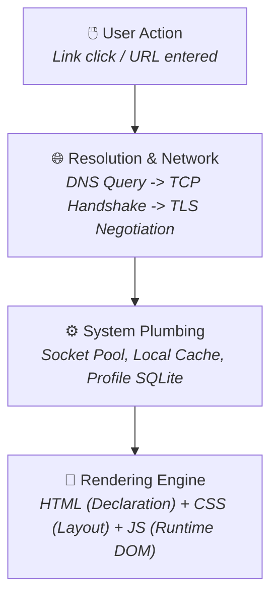
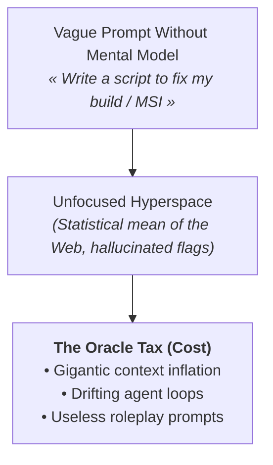
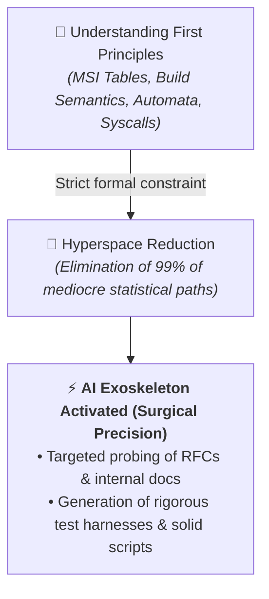
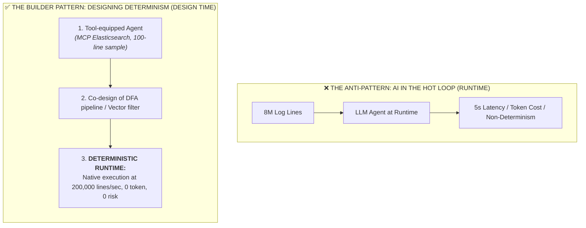
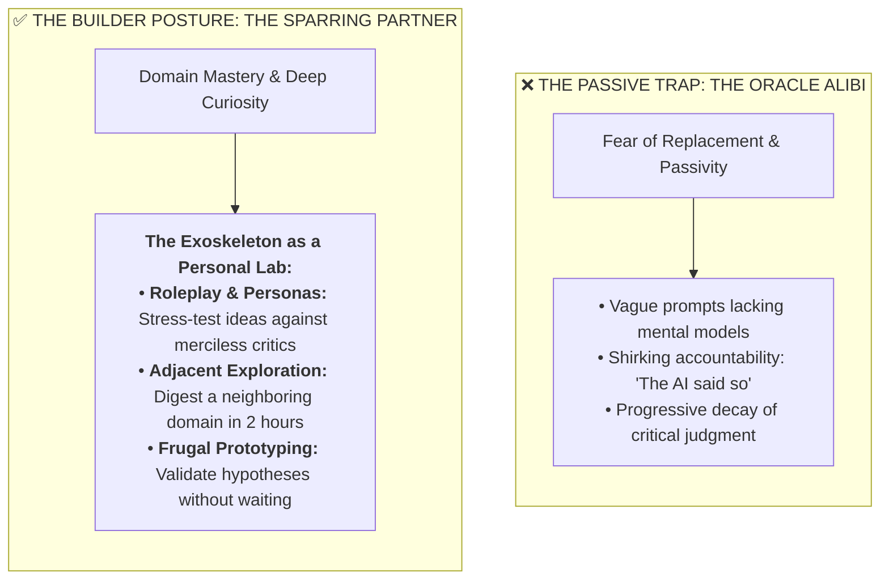
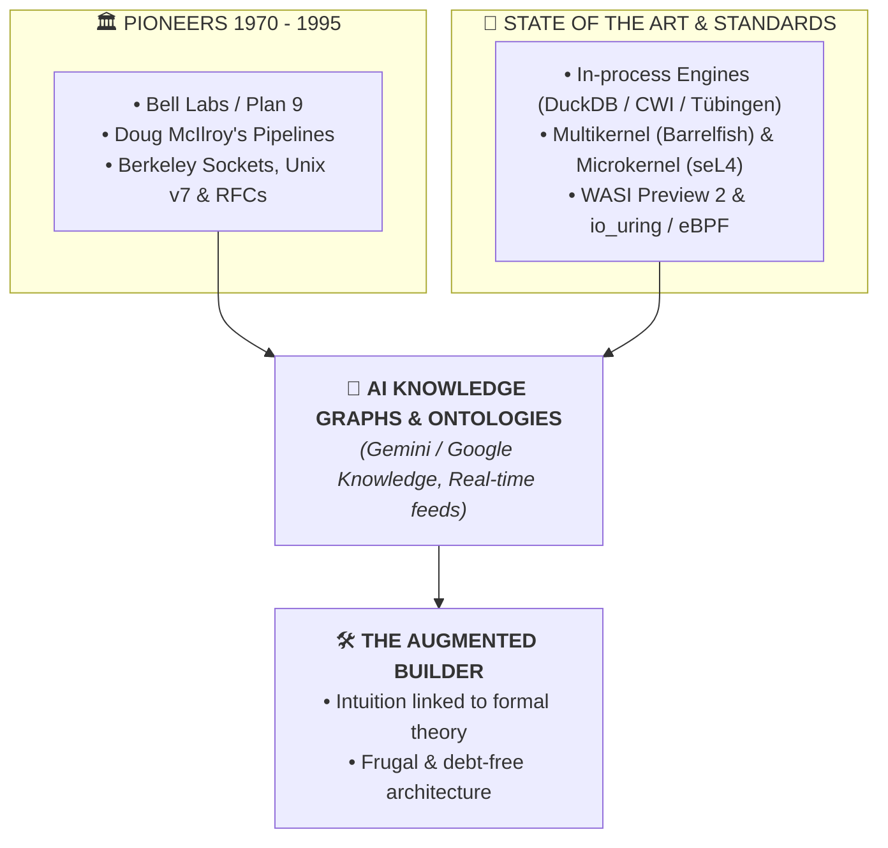
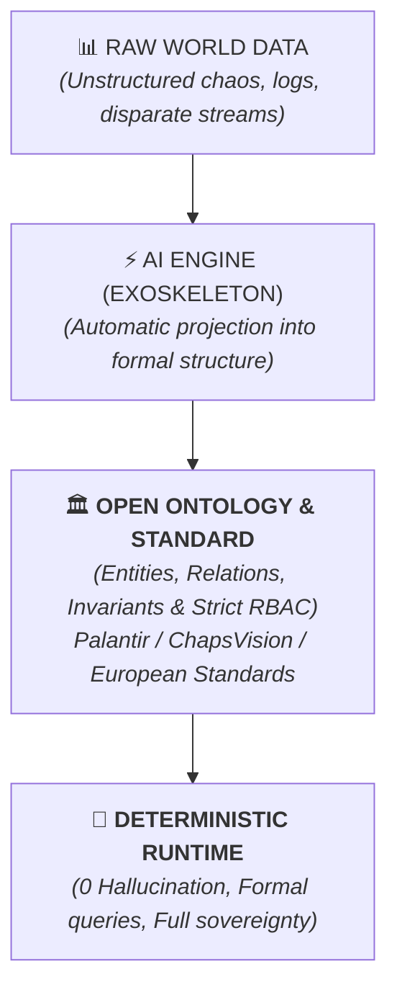
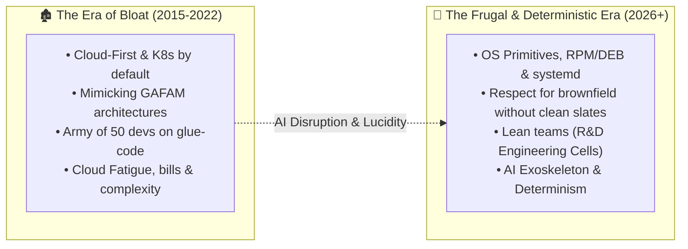
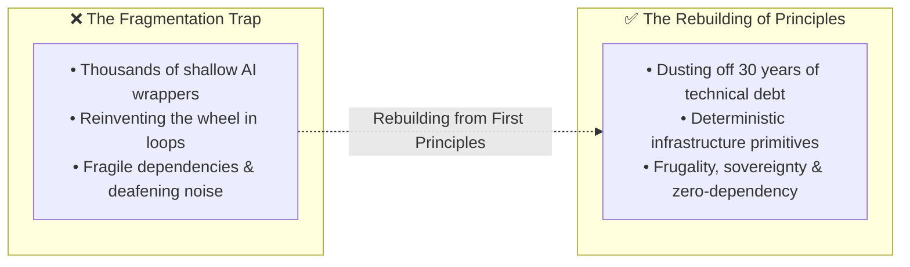
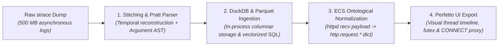

> *« AI is an exoskeleton for the builder, but a hazard for whoever seeks an oracle. »*

---

## 1. Six Years in the Trenches (2020 – 2026): Code as a Vector

I don't hold a PhD in machine learning. I don't design new transformer architectures, and I don't pretend to do theoretical data science research.

Nor am I an academic purist cloistered in an ivory tower. POSIX system calls and raw file descriptors account for barely 5% of my everyday time.

My day-to-day reality over the past six years is that of a **field engineer grounded in systems and automation**. 

From the day I graduated in 2020, a single obsession served as my compass: **systematically automate every time-consuming or repetitive task**. Over the years and through production-tested systems, this instinct matured into a golden rule: **understand and respect the mechanics of brownfield legacy without ever forcing dogmatic clean-slate rewrites**.

Whenever I approach an infrastructure or join a team, my method never wavers:
1. **Own the existing data flows** and map the real plumbing end-to-end.
2. **Pinpoint frictions and boundaries** where tools have turned into black boxes that no one dares touch anymore.
3. **Break deadlocks through direct engineering**: spin up a 30-minute Python POC to test a hypothesis and unblock an impasse, write scripts to extract the marrow of ancient MSVC 2008 `.vcproj` XML files and automatically regenerate modern `CMakeLists.txt` targets, tame Windows Batch scripting with `EnableDelayedExpansion` through edge cases where StackOverflow was a desert, or streamline C/C++ dependency management under Conan.

Long before the advent of LLMs, one conviction guided every single line of code: **code is never a monument to polish for the sake of beauty. It is not "code for code's sake". It is an engineering tool dedicated to concrete problem solving.**

### 1.1 The School of Fundamentals: Why "Vanilla" Was a Blessing

This mindset is rooted even earlier, in the crucible of French preparatory classes (CPGE) and public engineering schools. That rigorous scientific background forges an essential reflex: **never accept a black box**.

#### A. The Baptism of Rigor: CPGE (Lycée Dessaignes, MPSI / MP 2015 – 2016)
Before ever touching distributed architectures, the first intellectual shock took place at the blackboards of oral exam *khôlles* in Blois.

At the time, supervised by double-hat professors (mathematicians and physicists blending rigor with fundamental computing), programming was not taught as a mere production tool: **it was a science of proof dedicated to modeling the physical world**.
* We didn't stack dependencies: we proved algorithm termination through strict loop invariants.
* We didn't guess performance: we derived asymptotic complexity $\mathcal{O}(n \log n)$ on blackboards with chalk and markers.
* Theoretical computing (writing Python only after formalizing 20% of the problem on paper) was used to simulate physical dynamical systems, solve differential equations, or traverse pure graph structures.

This devotion to formal rigor and "zero approximation" laid the foundation: before running any code, you must understand *why* and *how* it operates mathematically.

#### B. The Field Test: INSA CVL and Learning "Vanilla"
At the engineering school (INSA Centre-Val de Loire), this rigor materialized in systems programming under the demanding watch of research professors who refused easy compromises:
* **Deconstructing the Web:** When Mr. Abdallah forced us to write our own HTTP router in raw PHP or C *from scratch* instead of blindly importing Symfony or CakePHP, many students dismissed it as "old-fashioned".
* **The Network Crucible & the OSI Model:** Barely six months out of prépa, wrestling with raw BSD socket primitives in C in Christian Toinard's classes. At the time, without operational hindsight, manipulating pointers, `sockaddr_in` structures, and attempting to materialize the abstract layers of the OSI model felt like an arid battle against syntax. We couldn't "see" packets flowing yet. But five years later, at the core of **cRSP** industrial infrastructure (Worldline), dissecting raw `.pcap` packet captures and troubleshooting subtle TCP/IP production anomalies became second nature.
* **Formal Language Theory:** Grinding through deterministic finite automata (DFA) and formal parsing logic in Pascal Berthomé's dense lectures.
* **The Kernel & Bare Metal:** Writing a full Unix shell in C (handling `fork`, `execve`, file descriptor tables, and trapping `SIGINT` / `SIGCHLD` signals) and hardening our chops on Gentoo Linux under Jérémy Briffaut.
* **Database Anatomy:** Implementing a relational DBMS engine by understanding the physical reality of $B$-Trees, ACID transactional locks, and formal $k$-anonymity constraints with Benjamin Nguyen.

At the time, against industry sirens clamoring for instant framework consumers, this demanding pedagogy could feel disorienting.

Looking back from 2026, **it was the greatest blessing imaginable**.

Frameworks die and reinvent themselves every four years, leaving behind waves of planned obsolescence. But graph theory, deterministic automata, OS scheduling mechanics, and file descriptor plumbing never change. This fundamental foundation is the only technical asset that never depreciates.

> [!TIP]
> **A Word of Advice to Juniors in Academic Training**  
> Seize the rare opportunity of being mentored by research professors to build an intimate understanding of first principles (operating systems, compilers, network protocols, computational complexity). Resist the temptation to skim over fundamentals with easy group projects chosen just to "secure a passing grade" by stacking trendy libraries. Libraries are forgotten; first principles remain your lifelong armor.

### 1.2 The Whiteboard Test: Understand Before Delegating to AI

This is the mindset that must drive the builder: visceral curiosity, a desire to dismantle mechanisms, and the obsession to understand how the machine truly breathes. This is precisely the playground that AI allows us to explore at lightning speed today.

However, there is an absolute prerequisite: **before delegating tasks or outsourcing your thinking to a language model, learn how to do the work yourself first.**

To thrive in the age of AI, diving beneath layers of abstraction is mandatory. To assess your level of understanding, start with a disarmingly simple exercise: **grab a marker and a whiteboard (or a blank sheet of paper). Could you diagram what actually happens between the moment you click a link in your browser and the display of the very first pixel on screen?**

Who is the machine talking to? Which layers get activated?

To explore this world, you don't need to wait for a model to explain it to you:
1. **Open your browser inspector (F12)** and inspect the Network tab: observe the cascade of requests, HTTP headers, and latency distributions.
2. **Launch Wireshark with TLS session keys** (`SSLKEYLOGFILE`) to observe decrypted traffic live: discover underlying network chatter, HTTP/2 or HTTP/3 multiplexing, and cipher suite negotiations.
3. **Understand the rendering engine:** Realize that **HTML** is merely a content declaration (*the what*), **CSS** the styling rules (*the how*), and **JavaScript** a local runtime engine to manipulate the in-memory DOM tree.

Mastering this chain makes it crystal clear why an ultra-frugal static site powered by **Hugo** (pure HTML/CSS pre-compiled in milliseconds, with no dynamic database or 5MB JavaScript bundle) is infinitely faster, more sustainable, and more resilient for the vast majority of web use cases.

Only once this mental model is engraved in your mind does AI become a formidable ally: not to conceal reality from you, but to help you manipulate it at the speed of thought.

---

### 1.3 The Legacy of the Elders: Learning to See the Machine and Keep Both Feet on the Ground

This scientific culture was then forged against real-world production thanks to my first mentors and architects when I left school.

On one hand, seasoned engineers near retirement (thank you Edi, Rainer) who had the infinite patience to transmit raw craftsmanship and taught me to **« see » the machine**:
* **Visualizing the inner life of a process** not through a pre-packaged dashboard, but by reading its file descriptor table (`/proc/<pid>/fd`) and socket states via `netstat` / `ss`.
* **Understanding networking down to raw packets:** Demystifying TCP, TLS, and IPsec at the bitstream level rather than placing blind trust in a client library.
* **The sober elegance of another era:** Discovering the world of `xinetd` long before `systemd`, understanding why a single-threaded event loop based on `select(2)` often outpaced heavy multithreaded architectures, and observing multi-repo architectures built on relative includes that looked rustic but had been running flawlessly for over twenty years.
* **Undocumented tribal knowledge:** Grasping the history and design trade-offs behind internal C/C++ libraries handling circular ring buffers and custom schedulers.

On the other hand, healthy reality checks with our infrastructure architect (MZ), who systematically anchored projects in **economic and operational realities on the ground**:
* *« We do not have Google's budget or their army of dedicated SREs. Our job is to be frugal, pragmatic, and realistic. »*
* **Rejecting CNCF Conference Cargo-Cults:** Rather than chasing the latest conference trends (deploying Mimir, Loki, or heavyweight dedicated monitoring clusters with high maintenance overhead), knowing how to be opportunistically smart by tapping into existing assets (eg. plugging directly into the **ElastiFlow / Elasticsearch** pipeline already maintained and hardened by the network team).
* Understanding that an elegant solution is not the one that stacks the most modern technologies, but the one that solves the business problem with the lowest operational burden for the team maintaining it over the next decade.

This dual transmission (the low-level systems rigor of the elders and the pragmatic economic realism of infrastructure architecture) is irreplaceable. An LLM has ingested millions of generic documentation pages, but it possesses neither the oral memory of twenty years of industrial systems nor the intuition for operational budget trade-offs.

Precisely because they taught me to look *behind* the black box while keeping both feet on the ground, I can now wield AI as a surgical acceleration lever rather than remaining its credulous spectator.

---

### 1.4 The Shockwave (2020 – 2026)

Since 2020, I have lived through the entire wave from within:
* The initial awe around GPT-3 in 2022,
* The arrival of GitHub Copilot in our IDEs,
* Integrated conversational assistants in 2024/2025,
* And today agentic work environments like Antigravity in 2026.

After six years of confronting these tools with raw production reality, a visceral truth emerges: **artificial intelligence does not create engineers. It acts as a magnifying mirror of the posture of whoever wields it.**

---

## 2. The « Oracle Tax » and the Trap of the Statistical Mean

When you use AI as an **Oracle** (i.e. when you delegate problem understanding to a model for something you do not grasp yourself), you immediately collide with an unforgiving mathematical reality: **the unfocused hyperspace**.

### 2.1 The Mean of the Web is Mediocre
An LLM is a probabilistic model trained on the entire public world corpus. If you feed it a WiX MSI error log or an obscure linker error without precisely framing the underlying mechanisms, it will reply with the **statistical average of that corpus**.

And the average of the Internet on specialized or legacy topics consists of outdated 2009 StackOverflow snippets, mushy abstractions, brittle workarounds that mask root causes, or outright hallucinations of non-existent CLI flags.

### 2.2 The Downward Spiral of the « Oracle Tax »
To mask this lack of understanding without putting in the effort to analyze real mechanics, the oracle user pays an exponential tax:
1. **Token inflation and gigantic context windows:** Dumping 50,000 lines of raw logs in the hope that the model will magically find the answer on its own.
2. **The illusion of "Magic Prompts":** Starting with *« You are a Staff Infrastructure Engineer with 30 years of experience »*. That is pure roleplay: the model adopts a more assertive tone, but its reasoning hasn't gained a single ounce of formal rigor.
3. **The mirage of "Agents of Agents":** Stacking three layers of automated agents that correct each other to compensate for hallucinations that compound with every iteration.
4. **The false promise of "Context Compressors":** Repositories racking up thousands of stars promising to "compress your prompts by 80%" using heuristic filters or recursive summarization. This is an optical illusion. By mechanically pruning text blocks without engineering discernment, these tools strip away the exact physical boundary constraints (installer error codes, build pass ordering, subtle syscall flags). It is a lossy compression that destroys the vital signal.

> [!WARNING]
> **The Illusion of « Context Compressors »**  
> Mechanically truncating text blocks with heuristic filters or recursive summaries eliminates the exact physical boundary constraints of your problem (installer error codes, build pass ordering, syscall edge cases). It is a lossy compression that destroys the vital signal. The only true compression is semantic: that of the engineer framing the theoretical invariants.

---

## 3. The Builder and the Material: Shrinking the State Space

Opposite the Oracle stands the posture of the **Builder**.

The builder knows how to manipulate the material. They understand the inner workings of their tools. They don't expect AI to solve problems on their behalf; they use AI as a **mechanical exoskeleton** to move ten times faster through exploration, prototyping, and execution.

### 3.1 How the Builder Bypasses the Oracle Tax
The builder bypasses this tax by **systematically grounding practical problems in formal theory and technical invariants**:
* **On build engineering / packaging:** They don't ask *« Why is my MSI failing? »*. They inspect the `InstallExecuteSequence` table, identify that the Custom Action runs in deferred context without elevation, and prompt the AI to generate the WiX snippet with the exact `Execute="deferred"` and `Impersonate="no"` attributes.
* **On high availability / server performance:** When an Apache `httpd` server collapses, an oracle user asks to double RAM or restart the pod. The builder summons **Little's Law ($L = \lambda W$)**[^little] and queuing theory: they understand that increased service latency explodes concurrent in-flight requests, triggering lock contention storms and `futex(2)` syscall thrashing. They prompt the AI to audit MPM configuration parameters (`ThreadsPerChild`, `MaxRequestWorkers`) and context switching metrics.
* **On stream integrity & networking:** Rather than stacking verbose protocols to secure a transport, they leverage **error-correcting codes (Hamming, Reed-Solomon)**[^shannon] and Shannon's information theory to structure the binary frame format.
* **On network / test automation:** They don't ask *« Write me a test bot »*. They specify the exact finite state machine (FSM), SSH status transitions via Paramiko, and Playwright DOM assertions with strict timeouts.
* **On data streaming:** They don't ask *« Redact some strings »*. They declare the constraint: *« I want a DFA automaton guaranteeing a 1:1 bijection without prefix collisions, with alias sorting by descending length and $O(U)$ memory complexity. »*

By stating the exact formal and technical constraint, **the builder collapses the hyperspace from 10 billion mediocre possibilities down to the 2 or 3 pure engineering solutions**. The model no longer has to guess: it is channeled straight to the apex of its corpus.

### 3.2 The Only True Compression: The First Principles Laser

True "context compression" does not come from a third-party tool pruning tokens at random. It stems from **the conceptual clarity of the builder**.

Instead of chaining trendy libraries to compress a bloated prompt, the engineer breaks down the problem into elementary primitives and uses **theoretical pivot keywords** (`DFA`, `SCM_RIGHTS`, `InstallExecuteSequence`, `zstd frame`, `SEEK_END`). These concepts act as ultra-precise GPS coordinates within the LLM's latent space.

A 30-word sentence structured around the right first principles delivers infinitely more signal and execution precision than a 5,000-token prompt dump run through a heuristic compressor.

---

### 3.3 AI at Design Time, Determinism at Runtime

This methodology leads to a cardinal architectural rule: **maximize AI during design and analysis to produce 100% deterministic solutions at runtime.**

Placing a language model inside the hot execution loop of a production system (to parse logs on the fly or make real-time critical routing decisions) is an operational mistake: unpredictable latency, non-determinism, and skyrocketing token costs.

The field engineer works in reverse:
* They do not feed **8 million lines of Apache `access.log`** into an agent within a massive context window.
* They equip the agent with an **MCP server connected to the Elasticsearch API** or submit a **representative 100-line sample** to analyze data structure.
* AI is used to model, prototype, and prove the solution: generate the exact DSL aggregation query, design a resilient Vector/Logstash filter, or write an $O(1)$ streaming coprocessor.
* **At runtime**, AI completely vanishes from the equation. The deterministic engine processes the 8 million lines at silicon speed with zero token cost and mathematical reliability.

> [!IMPORTANT]
> **The Builder's Golden Rule: AI at Design Time, Determinism at Runtime**  
> Maximize AI models upstream for mathematical modeling, architectural exploration, and rigorous test harness generation. But in production, inside the hot path: **zero tokens, zero inference latency, and zero probabilistic risk**. The runtime must be 100% deterministic and execute at bare-metal speed.

### 3.4 Domain Empowerment: Sparring Partners, Personas, and Exploration

This builder posture does not end at the borders of computer science. **It applies with equal force to any professional who refuses passivity in their craft.**

Today, many approach AI through the lens of replacement anxiety or use it as an alibi to mask sloppy execution. This is the eternal trap of the Oracle: waiting for the machine to dictate answers or complaining about its hallucinations.

For the practitioner and domain builder (whether an engineer, financial controller, lawyer, logistician, or physician), the AI exoskeleton opens instead an **unprecedented space for exploration and empowerment**:

#### 1. The Sparring Partner and Roleplay (*Personas*)
The hands-on practitioner does not ask AI to write their report. They use it as a **devil's advocate and critical mirror**:
* *« Act as a ruthless regulatory auditor and attack every vulnerability in my business continuity plan. »*
* *« Take the role of a skeptical enterprise client reviewing this architectural proposal and list your strongest objections. »*  
Within minutes, the builder exposes their intuition to rigorous simulated scrutiny, systematically eliminating blind spots.

> [!WARNING]
> **The Probabilistic Sophist Trap: The Imperative of Ontological Grounding**  
> Roleplay simulations or legal/financial explorations cannot rely on an unconstrained stochastic token generator. Without formal constraints, models fabricate fictitious precedents or imaginary tax rules.  
> This is where **grounding via formal ontologies and knowledge graphs** becomes the absolute cornerstone: constraining the AI within a verifiable factual structure to guarantee mathematical rigor (explored in depth in [**§4.3: The Power of Ontologies**](#43-the-power-of-ontologies-the-true-web-30-and-sovereignty)).

#### 2. Frictionless Exploration and the Scientific Awakening of Craft
How many bold ideas have been abandoned simply because they required mastering an adjacent domain (advanced statistical modeling, obscure regulatory standards, complex flow dynamics)?  
The AI exoskeleton removes the friction of the unfamiliar: it translates complex concepts into domain-specific terms and illuminates the underlying theoretical bridges.

Even better: **it unveils the hidden scientific and mathematical structures underpinning every profession.**  
Much like the pioneering work of **Inria's Catala project**[^catala]—which proved that entire sections of statutory tax law and family benefit calculations could be translated verbatim into unambiguous, formally verified mathematical logic—every domain rests on deep formal invariants.  
By sparring with their exoskeleton, the field practitioner weaves unexpected connections:
* The supply chain logistician discovers their resource assignment bottleneck is a textbook maximum flow problem on a directed graph or a linear program under constraints.
* The legal counsel discovers that their contractual corpus can be modeled as a deterministic finite-state automaton (DFA).
* The financial controller discovers the sheer power of vectorized columnar execution engines to audit millions of ledger entries in real time.

What was once locked within academic ivory towers becomes a day-to-day modeling instrument directly in the hands of the domain practitioner.

#### 3. Prototyping Without Dispersal
This is not about foolishly reinventing the wheel out of pride or rebuilding a custom ERP in isolation: delegating commodity primitives to proven SaaS and open-source software remains fundamental common sense.  
Yet for the **last mile**, the specific edge case or the operational bottleneck paralyzing a team: the domain expert is no longer powerless. They can design, test, and execute a deterministic prototype in hours on their local machine (such as a 50-line DuckDB/Python script reconciling 50 recalcitrant Excel workbooks in 1 second).

AI does not replace professional craftsmanship: **it grants those who master their craft the time, lucidity, and freedom to practice it at the highest level.**

---

## 4. The Omnidirectional Sonar: From Year 0 to the Frontiers of Research

For my generation of engineers (graduating around 2017+), the year 2000 unconsciously feels like "Year 0" of computing. That was the era when the Web exploded, Linux standardized, and most modern frameworks were born.

Yet the sonar of the augmented engineer is not merely retrospective: it is **omnidirectional**. It creates an instant bridge between fifty years of systems history and the cutting edge of contemporary research.

### 4.1 Dusting Off 50 Years of Forgotten Invariants
The greatest conceptual leaps in our discipline were designed at a time when running an OS required working with 64 KB of memory:
* The universal namespace and per-process isolation of **Plan 9 (Bell Labs)**[^plan9],
* The purity of stream composition by **Doug McIlroy**[^mcilroy],
* Foundational architectural debates preserved in mailing list archives (Apache, Linux kernel).

Too often, these historical bricks were misunderstood, resulting in clunky forks or 500 MB libraries built to reinvent what the OS offered natively. AI makes it possible to audit these historical decisions in seconds and re-inject their sobriety into our modern architectures.

### 4.2 Plugging into Academic and Industrial State of the Art
At the other end of the spectrum, a raw intuition fed to the model immediately connects with cutting-edge university research and modern systems architectures:

* **DuckDB: From database theory to scanning 70 MB of zstd logs in 5 seconds:**
  When addressing an analytical requirement through standard "business needs", the industry default is to deploy a behemoth: 6-node Elasticsearch cluster, Kafka brokers, and heavy Logstash pipelines.
  The builder steps back down to first principles: columnar storage, SIMD vectorization (ditching Volcano's tuple-by-tuple iteration in favor of vectorized cache-resident batches), and zero-copy multi-core parallelism.
  **DuckDB is not magic:** it is the pure embodiment of research from **CWI Amsterdam and the University of Tübingen**[^duckdb]. The result? A single in-process SQL query scans, decompresses, and aggregates **70 MB of `.zst` compressed Apache logs in 5 seconds flat** on a laptop, with zero resident background daemons and zero cloud bills.
* **Barrelfish and Multikernel Architecture (ETH Zurich / Microsoft Research)**[^barrelfish] :
  Instead of treating a modern 64-core machine as one giant shared-memory box collapsing under cache-coherency lock contention, the multikernel approach treats hardware as a distributed network of independent cores communicating via asynchronous message passing. What once required years of research becomes a clear lens for designing modern process supervisors.
* **seL4 and Formal Verification (UNSW / Data61)**[^sel4] :
  Capability-based security models and mathematical proofs of memory safety (long confined to aerospace and defense) become design patterns directly applicable to building rock-solid application microkernels.
* **Exokernels & Modular Isolation (WASI Preview 2) :**
  From the **MIT Exokernel philosophy** (exposing raw hardware primitives without imposing rigid abstractions) to the **WASI Preview 2** component specifications by the **Bytecode Alliance**[^wasi], AI allows us to build airtight, lightweight sandboxes without full VM virtualization overhead.
* **Modern Kernels & Zero-Copy I/O:** Exploiting asynchronous submission queues with `io_uring` or `eBPF` probes to inspect and filter streams without unnecessary context switches.

These academic concepts once seemed reserved for research labs or cloud hyperscalers. Today, with an AI exoskeleton, **they become practical design tools within arm's reach** for any builder who refuses technical debt and chooses first-principles excellence.

### 4.3 The Power of Ontologies: The Real Web 3.0 and Data Sovereignty

This qualitative leap stems from the very nature of modern AI architectures: they do not merely recite word probabilities. They are anchored in massive **Knowledge Graphs** and structured ontologies built over decades (such as the Google Knowledge Graph and real-time knowledge bases).

The builder formulates a raw intuition or domain use case $\to$ the model traverses knowledge graphs to connect it with formal taxonomies, IEEE/ACM papers, and evolving standards.

Yet ontologies are far more than a research accelerator: **they are the core value driver of tomorrow's data platforms.**

* **The Secret of Platforms like Palantir or ChapsVision:**
  What powers platforms like **Palantir Foundry / Gotham** or **ChapsVision** in defense, healthcare, and critical infrastructure is not magical chatbots. **It is their ontology.** It is the ability to constrain millions of disparate data points into a formal grammar of entities, relationships, and events. Once the ontology is locked, AI cannot drift: it reasons within a graph of strict mathematical and access-control constraints.
* **The Real Web 3.0: The Vindication of the Semantic Web:**
  For years, "Web3" was co-opted by crypto speculation. But **Tim Berners-Lee's original vision for Web 3.0 was the Semantic Web**[^semanticweb] (RDF ontologies, OWL, formal triples). That vision stalled for twenty years because hand-crafting ontologies was a titanic human bottleneck. AI changes the equation: it is finally the universal translator capable of structuring real-world chaos into actionable ontologies.
* **The European Geopolitical Opportunity:**
  Europe is often mocked for its regulatory focus (GDPR, AI Act, CSRD, NIS2), viewed by Silicon Valley as an impediment to speed. Yet this tradition of codification is our greatest strategic leverage. Rather than cloning yet another \$10B American LLM or locking ourselves into proprietary Palantir silos, Europe has the power to **define and enforce open reference ontological standards** (health, energy, supply chain, industrial sovereignty).
  By applying the "Brussels Effect" to data architecture, we compel tech giants to align with our open, deterministic standards rather than the reverse.

> [!NOTE]
> **The Brussels Effect Applied to Data**  
> The true value of large-scale analytics platforms (Palantir, ChapsVision) does not lie in magical models, but in **the formal rigor of their ontology**. By defining and imposing open reference ontologies in regulated sectors (healthcare, energy, supply chain), Europe turns its regulatory culture into a sovereign geopolitical asset.

We no longer reinvent the wheel in isolation. We build on the shoulders of pioneers, structure data through ontologies, and lay sovereign foundations for decades to come.

---

## 5. 2026 and the Frugal Era: The Return of Augmented R&D Workshops

Between 2015 and 2020, the software industry operated under near-religious dogma: "cloud-first", Kubernetes mandated for every embryonic microservice, and massive standardization on Java or mega-frameworks driven not by architectural elegance, but by hiring pool size (*« we need Java/Spring because the candidate pool is larger »*).

### 5.1 The « Cloud Fatigue » Syndrome and Brownfield Realism

By blindly copying architectures designed for hyperscalers (the handful of global companies handling millions of requests per second), the industry burdened mainstream enterprise projects with cathedrals of accidental complexity:
* 45-minute CI/CD pipelines building multi-gigabyte Docker images.
* Kubernetes clusters costing thousands of dollars a month to host three services consuming 200 MB of RAM.
* Critical dependency on dozens of proprietary managed cloud services that lock in data and budgets.

Yet the day-to-day reality of most engineers is **brownfield legacy**: proven industrial systems, battle-tested codebases handling critical business flows, and strict operational constraints.

Forcing containerization out of fashion or mandating cloud migrations with clean-slate rewrites is often a major strategic blunder. For 95% of real-world needs, **a clean compiled binary or native packaging in `.rpm` / `.deb`, supervised by a simple `systemd` service on a well-sized bare-metal box**, delivers ten times the performance, sub-millisecond latencies, bulletproof reliability, and negligible operating costs.

### 5.2 Embracing Frugality and Rethinking Foundations

In 2026, the AI exoskeleton shatters old trade-offs:
* **Ending the need for armies of glue-code developers:** A lean cell of builders no longer needs 50 people to write boilerplate framework plumbing. AI absorbs typing friction, enabling clean implementations built directly on OS primitives.
* **Respecting brownfield without inheriting its drag:** AI enables engineers to audit legacy plumbing, decode obscure formats, and construct robust engineering bridges (generating `CMakeLists.txt` from ancient XMLs, custom automation tooling, protocol parsers) without gambling on risky full rewrites.
* **The Renaissance of Engineering Design Offices:** We now have the historic opportunity to revive the spirit of industrial R&D design offices from 10 or 20 years ago. Agile cells of strategists, architects, and builders, equipped with exploration capacity multiplied by AI, where **imagination, technical rigor, and common sense become the only limits**.

---

## 6. Rethinking Open Source: Building Deterministic Primitives

This shift toward frugality poses a crucial question for the future of the Open Source ecosystem.

With LLM democratization, we already see a first danger: **sterile fragmentation**. Millions of disposable micro-projects and shallow wrappers generated in ten seconds reinventing the wheel in isolation, adding noise to noise.

Conversely, the AI exoskeleton offers a historic opening: **revisiting foundational infrastructure and SRE primitives.**

Many legacy open-source tools carry twenty or thirty years of technical debt, successive forks, and stacked patches designed to work around hardware limitations that no longer exist. AI enables us to audit these architectures, extract their core mechanics, and rebuild primitives that are:
* **Modern and deterministic**,
* **Frugal and free of superfluous dependencies**,
* **Aligned with the true primitives of modern operating systems.**

This is not about dogmatic "open source for open source's sake", nor about exhausting our energy building pale copies of proprietary software or trendy SaaS five years too late. That reactive posture is a dead end.

The builder embraces **the pragmatic path forged by Linus Torvalds**:
* Use industrial tools and standards without dogma whenever they get the job done,
* But the moment a foundational technical bottleneck blocks real-world engineering, **forge the missing primitive from first principles** (just as Linus designed `git`'s architecture in a matter of days around an immutable directed acyclic object graph, rather than cloning the centralized version control tools of his era).

This approach to open source is neither militant nor derivative: it is **luminous, fertile, and deeply emancipatory**.

### 6.1 Refusing the *Tabula Rasa*: Respect, Critique, Appropriate

With every major technological leap, our industry succumbs to a nihilistic temptation: the **clean-slate fantasy** (*« Forget low-level systems, forget protocols, AI models will regenerate everything from scratch »*).

This is a destructive illusion. Software engineering is a living heritage, an unbroken chain of transmission from engineer to engineer.

The builder's posture toward this heritage is threefold:
1. **Respect what was transmitted:** Acknowledge the elegance and robustness of the invariants laid down by pioneers and elders.
2. **Critique with lucidity:** Identify historical debt, obsolete compromises, and accidental complexity masked by years of overlays.
3. **Make the transmission your own:** Use the AI exoskeleton not to bulldoze the past, but to **restore, streamline, and refine these foundations** to meet the sovereignty, frugality, and security demands of our century.

> [!IMPORTANT]
> **The Triptych of Transmission**  
> 1. **Respect** what was transmitted: acknowledge the elegance and robustness of invariants laid down by pioneers.  
> 2. **Critique** with lucidity: identify historical debt, obsolete compromises, and accidental complexity.  
> 3. **Make the transmission your own**: use the AI exoskeleton to restore, streamline, and refine these foundations to meet the standards of 2026.

### 6.2 From Use-Case to Blue Ocean: The 48-Hour `strace` ETL Case Study

To understand the sheer leverage of a builder equipped with this exoskeleton, consider a concrete engineering challenge every systems engineer encounters: **deeply profiling the internal dynamics of a production server process from a raw 500 MB `strace` dump**.

In today's open-source ecosystem, there is no turnkey solution to turn this chaotic stream of asynchronous lines (`<unfinished ...>`, `<... resumed>`, deeply nested struct arguments in `recvfrom` or `ioctl`) into a queryable and visualizable analytical dataset. The industry's default reflex? Fragile, hand-rolled `grep` / `awk` one-liners or outright surrender in the face of volume.

By combining first principles with the AI exoskeleton, a complete ETL pipeline was **modeled, implemented, and validated in barely two days**:

1. **Compiler Theory to the Rescue of Debugging (Pratt Parser)**[^pratt] : Rather than stacking brittle regular expressions that break on the slightest syscall argument variation, designing a formal tokenizer and Pratt parser to extract the exact recursive structure of every system call.
2. **State Reconciliation (*Stitching*):** Reconciling concurrent syscall fragments (`unfinished` $\to$ `resumed`) across threads to rebuild the exact chronological sequence for each PID/TID.
3. **Frugal Analytics Engine (DuckDB & Parquet):** Converting the structured stream into **Parquet** files and leveraging in-process **DuckDB**, enabling vectorized SQL queries across millions of system events with sub-second latency on a standard laptop.
4. **Ontological Projection (Elastic Common Schema - ECS)**[^ecs] : Detecting application signatures: capturing the raw binary payload of an Apache `httpd` worker's `recv` syscall, decoding the underlying network stream, and projecting it directly into a structured dictionary adhering to the ECS standard (`http.request.method`, `http.request.bytes`, etc.).
5. **Visualization Without Reinventing the Wheel (Perfetto UI)**[^perfetto] : Exporting thread execution spans directly to trace formats consumable by **Perfetto UI** (`ui.perfetto.dev`). In seconds, the intimate inner workings of an Apache `httpd` daemon in `mpm_worker` mode are laid bare: the dance of `futex(2)` locks, worker thread contention on `accept4(2)` / `epoll_wait(2)`, and granular tracking of HTTP proxy tunneling streams (`CONNECT` via `http_connect_proxy`).

#### The Engineering Blue Ocean vs. The Wrapper Red Ocean

Faced with this kind of rapid engineering leap, the divergence in paths becomes unmistakable:

* **The Red Ocean (Saturated & Sterile):** 95% of the ecosystem crowds together to raise venture rounds for shallow LLM API "SaaS wrappers" or blindly rewrite legacy utilities in Rust purely out of fashion (*« Rewrite it in Rust »* without rethinking the core architecture).
* **The Blue Ocean (Pristine & Sovereign):** The untapped territories of low-level systems, deep observability, brownfield modernization bridges, and frugal SRE tooling. Domains where historic technical bottlenecks can now be unlocked through 48 hours of rigorous, AI-augmented co-design.

> [!TIP]
> **The Blue Ocean: The New Open Source Builder Guilds**  
> It is in this Blue Ocean that **passionate builder guilds and engineering collectives** must unite. In the open-source realm, our mission is not to inflate the bubble of disposable micro-wrappers, but to envision and forge tomorrow's foundational infrastructure primitives.  
> This is also an **invaluable opportunity for transmission to junior engineers**: rather than being relegated to passive prompt-pushers, they can sit alongside senior systems elders, absorb decades of low-level craft, and leverage the AI exoskeleton to digest, model, and perpetuate this deep technical heritage.  
> Armed with the *Strangler Fig* pattern, we no longer need to discard or condemn abandoned industrial *brownfield legacy*: we can **accompany, secure, instrument, and rethink it seamlessly**, with unprecedented elegance and sobriety.

### 6.3 The Builder's Laboratory: Interrogating the Plumbing

My ongoing personal research and explorations follow this exact philosophy:
* **Rethinking template engines** not as fragile regex stacks, but through the pure lens of **compiler theory** (AST syntax trees, bytecode, and optimization passes).
* **Re-evaluating I/O stream handling** by treating network sockets, subprocesses, and pipes as unified reactive file descriptors (`pipe(7)`, `dup2(2)`, `SCM_RIGHTS`).
* **Designing a DSE (Design Space Exploration) framework and compiled Finite State Machines (FSM)** to systematically map and benchmark architectural trade-offs along key dimensions (latency, memory footprint, robustness, cost) and guarantee $O(1)$ deterministic execution.
* **Structured ingestion of dense technical documents (PDFs)** to automatically project complex engineering corpora into formal knowledge graphs.
* **Exploring WASI / Component Model capabilities** to assemble the building blocks of a modern, lightweight, capability-secure micro-exokernel.
* **Interfacing with hardware peripherals and HID protocols** in a purely declarative fashion.

These explorations are not throwaway code generated by a chatbot to pad a resume.

They are **demonstrations by example of what software engineering becomes** when a builder rejects the laziness of the oracle and straps on AI as an exoskeleton: an unprecedented ability to clear the brush, eliminate accidental complexity, and engineer systems of exemplary sobriety and resilience.

---

## 7. Embark with Us: The First Principles Workshop

This blog and series of articles are not a theoretical showcase. **This is an open workshop.**

Whether you are a young engineer eager to learn how to "see the machine", a seasoned engineer exhausted by the accidental complexity of bloated architectures, or a builder seeking frugality and pure performance: **I invite you to take this journey with me**.

Throughout the upcoming articles, we will:
* **Dismantle system primitives** once thought reserved for an elite and reveal their luminous simplicity.
* **Explore real production plumbing**: from I/O stream interposition to network protocol arcana and build engineering.
* **Rebuild sovereign, deterministic, dependency-free primitives**, marrying the timeless rigor of the past with the firepower of modern AI.

No buzzwords, no black magic: just raw material, engineering discipline, and the joy of understanding how the world truly works.

The journey starts now with our first technical deep dive:

👉 **[What If Everything (Really) Were Just a File Descriptor? Act I: The Control Plane of stdout](/posts/2026-09-18-harness-introduction-with-dlp/)**

---

## References & Further Reading

[^little]: **Little's Law**: John D. C. Little, *“A Proof for the Queuing Formula: $L = \lambda W$”*, Operations Research, vol. 9, no. 3, 1961, pp. 383–387. Foundational queuing theory theorem relating the average number of items in a system to their average waiting time.
[^shannon]: **Information Theory & Error-Correcting Codes**: Claude E. Shannon, *“A Mathematical Theory of Communication”*, Bell System Technical Journal, 1948; Richard W. Hamming, *“Error detecting and error correcting codes”*, Bell System Technical Journal, 1950.
[^catala]: **Inria Catala Project**: Denis Merigoux, Nicolas Chataing et al., *“Catala: A Formal Language for Law”*, ACM SIGPLAN International Conference on Functional Programming (ICFP), 2021. Formal, proved, and executable domain-specific language for legislative statutes and social welfare rules — [catala-lang.org](https://catala-lang.org/).
[^plan9]: **Plan 9 from Bell Labs**: Rob Pike, Dave Presotto, Ken Thompson, Howard Trickey, *“Plan 9 from Bell Labs”*, UKUUG / Computing Systems, 1995. Distributed operating system unifying all system resources (networking, graphics, processes) as file trees via the 9P protocol.
[^mcilroy]: **Unix Pipelines & Composition**: M. D. McIlroy, *“A Research UNIX Reader: Annotated Excerpts from the Programmer's Manual, 1971–1986”*, Bell Laboratories Computing Science Technical Report no. 139, 1987.
[^duckdb]: **DuckDB & Vectorized Analytics Engines**: Mark Raasveldt, Hannes Mühleisen, *“DuckDB: an Embeddable Analytical Database”*, Proceedings of the 2019 ACM International Conference on Management of Data (SIGMOD), CWI Amsterdam / University of Tübingen — [duckdb.org](https://duckdb.org/).
[^barrelfish]: **Barrelfish Multikernel**: Andrew Baumann, Paul Barham, Pierre-Évariste Dagand, Tim Harris, Rebecca Isaacs, Simon Peter, Timothy Roscoe, Adrian Schüpbach, Akhilesh Singhania, *“The Multikernel: A new OS architecture for scalable multicore systems”*, ACM Symposium on Operating Systems Principles (SOSP), ETH Zurich & Microsoft Research, 2009.
[^sel4]: **seL4 Microkernel & Formal Verification**: Gerwin Klein, Kevin Elphinstone, Gernot Heiser et al., *“seL4: Formal verification of an OS kernel”*, ACM SOSP, 2009. First operating system kernel formally verified for functional correctness and absence of memory safety bugs (Trustworthy Systems / UNSW).
[^wasi]: **WASI & Component Model**: WebAssembly System Interface (WASI Subgroup / Bytecode Alliance), *“Component Model Specification & WASI 0.2 (Preview 2)”*, 2024 — [component-model.bytecodealliance.org](https://component-model.bytecodealliance.org/).
[^semanticweb]: **The Semantic Web**: Tim Berners-Lee, James Hendler, Ora Lassila, *“The Semantic Web”*, Scientific American, May 2001; W3C Resource Description Framework (RDF) and Web Ontology Language (OWL) standards.
[^pratt]: **Pratt Parser**: Vaughan R. Pratt, *“Top down operator precedence”*, ACM SIGACT-SIGPLAN Symposium on Principles of Programming Languages (POPL), 1973, pp. 41–51. Elegant recursive parsing algorithm for operator precedence and AST generation without heavyweight formal grammars.
[^ecs]: **Elastic Common Schema (ECS)**: Open, community-driven specification of standardized event and observability data fields — [elastic.co/guide/en/ecs](https://www.elastic.co/guide/en/ecs/current/index.html).
[^perfetto]: **Perfetto Trace Viewer**: Production-grade system profiling, timeline visualization, and syscall tracing platform from Android / Chromium open-source project — [ui.perfetto.dev](https://ui.perfetto.dev/).

